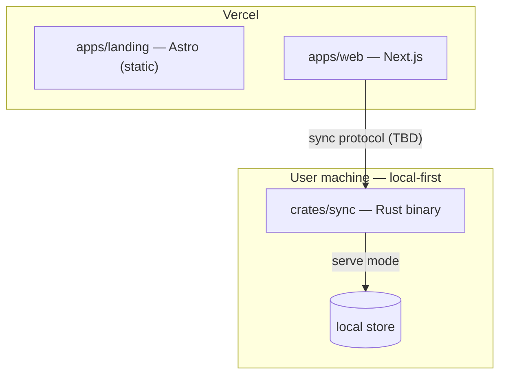

# CLAUDE.md

This file provides guidance to Claude Code (claude.ai/code) when working with code in this repository.

## Overview

`superai2026` is a monorepo with three deployable components:

- **`apps/landing`** — Astro **static** landing page. Deploys to Vercel.
- **`apps/web`** — Next.js (App Router, React 19) web app. Deploys to Vercel.
- **`crates/sync`** — Rust binary that runs as **both server and client** to support local-first sync. Subcommands: `sync serve` and `sync client`.

Two toolchains share the repo root: a **pnpm + Turborepo** workspace for JS (`apps/*`, `packages/*`) and a **Cargo** workspace for Rust (`crates/*`).

> Internals are intentionally placeholders ("to be specified later"). Scaffolding is in place; domain/protocol logic is not. Grep for `TODO` / `placeholder` before assuming behavior exists.

## Commands

JS commands run from the repo root via Turborepo unless noted.

| Task | Command |
| --- | --- |
| Install JS deps | `pnpm install` |
| Dev (all apps) | `pnpm dev` |
| Dev landing only | `pnpm dev:landing` |
| Dev web only | `pnpm dev:web` |
| Build all | `pnpm build` |
| Lint all | `pnpm lint` |
| Typecheck all | `pnpm typecheck` |

Run a script in one workspace: `pnpm --filter landing <script>` or `pnpm --filter web <script>`.

### Rust (`crates/sync`)

| Task | Command |
| --- | --- |
| Run server | `cargo run -p sync -- serve --addr 127.0.0.1:7878` |
| Run client | `cargo run -p sync -- client --addr 127.0.0.1:7878` |
| Build | `cargo build -p sync` |
| Check | `cargo check` |
| Lint | `cargo clippy --all-targets -- -D warnings` |
| Format | `cargo fmt` |
| Test (all) | `cargo test -p sync` |
| Single test | `cargo test -p sync <test_name>` |

`pnpm sync -- serve` is a convenience alias for `cargo run -p sync --`.

### Tests

No JS test runner is wired up yet (placeholder). When adding one, expose it as a `test` script in each package so `turbo run test` discovers it. Rust uses the built-in harness (`cargo test`).

## Architecture

- The **landing page** is fully static (no SSR adapter). Vercel runs `astro build` → `dist/`.
- The **web app** is the UI; it talks to the local-first **sync** binary running on the user's machine (transport TBD). `sync` owns persistence and reconciliation.
- **`sync`** is one crate compiled to one binary with two modes. `serve` is the authoritative peer; `client` connects to it. `main.rs` parses the CLI (clap) and dispatches to `server::run` / `client::run`.
- **`packages/`** holds shared JS libraries (empty placeholder) — e.g. future generated TS bindings for the sync protocol.

## Deployment (Vercel)

Two separate Vercel projects backed by the same repo:

- **Landing** — Root Directory `apps/landing`, framework preset Astro.
- **Web** — Root Directory `apps/web`, framework preset Next.js.

Set the project Root Directory in the Vercel dashboard; Vercel handles the monorepo `pnpm install` from the repo root. Turborepo remote caching is optional. `crates/sync` is **not** deployed to Vercel — it runs locally / self-hosted.

## Conventions

- Package manager is **pnpm** (pinned via `packageManager` in the root `package.json`). Do not use npm or yarn.
- TS apps extend `tsconfig.base.json`. The Astro app instead extends `astro/tsconfigs/strict` (Astro-specific).
- Rust: edition, version, and shared dependency versions live in the root `Cargo.toml` `[workspace]`; member crates inherit with `*.workspace = true`. Add shared deps there, not per-crate.
- The parent `/Users/debuggingfuture/workspaces/CLAUDE.md` SEO + agentic-SEO rules apply to `apps/landing` and `apps/web` (per-page metadata, canonical, OG, JSON-LD, `robots.txt`, `llms.txt`, sitemap, Core Web Vitals). Minimal `robots.txt` / `llms.txt` stubs and metadata are scaffolded — extend them, don't remove. `https://example.com` placeholders need the real production domain.
- The landing page must follow [PRESENTATION.md](./PRESENTATION.md) — art direction, free-flow layout, motion, and a11y/perf budgets for `apps/landing`. Illustrations are generated with the `/generate-arts` skill (`.claude/skills/generate-arts/SKILL.md`), which defers to PRESENTATION.md for presentation rules.
