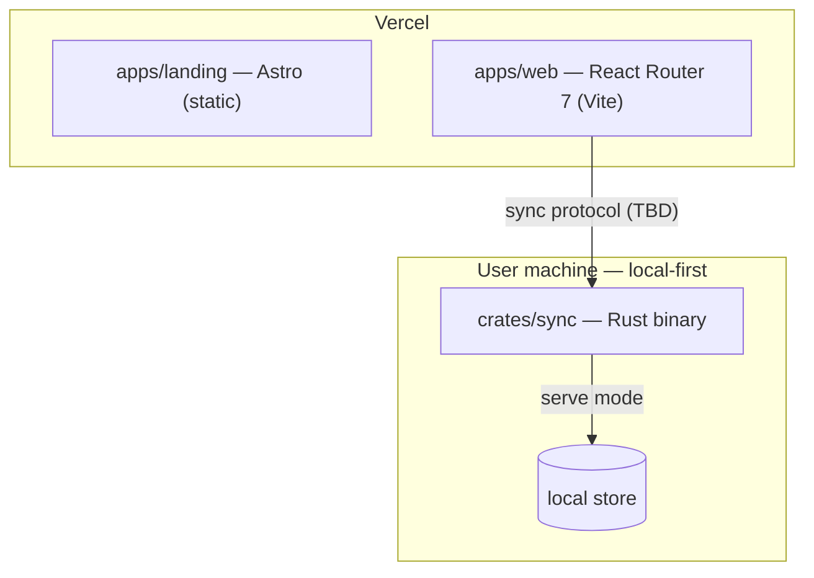

# CLAUDE.md

This file provides guidance to Claude Code (claude.ai/code) when working with code in this repository.

## Overview

`superai2026` is a monorepo with three deployable components:

- **`apps/landing`** — Astro **static** landing page. Deploys to Vercel.
- **`apps/web`** — React Router 7 (framework mode, Vite, React 19) web app: the interactive capability console (Flows A & B) with opt-in live presence against the relay; hosts the Weaver/Loro CRDT editor. Deploys to Vercel.
- **`crates/sync`** — Rust library + binary implementing the Contextful backend. Seven subcommands: `serve` (Loro WS relay), `client` (headless peer), `ingest`, `cron`, `mcp` (brain over JSON-RPC), `agent`, `ctl` (control plane).
- **`packages/protocol`** — `@superai2026/protocol`: TS capability engine + brain query + wire/MCP mirrors.
- **`tests/acceptance`** — `@superai2026/acceptance`: end-to-end Flow A/B tests against the built binary.
- **`infra/`** — Pulumi recipes (standalone; outside the pnpm workspace).

Two toolchains share the repo root: a **pnpm + Turborepo** workspace for JS (`apps/*`, `packages/*`, `tests/*`) and a **Cargo** workspace for Rust (`crates/*`).

> The backend is implemented and tested (capability engine, brain, MCP, relay, control plane). Cloud-integration edges the spec marks "Future" — real Biscuit-WASM, AWS Bedrock / LM Studio inference, Exa HTTP, Vercel Sandbox SDK, Weaver transport, Pulumi `apply` — are interface-complete and feature-gated off, so the default build is offline-capable with no external creds. Grep for `Future` / `feature` before assuming a cloud path is live.

## Commands

JS commands run from the repo root via Turborepo unless noted.

| Task | Command |
| --- | --- |
| Install JS deps | `pnpm install` |
| Dev (all apps) | `pnpm dev` |
| Dev landing only | `pnpm dev:landing` |
| Dev web only | `pnpm dev:web` |
| Build all | `pnpm build` |
| Lint all | `pnpm lint` |
| Typecheck all | `pnpm typecheck` |

Run a script in one workspace: `pnpm --filter landing <script>` or `pnpm --filter web <script>`.

### Rust (`crates/sync`)

| Task | Command |
| --- | --- |
| Seed control plane | `cargo run -p sync -- ctl seed` |
| Approve a scoped grant (Flow A) | `cargo run -p sync -- ctl grant --to agent:cto/1 --view stripe/finance_private --fields gross,credits,discount_tier` |
| Ingest + synthesize | `cargo run -p sync -- ingest --source stripe` |
| Run relay (+presence) | `cargo run -p sync -- serve --addr 127.0.0.1:7878` |
| Headless peer | `cargo run -p sync -- client --doc finops --principal agent:cto/1` |
| Brain over MCP (stdio) | `cargo run -p sync -- mcp --principal cfo` |
| Agent loop | `cargo run -p sync -- agent --principal agent:cto/1 --ask "..."` |
| Build / Lint / Format | `cargo build -p sync` · `cargo clippy --all-targets -- -D warnings` · `cargo fmt` |
| Test (all) | `cargo test -p sync` |

State lives under `~/.contextful` (override with `CONTEXTFUL_HOME`). `pnpm sync -- serve` is a convenience alias for `cargo run -p sync --`.

### Tests

- **JS:** `pnpm test` (`turbo run test`) runs `@superai2026/protocol` unit tests (vitest) and `@superai2026/acceptance` end-to-end Flow A/B tests against the built binary (the acceptance suite skips if `target/debug/sync` is absent).
- **Rust:** `cargo test -p sync` — capability/property tests (incl. the Flow B salary invariant) and brain synthesis/anomaly/card-scrub tests.

## Architecture

- The **landing page** is fully static (no SSR adapter). Vercel runs `astro build` → `dist/`.
- The **web app** is the UI; it talks to the local-first **sync** binary running on the user's machine (transport TBD). `sync` owns persistence and reconciliation.
- **`sync`** is one crate compiled to one binary with two modes. `serve` is the authoritative peer; `client` connects to it. `main.rs` parses the CLI (clap) and dispatches to `server::run` / `client::run`.
- **`packages/`** holds shared JS libraries (empty placeholder) — e.g. future generated TS bindings for the sync protocol.

## Deployment (Vercel)

Two separate Vercel projects backed by the same repo:

- **Landing** — Root Directory `apps/landing`, framework preset Astro.
- **Web** — Root Directory `apps/web`, React Router 7 (Vite) via `vercelPreset()` (framework preset Vite).

Set the project Root Directory in the Vercel dashboard; Vercel handles the monorepo `pnpm install` from the repo root. Turborepo remote caching is optional. `crates/sync` is **not** deployed to Vercel — it runs locally / self-hosted.

## Conventions

- Package manager is **pnpm** (pinned via `packageManager` in the root `package.json`). Do not use npm or yarn.
- TS apps extend `tsconfig.base.json`. The Astro app instead extends `astro/tsconfigs/strict` (Astro-specific).
- Rust: edition, version, and shared dependency versions live in the root `Cargo.toml` `[workspace]`; member crates inherit with `*.workspace = true`. Add shared deps there, not per-crate.
- The parent `/Users/debuggingfuture/workspaces/CLAUDE.md` SEO + agentic-SEO rules apply to `apps/landing` and `apps/web` (per-page metadata, canonical, OG, JSON-LD, `robots.txt`, `llms.txt`, sitemap, Core Web Vitals). Minimal `robots.txt` / `llms.txt` stubs and metadata are scaffolded — extend them, don't remove. `https://example.com` placeholders need the real production domain.
