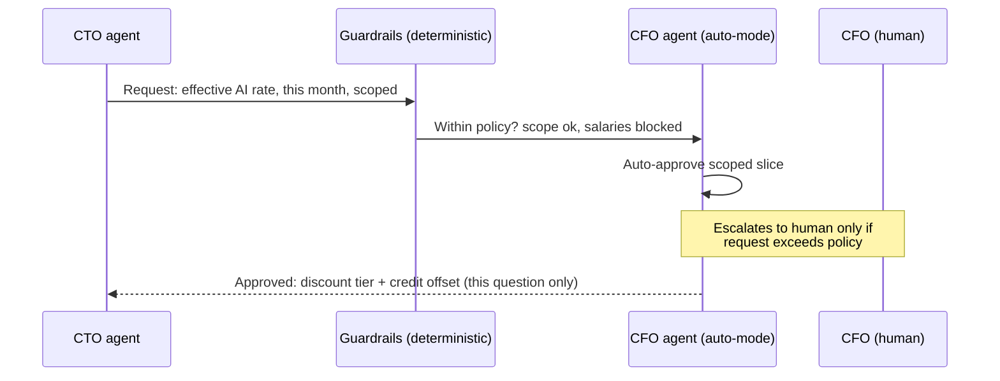
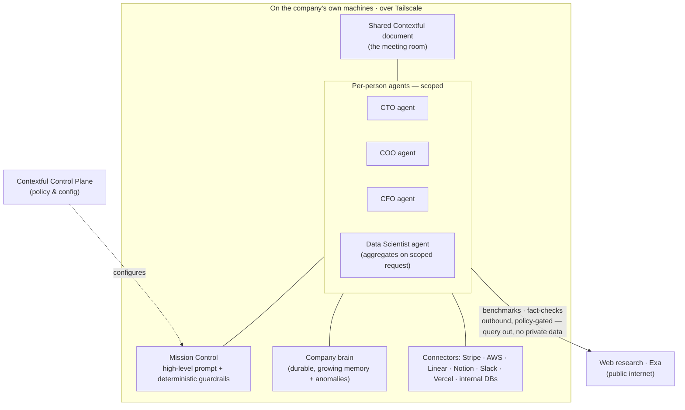
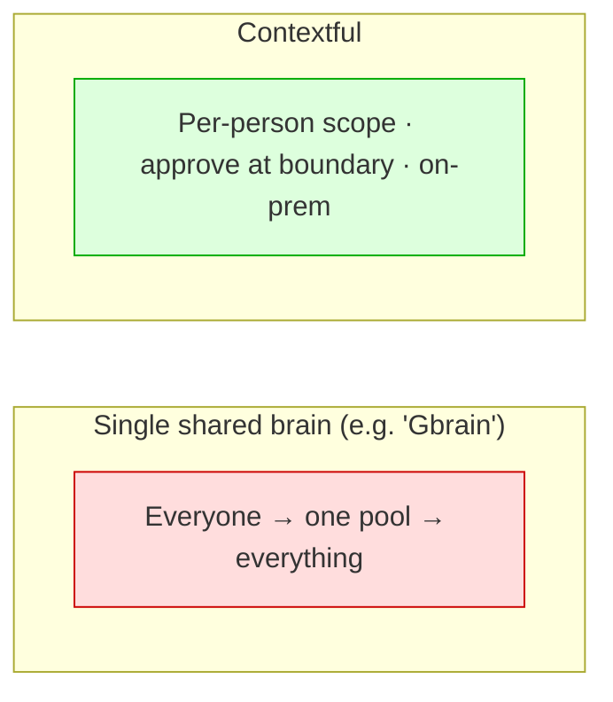

# Contextful — Demo Story & Presentation Flow

> **Logline:** Every company wants one AI that knows everything. That's exactly the
> thing you must never build. **Contextful** is the company brain that gets *smarter*
> as it gets *more careful* — scoped per person, approved at the boundary, run on your
> own machines.

This document is the **story spine** for the talk + demo. Slides and the AI-generated
video are derived from it. Read top to bottom: it's written as a narrative arc, then
broken into a slide skeleton and production notes at the end.

---

## The one-sentence problem

A 50-person company runs on Claude, Notion, Slack, Linear, AWS, Vercel, and Stripe —
and **nobody can answer "is this spend worth it?"** because the context needed to
answer it is split across people who each only hold one piece, and the obvious fix
(*dump it all into one all-knowing agent*) is the one thing that gets you breached.

Contextful answers the question **without** building the thing that gets you breached.

---

## Act 1 — The Problem (cold open)

### Beat 1: The CEO's "SuperAgent"

Open on a confident CEO at an all-hands:

> "We built a **SuperAgent**. It has *all* of our context. Ask it anything — finances,
> code, customers, salaries — it just knows."

The room applauds. Cut to the engineering corner: someone quietly types into the
SuperAgent: *"What's the CEO's salary?"* — and it answers.

### Beat 2: Things go south

### Beat 3: 

- **Insufficient context** → the agent is useless: it can't answer the real question.
- **No privacy awareness** → the agent is dangerous: CTO querying the CEO's salary, a
  compromised cloud provider leaking the lot, a single point of failure taking
  everything down.

- **Someone else's infra** -> company brain sitting on some other startups

---

## Act 2 — The Scenario (~30 seconds, then straight into the demo)

Keep this to **one beat on stage** — set the question, name the trap, and jump into the
live demo. The demo *shows* the rest of the scenario; don't tell it on slides.

**The CEO asks:** *"We're burning a lot every month on AI tokens and cloud. Review the
spend — is it worth it? By next standup."*

Simple question, and **nobody can answer it alone**: the CTO knows whether the agents
are *worth it* but not what they cost; the COO runs the outcome evals but sees no
pricing; the CFO holds the decisive pieces — credits, discount tier, Stripe revenue —
and won't expose them to everyone; the data scientist knows *how* to join it all but
holds no standing access at all.

**The trap:** the obvious fix is one all-knowing SuperAgent anyone can ask anything.
But **this is not how organizations work** — organizations run on need-to-know
boundaries. That single store is the world where an **engineer can query everyone's
salary.** The thing that would answer the question is the thing you can't allow to
exist.

> **Cast reference (speaker notes, not slides)** — who holds what, used by the demo
> beats below:
>
> | Persona | Holds | Blind to |
> | --- | --- | --- |
> | **CTO** | Claude Code / agent usage value, Linear throughput, what shipped | Pricing, discount tiers, real cost |
> | **COO** | Outcome evals — which workflows clear the bar | Any cost or pricing |
> | **CFO** | Credit offsets, discount tier, team budgets, **Stripe** revenue/cashflow | — (won't expose it all) |
> | **Data Scientist** | *How* to join Stripe revenue with the internal warehouse into per-product cost/margin/ROI | Holds **no** standing access; works only released slices |
> | **Engineer** | Their own code context | Salaries, finance — and that's the point |
>
> Why existing tools don't close the gap (one line if asked): per-service tools (AWS
> Budgets + IAM) fragment across Vercel/Stripe/Claude; aggregators lack the connectors;
> and the decisive context (credits, tiers, revenue) lives only with the CFO.

---

## Act 3 — The Solution (the live demo)

Take a step back: **do you trust ingesting all your company data into someone's
cloud?** That's what every "company brain" on the market asks you to do.

**Contextful** is a **local-first collaboration workspace for your agents** — your
data, your rules — with a **boundary at every person.** Each member's agent holds only
*their* context. When an answer needs something across a boundary, the request is
**routed to the owner's agent, approved, and scoped** — the data crosses the line for
*that question only*. Everything runs **on the company's own machines.**

> The whole demo happens inside **one shared Contextful document** — think a meeting
> room where each person has an agent at the table.

### Demo beat 1 — We built the company, not a dataset

Before any query runs, show that the demo isn't canned numbers — **we created a living
simulation of the whole company.** Pan across it for a few seconds:

- **Slack** — the team is actually *talking*: standups, a thread arguing about agent
  costs, the CEO dropping the question.
- **Stripe** — real revenue events flowing in per product (mock data seeded from a
  Kaggle dataset).
- **PostHog** — product analytics: usage, retention, the funnels the COO's evals read.

The agents draw from the same messy, live surfaces a real company has. Everything that
follows is answered from *this world*, not a spreadsheet we prepared.

### Demo beat 2 — The killer shot: one query, four different answers

The CEO's question lands in the shared doc, and **the same query is put to every agent
at the table.** Each one answers *differently* — not because they're different models,
but because **each holds only its owner's slice, and the access-control policy decides
what each may say:**

- **CTO's agent** → the *value*: Claude Code usage, Linear throughput, what shipped.
  On cost: *"I can't see effective rates or discount tiers."*
- **COO's agent** → the *outcomes*: which workflows clear the eval bar. No cost figures
  at all.
- **CFO's agent** → the *money*: effective rate after discounts, credit offsets, Stripe
  revenue per product — and it volunteers nothing beyond what policy allows.
- **Engineer's agent** → asked the same question (and, cheekily, *"what's the CEO's
  salary?"*) → **denied by policy.** A hard-coded rule, not a model's good manners.

Same question, four scoped answers. **That's the product in one shot:** the brain spans
the whole company, but every answer abides by the boundary.

> While agents draft, they also reach *outward* — a **web-research** pass (**Exa**) for
> the *public* market rate of the models and clouds in use. Open-internet benchmark, no
> boundary crossing; every figure lands with its **source link inline.**

### Demo beat 3 — A request crosses the boundary (the key mechanism)

Instead of failing or over-reaching, the CTO's agent **raises a scoped request**:

> "To answer this I need: effective rate after discount + credit offset for *this
> month's AI spend*. Not invoices. Not salaries."

The **CFO's agent**, in **auto mode**, evaluates the request against **deterministic
guardrails** and the CFO's policy — and **approves just that slice.** No permission
fatigue, no exposing the full ledger.

> **Talking point — "auto mode":** agents handle the safe, in-policy requests
> themselves and **only raise to a human when something exceeds the guardrails.** That's
> how you avoid the click-yes-to-everything fatigue that kills permission systems.

### Demo beat 4 — A specialist works the released slices (on request)

The CFO and COO want the view nobody has produced yet: *spend per product vs. the
revenue it drives.* They **request the Data Scientist's agent** — which holds **no**
standing access. The scoped request releases exactly what the job needs (**Stripe**
revenue by product + the internal product/usage warehouse, nothing else), and the DS
agent joins them into per-product revenue, cost, and margin. Two boundaries crossed,
**never pooled** — the slices existed for this question only. A specialist invoked
**on request**, not a standing all-seeing analyst.

### Demo beat 5 — The answer assembles — and the boundary holds

The shared doc now contains a **synthesized, sourced answer**: every claim attributed
to the agent that vouched for it (value ← CTO, rate ← CFO, revenue ← CFO/Stripe,
product performance ← Data Scientist, market benchmark ← Exa). As a one-line flourish,
the brain flags an **anomaly** learned from prior months — *"spend is 38% above
pattern; driver is a runaway AWS agent workflow retrying since the 3rd, not the
tokens."*

During synthesis, a regular **web-research pass (Exa)** re-checks the external
benchmarks and **cites each source next to the claim it backs** — only the *query*
leaves the network, never private context.

And the closing callback to beat 2: the **engineer in the same document still cannot
see salaries.** The scoping held the whole time. *That's the proof.*

### What just happened (architecture)

The pillars to land on screen:

- **Scoped agents** — each member's agent has *partial* access; nothing holds everything.
- **Specialist agents on request** — a worker like the **Data Scientist agent** aggregates
  product performance across Stripe + internal databases, but only on a scoped request from
  the CFO/COO — never as a standing, all-seeing analyst.
- **Researches the open web** — agents ground answers against the public internet via
  **Exa** (integrating in a separate PR): inline **while editing** the doc, and as a
  regular pass **during synthesis.** Every external figure is cited; only the query goes
  out (policy-gated), never private context.
- **Auto mode + human-in-the-loop** — agents decide what's safe, raise the rest.
- **Mission Control** — steer with a high-level prompt *and* pin down
  **deterministic guardrails** (not vibes).
- **Learns over time** — baselines from past months → anomaly detection this month.
- **On-prem, over Tailscale** — data never leaves your machines; the network is yours.
- **Configured via our Control Plane** — policy and topology set once, centrally.
- **[TBC] Ad-hoc connectors** — an agent writes a one-off integration connector using
  our primitives when a source isn't wired yet.

---

## Act 4 — Why this matters (outro)

### Beat 1: The status quo is *blocking*

> Most organizations didn't solve this. **They just blocked Claude (and the rest)
> entirely.** Safety by amputation — and they lose every bit of the upside.

Contextful is the third option: keep the upside, scope the risk.

### Beat 2: Not another shared brain

Other memory systems are **all-or-nothing and cloud-bound** — a single pool everyone
queries. Contextful is **boundaried and local-first**: the brain gets richer *because*
access stays scoped, not despite it.

### Beat 3: The local stack is ready

The local/on-prem stack is **more powerful than ever** — capable local inference
(LM Studio + Gemma, OpenAI-compatible) means real work runs on your own machines.
**Workloads are going hybrid**: sensitive context stays local, burst goes out under
policy. Contextful is built for that world.

### The two things to prove on stage

1. **You can analyze and answer real questions with the company brain** — the FinOps
   question gets a genuine, sourced answer.
2. **The company brain actually *grows*** — this month's approved reasoning, guardrails,
   and the caught anomaly become durable memory, so next month the same question is
   answered faster and the policy is already codified.

---

## Slide deck (≤ 10 slides — the deck is built from this)

**Slide principles:** keep it simple — **no more than 10 slides**, **mostly jargon-free**.
Each slide = **one idea + one money line**; the detail lives in the speaker notes, not on
the slide. Only the **technical breakdown slides (max 3)** may use technical terms — mark
them. Everything else must read to a non-technical exec. The deck is generated and kept in
sync from this table by the **`slidev-deck`** skill → `slides/slides.md`.

| # | Slide | One idea on screen | Source | Jargon? |
| --- | --- | --- | --- | --- |
| 1 | **Hook** | "Workspace with your agents. Your data. Your rules." Cold open: CEO brags → an intern asks the CEO's salary → it answers → *slap*: "why'd you give it all the access?" | Act 1 (one continuous ~12s gag; drop the Nucleus bit) | No |
| 2 | **The problem** | Too little context → useless. Too much access → dangerous. Today you're forced to pick one. | Act 1 · Beat 4 | No |
| 3 | **The scenario (30s) & the trap** | CEO: *"Review the AI spend — is it worth it?"* Nobody can answer alone, and the obvious fix (one all-knowing AI) is the one you can't allow. One slide, then demo. | Act 2 | No |
| 4 | **Contextful** | Local-first collaboration workspaces for your agents. **Your data. Your rules.** The brain gets smarter as it gets more careful. (Spoken open: "do you trust ingesting all your company data into someone's cloud?") | Act 3 intro | No |
| 5 | **Live demo** | **A simulated company** (Slack chatter, Stripe revenue, PostHog analytics) → **one query, four different answers** — each agent answers per its owner's access policy (the killer shot) → a scoped request approved at the boundary → a sourced answer assembles. **And the engineer still can't see salaries** — the money shot. | Act 3 · Beats 1–5 (anomaly demoted to a one-line flourish) | No |
| 6 | **How it works** 🔧 | Scoped agents; a **deterministic policy engine** decides the boundary (the agent only *drafts* the request); auto-mode escalates to a human only on a policy breach. | Act 3 architecture | **Technical 1/3** |
| 7 | **Where it runs** 🔧 | On-prem over Tailscale; Mission Control + guardrails; control plane; the brain grows (learns baselines, flags anomalies); agents research the open web (Exa) — outbound, policy-gated, cited. | Act 3 architecture | **Technical 2/3** |
| 8 | **Why now** | Most companies just *blocked* AI (safety by amputation). Other brains are one shared cloud pool; Contextful is boundaried + local-first. Workloads are going hybrid. | Act 4 (de-named — no "Gbrain") | No |
| 9 | **BYOC** | Bring your own connectors — not paying **$200 × N per connector, every month**, to reach your own data. Your agent writes the connector once; it runs on your machines. Sample setup on screen: 2 server nodes (AWS box + office Mac Studio) and 3–4 client nodes on employee laptops. | Act 3 ad-hoc connectors + "why today's tools fail" | No |
| 10 | **The ask** | What we want — design partners (companies that already blocked AI and want the upside back). *Replace with the real ask once decided.* | Act 4 close | No |

> **Cold-open storyboard:** the comic frames in `assets/` are inserted into the deck as
> full-bleed image slides right after slide 1, in story order: the brag (001) → the
> innocent cloud-cost ask (002) → one merged panel for frames 003+004 (the agent leaks
> the CEO's Lamborghini buy AND shuts down cloud + building power —
> `slides/public/assets/003-004-merged.png`, AI-merged scene with the bubble text
> composited deterministically; regenerate via `apps/landing/scripts/merge-comic.mjs`
> then `apps/landing/scripts/compose-bubbles.py`). They are beats of the slide-1 hook, not separate
> table rows — the slide-count cap is deliberately ignored while the storyboard is in.

> **Cut from the long narrative for the spoken talk** (kept here as source material / for
> the investor & appendix version): the separate CEO / Batman / Nucleus slides (now one
> hook), the persona-cast slide, the "why today's tools fail" slide (one line on slide 3
> is enough), and the named competitor. Money shot (slide 5 salary denial) should be a
> **hard-coded policy rule**, never a live model call — see `.tmp/presentation-review.md`.

---

## Production notes

- **AI-generated video** for the cold open (Acts 1) and outro stings.
- **Theme:** HBO *Silicon Valley* — musical sting + visual language. The **Nucleus
  phone leak** is the explicit analogy for "one careless moment spills everything."
- **Memes:** Batman-slapping-Robin for the access punchline.
- **Demo data — the simulated company:** the demo world is a full company simulation,
  not seeded tables. **Slack** carries generated team conversation (standups, the
  cost-argument thread, the CEO's question), **Stripe** holds revenue events populated
  with **mock data from a Kaggle dataset**, and **PostHog** holds the product analytics
  the COO's evals read. Realistic surfaces without exposing anything real. Keep the
  FinOps language plain; no jargon on screen.
- **Web research:** the agent's open-web lookups use **Exa** (landing in a separate PR).
  For a reliable stage run, **cache/replay** the research results so it's deterministic;
  show the inline source citations either way.
- **Demo staging:** run the whole thing inside **one shared Contextful document** so the
  "meeting room of agents" reads instantly. Open with the **same query put to every
  agent** — four scoped answers side by side is the killer shot. Show the engineer's
  blocked salary query live in the same pass — the denial closes the loop.
- **Tone:** the trade-off everyone accepts (useless *or* dangerous) is false; show the
  third path working end to end.

---

## Open items to confirm before the deck

- Real production domain (replace `https://example.com` placeholders in landing/web).
- Exact `$X/month` burn + the anomaly % to use in the demo (pick numbers that read).
- "Gbrain" comparison: confirm which system(s) we name vs. describe generically.
- **[TBC]** Whether the ad-hoc-connector-writing beat is in-scope for this demo or
  teased as roadmap.
- **[TBC]** Web research (**Exa**, separate PR): run it **live** on stage or with
  **cached/replayed** results to keep the demo deterministic.
