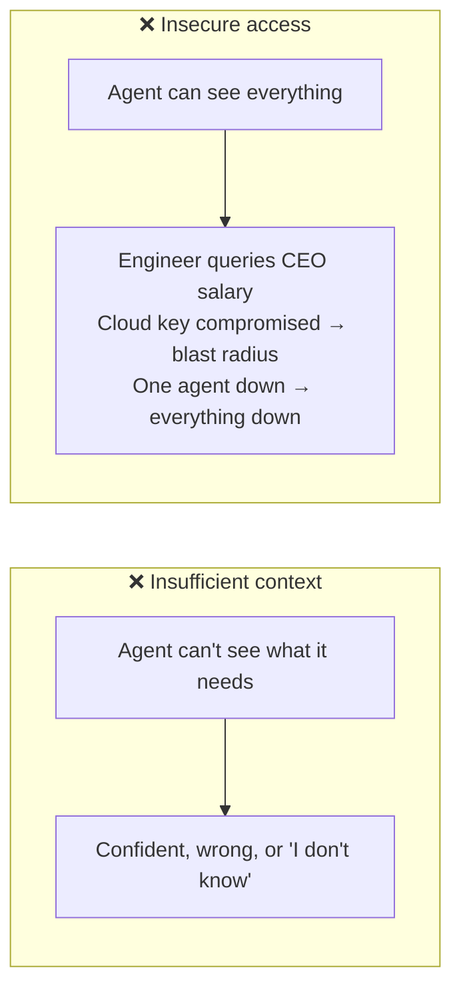
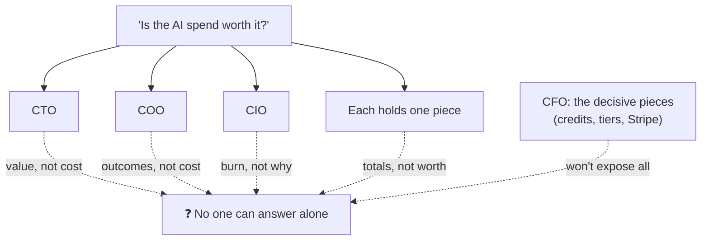
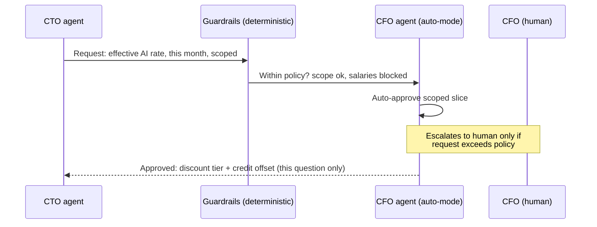
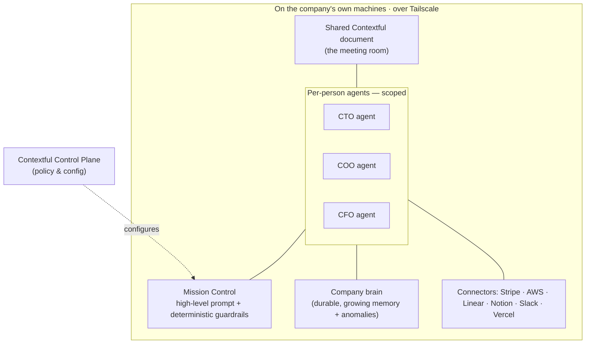
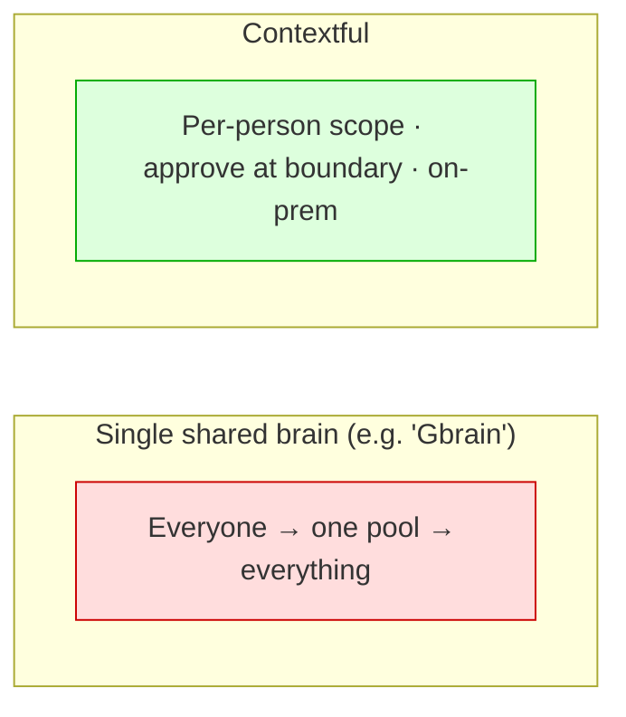

# Contextful — Demo Story & Presentation Flow

> **Logline:** Every company wants one AI that knows everything. That's exactly the
> thing you must never build. **Contextful** is the company brain that gets *smarter*
> as it gets *more careful* — scoped per person, approved at the boundary, run on your
> own machines.

This document is the **story spine** for the talk + demo. Slides and the AI-generated
video are derived from it. Read top to bottom: it's written as a narrative arc, then
broken into a slide skeleton and production notes at the end.

---

## The one-sentence problem

A 50-person company runs on Claude, Notion, Slack, Linear, AWS, Vercel, and Stripe —
and **nobody can answer "is this spend worth it?"** because the context needed to
answer it is split across people who each only hold one piece, and the obvious fix
(*dump it all into one all-knowing agent*) is the one thing that gets you breached.

Contextful answers the question **without** building the thing that gets you breached.

---

## Act 1 — The Problem (cold open)

### Beat 1: The CEO's "SuperAgent"

Open on a confident CEO at an all-hands:

> "We built a **SuperAgent**. It has *all* of our context. Ask it anything — finances,
> code, customers, salaries — it just knows."

The room applauds. Cut to the engineering corner: someone quietly types into the
SuperAgent: *"What's the CEO's salary?"* — and it answers.

### Beat 2: The slap (meme)

**Batman-slapping-Robin** meme format:

- **CEO:** "Our SuperAgent has ALL the context, it can answer anyth—"
- **🦇 *SLAP* 🦇** — "**Why did you give it all the access?**"

This is the thesis in one frame: **all context in one place = all access in one place.**

### Beat 3: The leak (Silicon Valley homage)

Channel the **Nucleus phone leak** from *Silicon Valley* S2 — a drunk Hooli dev leaves
a prototype phone on a bar stool; Big Head hands it to Richard; one careless moment
hands a competitor everything.

The lesson re-skinned for AI: a single store that holds everything needs only **one**
careless moment — one compromised key, one over-broad prompt, one leaked session — to
spill the whole company. The "SuperAgent" *is* the prototype phone on the bar stool.

> Use the HBO *Silicon Valley* musical/visual theme for the cold open and outro stings.

### Beat 4: The two failure modes

Frame everything after this as two recurring failures:

- **Insufficient context** → the agent is useless: it can't answer the real question.
- **Insecure access** → the agent is dangerous: CTO querying the CEO's salary, a
  compromised cloud provider leaking the lot, a single point of failure taking
  everything down.

Today you're forced to pick one. **Contextful refuses the trade-off.**

---

## Act 2 — The Scenario (the cast & the mess)

A real situation (from Vincent's experience), told without the FinOps jargon.

**Setup:** A 50-person software company is trying to spend smarter. Leadership wants to
know which AI and agentic workflows — across engineering *and* operations — actually
earn their keep. The work runs on **Claude, Notion, Slack, Linear, AWS, Vercel, and
Stripe.**

**The question on the table:** *"We're burning a lot every month on AI and cloud. Does
it make sense?"*

Simple question. **Nobody can answer it alone**, because each person holds one piece and
no one is allowed to hold all of them:

| Persona | What they know | What they're blind to |
| --- | --- | --- |
| **CTO + Engineering** | Whether the Claude Code / agent usage is *worth it* in output | Actual pricing, discount tiers, what it really costs |
| **CTO (alone)** | More of the cost picture | Won't commit invoices to a GitHub repo the whole team can read |
| **COO + Ops** | Whether a workflow's *outcome* clears the bar; runs the evals | Any cost or pricing visibility |
| **Finance** | The invoice totals | Whether $100k/mo on tokens is reasonable or insane |
| **CIO** | Sees a huge monthly burn | No idea what it's *for* |
| **CFO** | Credits offsets, discount tier, team budgets, **+ Stripe** revenue/cashflow to size budgets per product & client | Doesn't want to expose all of it to everyone |

**Why the existing tools don't close the gap:**

- **AWS Budgets + fine-grained IAM** is genuinely good — until you have *many* services
  (Vercel, Stripe, Claude, …) and the picture fragments across all of them.
- **Aggregators (e.g. vantage.sh)** are missing the connectors you actually need.
- The decisive context — **what's offset by credits, which discount tier you're on,
  team-based budgets, and the Stripe revenue that justifies it** — lives only with the
  CFO.

**The trap:** The "obvious" fix is a single company context store — a SuperAgent —
where anyone can ask anything. But that's the world where an **engineer can query
everyone's salary.** The thing that would answer the question is the thing you can't
allow to exist.

---

## Act 3 — The Solution (the live demo)

**Contextful** is a **company brain with a boundary at every person.** Each member's
agent holds only *their* context. When an answer needs something across a boundary, the
request is **routed to the owner's agent, approved, and scoped** — the data crosses the
line for *that question only*. Everything runs **on the company's own machines.**

> The whole demo happens inside **one shared Contextful document** — think a meeting
> room where each person has an agent at the table.

### Demo beat 1 — The question lands

The **CIO** posts into the shared doc:

> "We're burning $X/month on AI + cloud. Justify it — by next standup."

Around the table: the CTO's agent, the COO's agent, the CFO's agent. Each can see only
what its owner can see.

### Demo beat 2 — Engineering brings *value*, not *cost*

The **CTO's agent** pulls engineering signal it's allowed to see — Claude Code usage,
Linear throughput, what shipped — and reports the *value*. But it **can't** see real
pricing or discount tiers. It hits the boundary.

### Demo beat 3 — A request crosses the boundary (the key moment)

Instead of failing or over-reaching, the CTO's agent **raises a scoped request**:

> "To answer this I need: effective rate after discount + credit offset for *this
> month's AI spend*. Not invoices. Not salaries."

The **CFO's agent**, in **auto mode**, evaluates the request against **deterministic
guardrails** and the CFO's policy — and **approves just that slice.** No permission
fatigue, no exposing the full ledger.

> **Talking point — "auto mode":** agents handle the safe, in-policy requests
> themselves and **only raise to a human when something exceeds the guardrails.** That's
> how you avoid the click-yes-to-everything fatigue that kills permission systems.

### Demo beat 4 — The CFO's agent grounds it in revenue

The CFO's agent pulls **Stripe** data (mock data populated from a Kaggle dataset) and
adds the piece only it has: *this product line's spend is covered by the revenue it
drives; here's the cashflow headroom.* Now the answer has a denominator.

### Demo beat 5 — The brain catches what humans missed

Contextful surfaces an **anomaly** it learned from prior months:

> "This month's spend is **38% above** the pattern. Driver: a runaway agent workflow on
> AWS that's been retrying since the 3rd. That, not the token spend, is your overage."

It learned the baseline from **past months' mistakes** and flags the outlier
automatically.

### Demo beat 6 — The answer assembles itself — and the boundary holds

The shared doc now contains a **synthesized, sourced answer**: every claim attributed to
the agent/owner that vouched for it (value ← CTO, rate ← CFO, revenue ← CFO/Stripe,
anomaly ← Contextful). Meanwhile, an **engineer in the same document still cannot see
salaries.** The scoping held the whole time. *That's the proof.*

### What just happened (architecture)

The pillars to land on screen:

- **Scoped agents** — each member's agent has *partial* access; nothing holds everything.
- **Auto mode + human-in-the-loop** — agents decide what's safe, raise the rest.
- **Mission Control** — steer with a high-level prompt *and* pin down
  **deterministic guardrails** (not vibes).
- **Learns over time** — baselines from past months → anomaly detection this month.
- **On-prem, over Tailscale** — data never leaves your machines; the network is yours.
- **Configured via our Control Plane** — policy and topology set once, centrally.
- **[TBC] Ad-hoc connectors** — an agent writes a one-off integration connector using
  our primitives when a source isn't wired yet.

---

## Act 4 — Why this matters (outro)

### Beat 1: The status quo is *blocking*

> Most organizations didn't solve this. **They just blocked Claude (and the rest)
> entirely.** Safety by amputation — and they lose every bit of the upside.

Contextful is the third option: keep the upside, scope the risk.

### Beat 2: Not another shared brain

Other memory systems are **all-or-nothing and cloud-bound** — a single pool everyone
queries. Contextful is **boundaried and local-first**: the brain gets richer *because*
access stays scoped, not despite it.

### Beat 3: The local stack is ready

The local/on-prem stack is **more powerful than ever** — capable local inference
(LM Studio + Gemma, OpenAI-compatible) means real work runs on your own machines.
**Workloads are going hybrid**: sensitive context stays local, burst goes out under
policy. Contextful is built for that world.

### The two things to prove on stage

1. **You can analyze and answer real questions with the company brain** — the FinOps
   question gets a genuine, sourced answer.
2. **The company brain actually *grows*** — this month's approved reasoning, guardrails,
   and the caught anomaly become durable memory, so next month the same question is
   answered faster and the policy is already codified.

---

## Slide deck (≤ 9 slides — the deck is built from this)

**Slide principles:** keep it simple — **fewer than 10 slides**, **mostly jargon-free**.
Each slide = **one idea + one money line**; the detail lives in the speaker notes, not on
the slide. Only the **technical breakdown slides (max 3)** may use technical terms — mark
them. Everything else must read to a non-technical exec. The deck is generated and kept in
sync from this table by the **`slidev-deck`** skill → `slides/slides.md`.

| # | Slide | One idea on screen | Source | Jargon? |
| --- | --- | --- | --- | --- |
| 1 | **Hook** | "The company brain you don't have to be afraid of." Cold open: CEO brags → an intern asks the CEO's salary → it answers → *slap*: "why'd you give it all the access?" | Act 1 (one continuous ~12s gag; drop the Nucleus bit) | No |
| 2 | **The problem** | Too little context → useless. Too much access → dangerous. Today you're forced to pick one. | Act 1 · Beat 4 | No |
| 3 | **The scenario & the trap** | 50 people, 7 tools, one question — *"is the spend worth it?"* Nobody can answer alone, and the obvious fix (one all-knowing AI) is the one you can't allow. | Act 2 | No |
| 4 | **Contextful** | A boundary at every person. The brain gets smarter as it gets more careful. | Act 3 intro | No |
| 5 | **Live demo** | The question → a scoped request → approved at the boundary → a sourced answer assembles. **And the engineer still can't see salaries** — the money shot. | Act 3 · Beats 1–6 (anomaly demoted to a one-line flourish) | No |
| 6 | **How it works** 🔧 | Scoped agents; a **deterministic policy engine** decides the boundary (the agent only *drafts* the request); auto-mode escalates to a human only on a policy breach. | Act 3 architecture | **Technical 1/3** |
| 7 | **Where it runs** 🔧 | On-prem over Tailscale; Mission Control + guardrails; control plane; the brain grows (learns baselines, flags anomalies). | Act 3 architecture | **Technical 2/3** |
| 8 | **Why now** | Most companies just *blocked* AI (safety by amputation). Other brains are one shared cloud pool; Contextful is boundaried + local-first. Workloads are going hybrid. | Act 4 (de-named — no "Gbrain") | No |
| 9 | **The ask** | What we want — design partners (companies that already blocked AI and want the upside back). *Replace with the real ask once decided.* | Act 4 close | No |

> **Cut from the long narrative for the spoken talk** (kept here as source material / for
> the investor & appendix version): the separate CEO / Batman / Nucleus slides (now one
> hook), the persona-cast slide, the "why today's tools fail" slide (one line on slide 3
> is enough), and the named competitor. Money shot (slide 5 salary denial) should be a
> **hard-coded policy rule**, never a live model call — see `.tmp/presentation-review.md`.

---

## Production notes

- **AI-generated video** for the cold open (Acts 1) and outro stings.
- **Theme:** HBO *Silicon Valley* — musical sting + visual language. The **Nucleus
  phone leak** is the explicit analogy for "one careless moment spills everything."
- **Memes:** Batman-slapping-Robin for the access punchline.
- **Demo data:** Stripe connector populated with **mock data from a Kaggle dataset** —
  realistic revenue/cashflow without exposing anything real. Keep the FinOps language
  plain; no jargon on screen.
- **Demo staging:** run the whole thing inside **one shared Contextful document** so the
  "meeting room of agents" reads instantly. Show the engineer's blocked salary query
  live — the denial is the money shot.
- **Tone:** the trade-off everyone accepts (useless *or* dangerous) is false; show the
  third path working end to end.

---

## Open items to confirm before the deck

- Real production domain (replace `https://example.com` placeholders in landing/web).
- Exact `$X/month` burn + the anomaly % to use in the demo (pick numbers that read).
- "Gbrain" comparison: confirm which system(s) we name vs. describe generically.
- **[TBC]** Whether the ad-hoc-connector-writing beat is in-scope for this demo or
  teased as roadmap.
