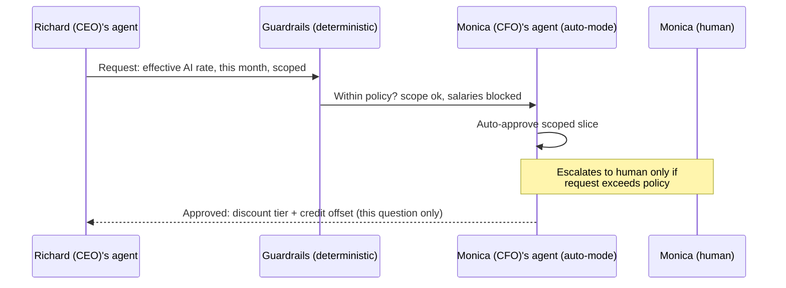
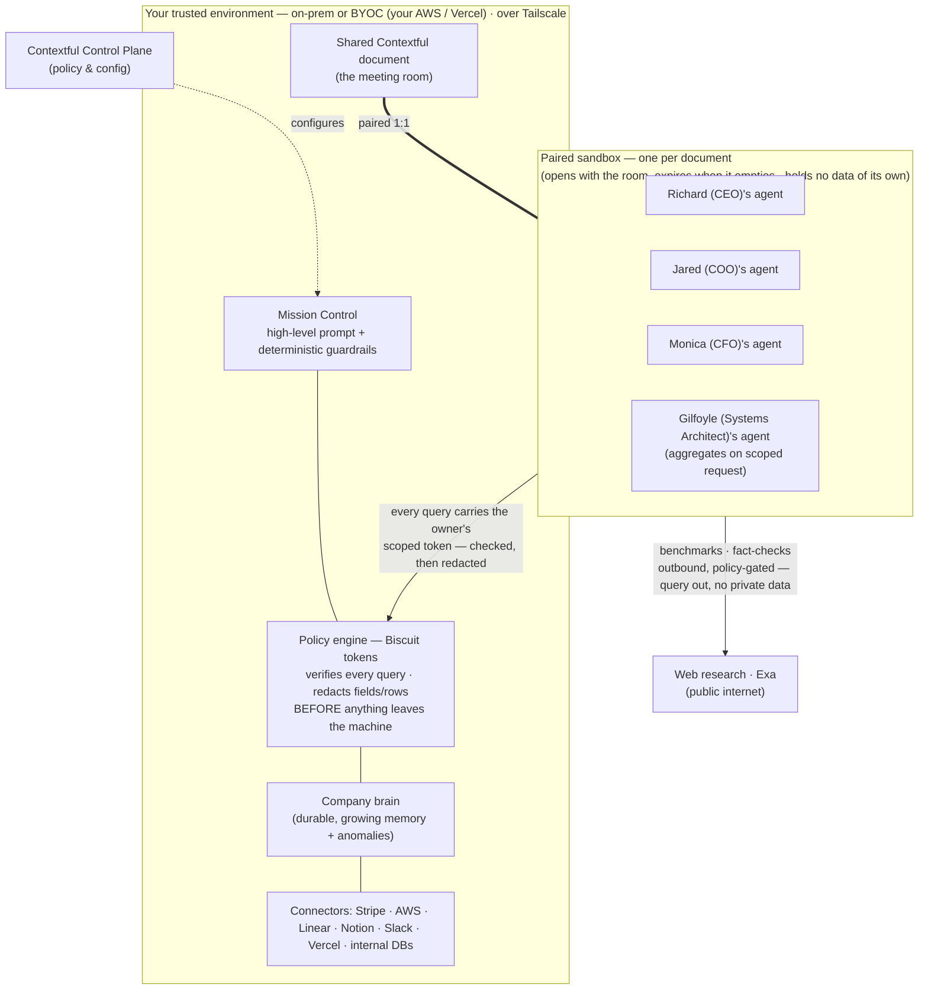
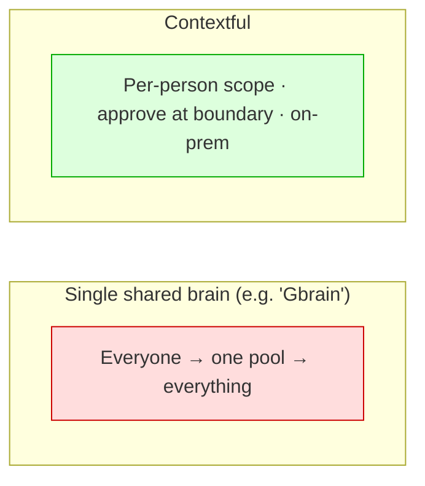

# Contextful — Demo Story & Presentation Flow

> **Logline:** Every company wants one AI that knows everything. That's exactly the
> thing you must never build. **Contextful** is the company brain that gets *smarter*
> as it gets *more careful* — scoped per person, approved at the boundary, run in your
> trusted environment: on-prem or your own cloud.

This document is the **story spine** for the talk + demo. Slides and the AI-generated
video are derived from it. Read top to bottom: it's written as a narrative arc, then
broken into a slide skeleton and production notes at the end.

---

## The one-sentence problem

A 50-person company runs on Claude, Notion, Slack, Linear, AWS, Vercel, and Stripe —
and **nobody can answer "is this spend worth it?"** because the context needed to
answer it is split across people who each only hold one piece, and the obvious fix
(*dump it all into one all-knowing agent*) is the one thing that gets you breached.

Contextful answers the question **without** building the thing that gets you breached.

---

## Act 1 — The Problem (cold open)

### Beat 1: The CEO's "SuperAgent"

Open on a confident CEO at an all-hands:

> "We built a **SuperAgent**. It has *all* of our context. Ask it anything — finances,
> code, customers, salaries — it just knows."

The room applauds. Cut to the engineering corner: someone quietly types into the
SuperAgent: *"What's the CEO's salary?"* — and it answers.

### Beat 2: Things go south

### Beat 3: The three bad options

Today every company picks one of three bad options — ask the room: **do you…**

- **Give AI all your context?** → dangerous: a CTO querying the CEO's salary, a
  compromised cloud provider leaking the lot, a single point of failure taking
  everything down. (And starving it instead → useless: it can't answer the real
  question.)
- **Block AI usage?** → safety by amputation — you lose every bit of the upside.
- **Hand your company brain to some startup?** → your most sensitive context sitting
  on someone else's infra.

### Beat 4: Why me — "I'm Vincent"

Step out of the gag and address the room directly — the earned-insight beat:

> "I'm **Vincent** — **fractional CTO / CISO to startups**. I've seen this in many
> companies: the all-knowing agent, the blanket ban, the company brain on someone
> else's cloud. **In order to address this**, I built Contextful."

One sentence of lived credibility before the solution reveal — this isn't a
hypothetical problem borrowed from a TV show; it's the one I get hired to fix.

---

## Act 2 — The Scenario (~30 seconds, then straight into the demo)

Keep this to **one beat on stage** — set the question, name the trap, and jump into the
live demo. The demo *shows* the rest of the scenario; don't tell it on slides.

**Richard (CEO) writes in the shared doc:** *"Let's improve AI optimization spending
for 2026 Q3."* **Jared (COO) adds the nuance:** *"We can't just cut cost — we're growing.
We need to check unit economics: cost per compression ($/KB) at the client."* The real
question underneath: we're burning a lot on AI tokens and cloud to run the compression
SaaS — is it worth it, per KB we compress?

Simple question, and **nobody can answer it alone** — not even Richard: his own agent
knows whether the agents are *worth it* but not what they cost; Jared (COO) runs the
outcome evals but sees no pricing; Monica (CFO) holds the decisive pieces — credits,
discount tier, Stripe revenue — and won't expose them to everyone; Gilfoyle (Systems
Architect) knows *how* to join it all but holds no standing access at all.

**The trap:** the obvious fix is one all-knowing SuperAgent anyone can ask anything.
But **this is not how organizations work** — organizations run on need-to-know
boundaries. That single store is the world where an **engineer can query everyone's
salary.** The thing that would answer the question is the thing you can't allow to
exist.

> **Cast reference (speaker notes, not slides)** — the cast is always the **Pied Piper
> team** (HBO *Silicon Valley*), displayed **"Name (Role)"** everywhere — and the same
> convention for agents: **"Richard (CEO)'s agent"**, never "Richard's agent". Who
> holds what, used by the demo beats below:
>
> | Persona | Holds | Blind to |
> | --- | --- | --- |
> | **Richard (CEO)** | Asks the question. His agent: Claude Code / agent usage value, Linear throughput, what shipped | Pricing, discount tiers, real cost |
> | **Jared (COO)** | Outcome evals — which workflows clear the bar | Any cost or pricing |
> | **Monica (CFO)** | Credit offsets, discount tier, team budgets, **Stripe** revenue/cashflow | — (won't expose it all) |
> | **Gilfoyle (Systems Architect)** | *How* to join Stripe revenue with the internal warehouse into per-product cost/margin/ROI | Holds **no** standing access; works only released slices |
> | **Dinesh (CTO)** | His own code context | Salaries, finance — and that's the point |
>
> Why existing tools don't close the gap (one line if asked): per-service tools (AWS
> Budgets + IAM) fragment across Vercel/Stripe/Claude; aggregators lack the connectors;
> and the decisive context (credits, tiers, revenue) lives only with Monica (CFO).

---

## Act 3 — The Solution (the live demo)

Take a step back: **do you trust ingesting all your company data into someone's
cloud?** That's what every "company brain" on the market asks you to do.

**Contextful** is a **local-first collaboration workspace for your agents** — your
data, your rules — with a **boundary at every person.** Each member's agent holds only
*their* context. When an answer needs something across a boundary, the request is
**routed to the owner's agent, approved, and scoped** — the data crosses the line for
*that question only*. Everything runs **in a trusted environment the company chooses**
— fully on-prem (an office Mac Studio) or **BYOC** in the company's own cloud accounts
(AWS, or Vercel) — never in someone else's pool.

> The whole demo happens inside **one shared Contextful document** — think a meeting
> room where each person has an agent at the table. **Every document is paired with its
> own isolated sandbox** — the room's agents run there, and that's where the access
> boundary bites: an agent inside holds only its owner's scoped token, and nothing
> enters the sandbox that policy hasn't already filtered.

> **Demo principle — the product speaks for itself.** The demo is not a screen
> recording and not a localhost build: it runs live at **demo.contextful.work**, where
> the audience sees **agents actively collaborating in real time** — presence in the
> roster, live cursors, drafts assembling in the shared doc — playing out the
> **designed scenarios** below. Anyone can open the URL during the talk and watch the
> same room. The narration explains *why* it matters; the screen proves *that* it works.

### Demo beat 1 — The brain lives on the on-prem machine

Open on the **on-prem machine itself** (the office Mac Studio running the Contextful
host). Monica (CFO) **has been ingesting Stripe data into the company brain** — revenue
events, credits, the discount tier — as part of normal operation, not staged for the
demo.

Prove it with nothing but the **filesystem**: open `~/.contextful` and browse the
**memory files** — human-readable **Markdown cards** you can read with `ls` and `cat`,
not an opaque vector dump in someone's cloud. The audience sees the actual artifacts
the agents will draw on: synthesized Stripe memory, tagged `finance_private`, sitting
on a machine the company owns.

Quick context pan while the files are on screen: the brain feeds from the same messy,
live surfaces a real company has — **Slack** (standups, the cost-argument thread,
Richard (CEO) dropping the question), **Stripe** (revenue events seeded from a Kaggle
dataset), **PostHog** (the analytics Jared (COO)'s evals read). Everything that follows
is answered from *this world*, not a spreadsheet we prepared.

### Demo beat 2 — The question is in the doc; Monica (CFO) queries it live

Switch from the filesystem to **demo.contextful.work**. The shared doc already carries
the thread, written by the cast:

> **Richard (CEO):** "Let's improve AI optimization spending for 2026 Q3."
>
> **Jared (COO):** "We can't just cut cost — we're growing. We need to check unit
> economics: cost per compression ($/KB) at the client."

Then the presenter, **typing live on behalf of Monica (CFO)** — no canned playback —
queries her agent: **"What's our out-of-pocket expense for the compression SaaS this
month?"** Her agent answers **from the exact Markdown cards the audience just saw on
disk** — gross spend, credits, discount tier → the net number. That's the link to
land: what you `cat`-ed ten seconds ago is what answers in the browser — same brain,
same machine, two views.

### Demo beat 3 — Same question from Dinesh (CTO)'s laptop — denied

Physically **switch machines**: Dinesh (CTO)'s laptop, same room, same shared doc.
The presenter types the **same out-of-pocket query on his behalf** — and the policy
engine **blocks it**: his token carries no grant for `finance_private`, so the query
is denied *before* any data leaves the host. Deterministic policy, not a model's good
manners. Two laptops, one question, opposite outcomes — **the boundary is per-person,
and it's real.** (It also plants the money shot: Dinesh is blind to finance — and to
salaries, as beat 4 will make cheeky use of.)

### Demo beat 4 — The killer shot: one query, four different answers

With Richard (CEO)'s 2026 Q3 question already in the doc, **the same query is put to
every agent at the table.** Each one answers *differently* — not because they're different
models, but because **each holds only its owner's slice, and the access-control policy
decides what each may say:**

- **Richard (CEO)'s agent** → the *value*: Claude Code usage, Linear throughput, what
  shipped. On cost: *"I can't see effective rates or discount tiers."*
- **Jared (COO)'s agent** → the *outcomes*: which workflows clear the eval bar. No cost
  figures at all.
- **Monica (CFO)'s agent** → the *money*: effective rate after discounts, credit
  offsets, Stripe revenue per product — and it volunteers nothing beyond what policy
  allows.
- **Dinesh (CTO)'s agent** → asked the same question (and, cheekily, *"what's
  Richard's salary?"*) → **denied by policy.** A hard-coded rule, not a model's good
  manners.

Same question, four scoped answers. **That's the product in one shot:** the brain spans
the whole company, but every answer abides by the boundary.

> While agents draft, they also reach *outward* — a **web-research** pass (**Exa**) for
> the *public* market rate of the models and clouds in use. Open-internet benchmark, no
> boundary crossing; every figure lands with its **source link inline.**

### Demo beat 5 — A request crosses the boundary (the key mechanism)

Instead of failing or over-reaching, Richard (CEO)'s agent **raises a scoped request**:

> "To answer this I need: effective rate after discount + credit offset for *this
> month's AI spend*. Not invoices. Not salaries."

**Monica (CFO)'s agent**, in **auto mode**, evaluates the request against
**deterministic guardrails** and Monica's policy — and **approves just that slice.**
No permission fatigue, no exposing the full ledger.

> **Talking point — "auto mode":** agents handle the safe, in-policy requests
> themselves and **only raise to a human when something exceeds the guardrails.** That's
> how you avoid the click-yes-to-everything fatigue that kills permission systems.

### Demo beat 6 — A specialist works the released slices (on request)

Monica (CFO) and Jared (COO) want the view nobody has produced yet: *spend per product
vs. the revenue it drives.* They **request Gilfoyle (Systems Architect)'s agent** —
which holds **no** standing access. The scoped request releases exactly what the job
needs (**Stripe** revenue by product + the internal product/usage warehouse, nothing
else), and Gilfoyle's agent joins them into per-product revenue, cost, and margin. Two
boundaries crossed, **never pooled** — the slices existed for this question only. A
specialist invoked **on request**, not a standing all-seeing analyst.

### Demo beat 7 — The answer assembles — and the boundary holds

The shared doc now contains a **synthesized, sourced answer**: every claim attributed
to the agent that vouched for it (value ← Richard (CEO), rate ← Monica (CFO), revenue
← Monica (CFO)/Stripe, product performance ← Gilfoyle (Systems Architect), market
benchmark ← Exa). As a one-line flourish,
the brain flags an **anomaly** learned from prior months — *"spend is 38% above
pattern; driver is a runaway AWS agent workflow retrying since the 3rd, not the
tokens."*

During synthesis, a regular **web-research pass (Exa)** re-checks the external
benchmarks and **cites each source next to the claim it backs** — only the *query*
leaves the network, never private context.

And the closing callback to beats 3–4: **Dinesh (CTO), in the same document,
still cannot see salaries** — the same boundary that denied his out-of-pocket query
on his own laptop. The scoping held the whole time. *That's the proof.*

### What just happened (architecture)

The pillars to land on screen:

- **Scoped agents** — each member's agent has *partial* access; nothing holds everything.
- **One sandbox per document** — every shared doc is paired with its own isolated,
  disposable sandbox; its agents run there with **no ambient authority** (no filesystem,
  no open network — the brain is the only door). Each agent carries only its owner's
  attenuated token, and every query is verified and redacted *before* data enters the
  sandbox. The sandbox stores nothing; findings flow back to the brain and the sandbox
  expires with the room.
- **Specialist agents on request** — a worker like **Gilfoyle (Systems Architect)'s
  agent** aggregates product performance across Stripe + internal databases, but only on
  a scoped request from Monica (CFO) / Jared (COO) — never as a standing, all-seeing
  analyst.
- **Researches the open web** — agents ground answers against the public internet via
  **Exa** (integrating in a separate PR): inline **while editing** the doc, and as a
  regular pass **during synthesis.** Every external figure is cited; only the query goes
  out (policy-gated), never private context.
- **Auto mode + human-in-the-loop** — agents decide what's safe, raise the rest.
- **Mission Control** — steer with a high-level prompt *and* pin down
  **deterministic guardrails** (not vibes).
- **Learns over time** — baselines from past months → anomaly detection this month.
- **Your trusted environment** — data never leaves infrastructure you control: fully
  **on-prem** (e.g. a Mac Studio, over Tailscale — the network is yours) or **BYOC** in
  your own AWS / Vercel accounts. Inference follows the same rule: local (LM Studio +
  Gemma) on-prem, or your own Bedrock / AI Gateway credentials in BYOC — never a
  third-party pool. Say on stage which one is answering.
- **Configured via our Control Plane** — policy and topology set once, centrally.
- **[TBC] Ad-hoc connectors** — an agent writes a one-off integration connector using
  our primitives when a source isn't wired yet.

---

## Act 4 — Why this matters (outro)

### Beat 1: The status quo is *blocking*

> Most organizations didn't solve this. **They just blocked Claude (and the rest)
> entirely.** Safety by amputation — and they lose every bit of the upside.

Contextful is the third option: keep the upside, scope the risk.

### Beat 2: Not another shared brain

Other memory systems are **all-or-nothing and cloud-bound** — a single pool everyone
queries. Contextful is **boundaried and local-first**: the brain gets richer *because*
access stays scoped, not despite it.

### Beat 3: The memory doesn't just store — it works

The brain grows through **three channels**, and only one of them is you feeding it:

1. **Ingestion** — connectors pull the company's real surfaces (Slack, Stripe,
   PostHog, …) and synthesize them into **human-readable Markdown memory**, not an
   opaque vector dump.
2. **Research** — agents ground answers against the public web via **Exa**: pricing,
   benchmarks, vendor events — every figure cited, every result cached for offline.
   The **egress firewall** means only public terms ever leave the network; a private
   value can't be smuggled out inside a search query.
3. **Daydreaming** — overnight, on a cron schedule, the brain **connects cards on its
   own**: it samples pairs it's allowed to relate, grounds the hypothesis against world
   memory, and keeps the valuable ones as cited insight cards — *"Claude usage relates
   to the expiring discount tier"* is a connection nobody asked for. And the boundary
   holds even while it dreams: insights inherit the strictest tag of their parents and
   surface **only to the people cleared to see them** — the salary invariant survives
   the night.

So next month's answer isn't just faster because the data is there — it's better
because the brain spent the month **reading, checking, and thinking**.

### Beat 4: The local stack is ready

The local/on-prem stack is **more powerful than ever** — capable local inference
(LM Studio + Gemma, OpenAI-compatible) means real work runs on your own machines —
**that's what the stage demo runs: local inference on the Mac Studio you're looking
at.** And when you want more horsepower, **BYOC keeps the same trust boundary**: the
inference call goes to *your* AWS Bedrock account or *your* Vercel AI Gateway key —
your cloud, your contract, never our pool. **Workloads are going hybrid**: sensitive
context stays local, burst goes out under policy. Contextful is built for that world.

### Beat 5: BYOC — bring your own cloud (and connectors)

You're not locked to our infrastructure — **you choose where the brain runs**:

- **AWS** — your VPC, your account; the host runs as just another box you already audit.
- **Vercel** — the web surfaces (console, landing) deploy to your own Vercel projects;
  sandboxes provision there under your token.
- **Local** — an office Mac Studio or a laptop; the demo you just watched ran here.

Same binary, same policy engine, same Markdown memory — the deployment is a choice,
not an architecture change. And the connectors are yours too: your agent writes the
connector once, it runs on your machines — not $200 × N per connector, every month,
to reach your own data.

### Beat 6: The close — Contextful

End on the name and the three things it stands for, one line each:

> **Contextful.**
>
> - **Data stays in a trusted environment** — your machines, your network.
> - **Access control** — every answer abides by the boundary.
> - **Agents work with context** — scoped, approved, and growing.
>
> **Contextful — powering the command center.**

### The two things to prove on stage

1. **You can analyze and answer real questions with the company brain** — the FinOps
   question gets a genuine, sourced answer.
2. **The company brain actually *grows*** — this month's approved reasoning, guardrails,
   and the caught anomaly become durable memory; Exa research keeps it grounded in the
   public world; and the daydream loop connects cards overnight — so next month the same
   question is answered faster, the policy is already codified, and the brain has
   insights nobody asked it for.

---

## Slide deck (≤ 20 slides — the deck is built from this)

**Slide principles:** keep it simple — **no more than 20 slides**, **mostly jargon-free**.
Each slide = **one idea + one money line**; the detail lives in the speaker notes, not on
the slide. Only the **technical breakdown slides (max 3)** may use technical terms — mark
them. Everything else must read to a non-technical exec. The deck is generated and kept in
sync from this table by the **`slidev-deck`** skill → `slides/slides.md`.

| # | Slide | One idea on screen | Source | Jargon? |
| --- | --- | --- | --- | --- |
| 1 | **Hook** | "Workspace with your agents. Your data. Your rules." Cold open: CEO brags → an intern asks the CEO's salary → it answers → *slap*: "why'd you give it all the access?" | Act 1 (one continuous ~12s gag; drop the Nucleus bit) | No |
| 2 | **How to share company brain for everyone and agents** | Too little context → useless. Too much access → dangerous. Today you're forced to pick one. | Act 1 · Beat 4 | No |
| 3 | **Context for collaboration matters** | A **screenshot of the shared doc thread** (slot at `slides/public/assets/context-matters.png`): Richard (CEO): *"Let's improve AI optimization spending for 2026 Q3."* · Jared (COO): *"We can't just cut cost — we're growing. We need to check unit economics: cost per compression ($/KB) at the client."* CEO/CFO/CTO avatars below. Spoken: nobody can answer alone; the obvious fix (one all-knowing AI) is the one you can't allow. One slide, then demo. | Act 2 | No |
| 4 | **We let agents run a mock company** | The demo world is a **living simulation run by agents**, not seeded tables: **Slack** (the team actually talking — standups, the cost argument), **Stripe** (revenue events per product), **PostHog** (the analytics behind the evals). Money line: *"Everything that follows is answered from this world."* | Act 3 · Beat 1 context pan + production notes (simulated company) | No |
| 5 | **Do you…** | Ask the room — today you pick one of three bad options: **Give AI all your context?** (one careless query spills everything) · **Block AI usage?** (safety by amputation — you lose the upside) · **Hand your company brain to some startup?** (your context on someone else's infra). All three are bad. That's the point. | Act 1 · Beat 3 + Act 4 · Beat 1 | No |
| 6 | **I've seen this at many companies** | Title is the line itself. Body: "I'm **Vincent** — fractional CTO / CISO to startups. In order to address this, I built Contextful." On screen: Vincent's avatar (LinkedIn photo, exported to `slides/public/cast/vincent.webp`), linked to <https://www.linkedin.com/in/vincentlaucy> — and the **FractalBox brand** (wordmark + dark/mint theme mirrored from <https://fractalbox.dev/>; a deliberate one-slide theme break, it's the presenter's studio brand). | Act 1 · Beat 4 | No |
| 7 | **Contextful** | Local-first collaboration workspaces for your agents. **Your data. Your rules.** The brain gets smarter as it gets more careful. (Spoken open: "do you trust ingesting all your company data into someone's cloud?") | Act 3 intro | No |
| 8 | **Live demo** | **Live at demo.contextful.work — the product speaks for itself.** Open on the **on-prem machine**: Monica (CFO) has been ingesting Stripe into the company brain — browse the **memory files right on the filesystem** (readable Markdown, your machine, not a cloud) → the doc carries the thread (Richard (CEO): "improve AI optimization spending for 2026 Q3"; Jared (COO): "we can't just cut cost — check unit economics: cost per compression, $/KB at client") → Monica (CFO) **types the query live** ("out-of-pocket expense for the compression SaaS this month?") and gets the answer from those same cards → **switch laptops**: the same query on behalf of Dinesh (CTO) is **denied by policy** → **one query, four different answers** — each agent answers per its owner's access policy (the killer shot) → a scoped request approved at the boundary → a sourced answer assembles. **And Dinesh (CTO) still can't see salaries** — the money shot. | Act 3 · Beats 1–7 (anomaly demoted to a one-line flourish) | No |
| 9 | **How it works** 🔧 | **Each document is paired with its own isolated sandbox** — the room's agents run there with no ambient authority, holding only their owner's scoped token; a **deterministic policy engine** verifies and redacts every query *before* data enters the sandbox (the agent only *drafts* requests); auto-mode escalates to a human only on a policy breach. | Act 3 architecture | **Technical 1/3** |
| 10 | **Where it runs** 🔧 | **Your trusted environment, your choice:** fully **on-prem** (this Mac Studio, over Tailscale — inference included: LM Studio + Gemma, which is what's answering on stage) or **BYOC** in your own AWS / Vercel accounts (inference via *your* Bedrock / AI Gateway credentials — your cloud, never our pool). Mission Control + guardrails; control plane; the brain grows (learns baselines, flags anomalies); agents research the open web (Exa) — outbound, policy-gated, cited. Footer: **full tech docs on the landing page** (local-first & ingestion · sandbox & capability tokens · collaboration & CRDT). | Act 3 architecture + landing docs | **Technical 2/3** |
| 11 | **BYOC** | Bring your own cloud *and* connectors. **Deployment options shown as logos: AWS · Vercel · Apple (Local · Mac)** — same binary, same policy engine; the deployment is a choice, not an architecture change. All nodes joined over a **Tailscale zero-trust network** — your network, not the public internet. Per-document **sandboxes run on Vercel Sandbox, Docker, or OrbStack** — cloud or fully local. Connectors: your agent writes them once, they run on your machines — not **$200 × N per connector, every month**. Sample setup on screen: 2 server nodes (AWS box + office Mac Studio) and 3–4 client nodes on employee laptops. | Act 4 · Beat 5 + Act 3 ad-hoc connectors | No |
| 12 | **The ask** | What we want — design partners (companies that already blocked AI and want the upside back). *Replace with the real ask once decided.* | Act 4 close | No |
| 13 | **Close** | **Contextful. Your Agents. Your Data. Your Rules.** Money line: **"We power your command center."** (The three pillars — trusted environment · access control · agents with context — live in the spoken close.) | Act 4 · Beat 6 | No |

> **Cut from the deck on 2026-06-10** (kept in the narrative for the investor/appendix
> version): the **"Why now"** slide (Act 4 Beats 1–3 — blocked-AI status quo, daydream
> loop, hybrid workloads: now spoken material only) and the **three comic-frame slides**
> (the ~27s demo film after slide 1 carries the cold-open gag on its own; the frames
> remain in `assets/` for the landing page and socials).

> **Cold-open storyboard:** the comic frames in `assets/` (the brag 001 → the innocent
> cloud-cost ask 002 → the merged leak-and-shutdown panel 003+004,
> `slides/public/assets/003-004-merged.png`; regenerate via
> `apps/landing/scripts/merge-comic.mjs` + `compose-bubbles.py`) were **cut from the
> deck on 2026-06-10** — the ~27s demo-film slide right after slide 1 carries the
> cold-open gag alone. The frames stay in `assets/` as the visual-language source for
> the landing page, avatars, and socials.

> **Cut from the long narrative for the spoken talk** (kept here as source material / for
> the investor & appendix version): the separate CEO / Batman / Nucleus slides (now one
> hook), the persona-cast slide, the "why today's tools fail" slide (one line on slide 3
> is enough), and the named competitor. Money shot (slide 7 salary denial) should be a
> **hard-coded policy rule**, never a live model call — see `.tmp/presentation-review.md`.

---

## Production notes

- **AI-generated video** for the cold open (Acts 1) and outro stings.
- **Theme:** HBO *Silicon Valley* — used **consistently across every surface**: slides,
  the live demo fixtures, the web app's demo docs, and video stings. The cast is always
  the **Pied Piper team**, displayed **"Name (Role)"** — Richard (CEO), Monica (CFO),
  Jared (COO), Gilfoyle (Systems Architect), Dinesh (CTO) — and the **same
  convention applies to agents: "Richard (CEO)'s agent", never "Richard's agent"**
  (principal ids like `cto`/`agent:cto/1` stay stable on the wire; only display names
  carry the theme). Musical sting + visual language; the **Nucleus phone leak** is the
  explicit analogy for "one careless moment spills everything."
- **Cast avatars — from `assets/`:** persona avatars reuse the comic art in `assets/`
  (the cold-open frames are the visual language: Richard + Jared in `001.png`, Gilfoyle
  in `002.png`). Crop/export headshots to `assets/avatars/<name>.png` and use them
  **consistently everywhere a persona appears**: slide cast mentions, the demo doc
  facepile/roster in the web app, and the four-answers beat. Portraits missing from the
  existing frames (Monica, Dinesh) are generated in the same comic style via the
  `/generate-arts` skill. **Vincent's avatar** (slide 5) is the real LinkedIn photo —
  export it manually to `assets/avatars/vincent.png` (LinkedIn photos can't be
  hotlinked) and link the slide image to
  <https://www.linkedin.com/in/vincentlaucy>.
- **Memes:** Batman-slapping-Robin for the access punchline.
- **Demo data — the simulated company:** the demo world is a full company simulation,
  not seeded tables. **Slack** carries generated team conversation (standups, the
  cost-argument thread, the CEO's question), **Stripe** holds revenue events populated
  with **mock data from a Kaggle dataset**, and **PostHog** holds the product analytics
  the COO's evals read. Realistic surfaces without exposing anything real.
- **No business jargon on any user-facing surface** — slides, landing page, demo doc
  titles, web UI. "FinOps" is the canonical offender: say **"AI spend review"** (the
  demo doc is titled *"Q3 AI Spend Review"*). Industry shorthand stays in specs and
  speaker notes; the technical docs pages may use technical terms (CRDT, capability
  token) but not business jargon.
- **Web research:** the agent's open-web lookups use **Exa** (landing in a separate PR).
  For a reliable stage run, **cache/replay** the research results so it's deterministic;
  show the inline source citations either way.
- **Demo staging:** open on the **on-prem machine's filesystem** (`~/.contextful` —
  Stripe memory cards readable as Markdown) to ground the local-first claim, then run
  everything else inside **one shared Contextful document** so the "meeting room of
  agents" reads instantly. **Two physical machines on stage:** Monica (CFO) types her
  query live in the web app and is answered from the cards just shown on disk; then
  switch to Dinesh (CTO)'s laptop where the same typed query is denied
  by policy — rehearse the machine hand-off, it's the first visceral proof. Then put
  the **same query to every agent** — four scoped answers side by side is the killer
  shot. Show the engineer's
  blocked salary query live in the same pass — the denial closes the loop.
- **The product speaks for itself:** the demo runs **live at demo.contextful.work** —
  agents actively collaborating in real time (presence roster, live cursors, answers
  drafting in the doc), driven by the **designed scenarios** (Act 3 beats 1–5) so the
  collaboration is choreographed but genuinely live. Drop the URL on the slide so the
  audience can open the room and watch alongside; minimize narration over the screen —
  if the room isn't visibly alive on its own, the staging has failed. Rehearse the
  scenario runner end to end; keep a recent recording only as the catastrophic-failure
  fallback, never as the plan.
- **Tone:** the trade-off everyone accepts (useless *or* dangerous) is false; show the
  third path working end to end.

---

## Landing page — technical documentation

The landing page (`apps/landing`) is extended with a **"How it works" documentation
section** — for the technical visitor who lands after the talk and wants the mechanism,
not the pitch. The talk stays jargon-light; the depth lives here, one URL away. Slides
8–9 and the demo footer link to it.

Three doc pages, each derived from the corresponding spec (the spec is the source of
truth — the doc page is the readable narrative over it, kept in sync, not hand-forked):

1. **Local-first & data ingestion** (from `specs/00`, `02`, `05`) — the host runs on
   your machines (`~/.contextful` holds the store, the brain index, the keys); the
   relay and brain are on-prem over Tailscale. Connectors (Stripe, Slack, PostHog, …)
   pull raw events → the brain synthesizes them into **human-readable Markdown memory**
   with an SQLite+FTS5 index — not an opaque vector dump. World memory (Exa) and the
   daydream loop enrich it in the background; with no cloud creds everything degrades
   to the on-host cache and deterministic floor — never to fakes.
2. **Sandbox & capability tokens** (from `specs/03`, `04`) — every document is paired
   1:1 with an isolated, disposable sandbox; agents run there with **no ambient
   authority** (the brain MCP is the only door). Each agent holds an **attenuated
   Biscuit token** — cryptographically signed, append-only narrowing, Datalog-verified
   on every query — and the host **redacts fields/rows before data enters the
   sandbox**. Cover the `request_access` flow (auto-approve in-envelope, escalate to a
   human beyond it), taint-tracked writes, the egress firewall, and the salary
   invariant as the worked example.
3. **Collaboration & CRDT** (from `specs/01`) — every document is a live **Loro CRDT**
   room synced through the on-prem WS relay; presence, live cursors, and agent/human
   co-editing ride the same stream (one roster for both). Offline edits merge without
   conflicts when peers reconnect — local-first means the doc is *yours* even with the
   relay down. The web app embeds the Weaver editor over this; agents appear in the
   roster exactly like human collaborators.

Production notes for these pages:

- Follow the parent workspace SEO + agentic-SEO rules: each page gets its own metadata,
  JSON-LD (`Article`/`FAQPage` where it fits), a **Markdown variant served alongside the
  HTML**, and entries in `llms.txt` / `llms-full.txt` — an agent should be able to learn
  how Contextful works in one fetch.
- Diagrams reuse the Mermaid sources in this file and the specs; illustrations via the
  `/generate-arts` skill per ART-DIRECTION.md.
- Tone: answer-shaped — lead each page with the one-paragraph "how it works", then
  expand. The reader just watched the demo; the docs prove the mechanism is real.

---

## Open items to confirm before the deck

- Real production domain (replace `https://example.com` placeholders in landing/web).
- Exact `$X/month` burn + the anomaly % to use in the demo (pick numbers that read).
- "Gbrain" comparison: confirm which system(s) we name vs. describe generically.
- **[TBC]** Whether the ad-hoc-connector-writing beat is in-scope for this demo or
  teased as roadmap.
- **[TBC]** Web research (**Exa**, separate PR): run it **live** on stage or with
  **cached/replayed** results to keep the demo deterministic.
- **[TBC]** Audience access to the live room: demo.contextful.work is public, but the
  relay it syncs through lives on the demo host behind Tailscale — audience browsers
  can't reach it. Options: expose the relay WS via **Tailscale Funnel** for the talk,
  or scope "open it yourself" to presenter screens only.
