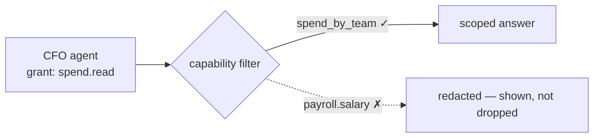

# Contextful

**Your Agents. Your Data. Your Rules.**

🌐 **Website:** [contextful.work](https://contextful.work/) · 🚀 **Live demo:** [demo.contextful.work](https://demo.contextful.work/)

<p align="center">
  
</p>

Every company wants one AI that knows everything. That's exactly the thing you must
never build. **Contextful** is the company brain that gets *smarter* as it gets *more
careful* — a **local-first collaboration workspace with your agents**, scoped per
person, approved at the boundary, run in a trusted environment you choose: on-prem or
your own cloud (BYOC).

Each member's agent holds only *their* context. When an answer needs something across
a boundary, the request is **routed to the owner's agent, approved, and scoped** — the
data crosses the line for *that question only*. Every agent sees **exactly what it is
permitted to** — capability-scoped, attenuable, field/row-enforced. The one-line claim:
*"the CTO's agent can't read the CEO's salary — provably."*

## Why not a SuperAgent?

Company context is split across people who each hold one piece — and the obvious fix,
one all-knowing agent, is the thing that gets you breached. Today you pick a failure
mode: **insufficient context** (the agent can't see what it needs — useless) or
**insecure access** (it sees everything — one prompt injection spills the company).

Contextful refuses the trade-off. **Omniscience is the vulnerability:**

| One omniscient SuperAgent | Contextful |
| --- | --- |
| Sees everything — so one prompt injection leaks everything. | Each agent sees a provable subset — never more than its grantor. |
| Trust by configuration: a forgotten ACL is a breach. | Trust by construction: scopes attenuate, they can't widen. |
| Your context lives in someone else's cloud. | Context stays on your machines — on-prem or BYOC. |
| No proof of what it could and couldn't access. | Every answer is auditable, with redactions shown inline. |

## What you get

- **Capability-scoped access** — agents inherit a subset of your permissions — never
  more. Delegation is attenuation, not trust.
- **A brain that grows** — Contextful ingests your tools, synthesizes context, flags
  anomalies, and learns from last month's mistakes — then answers questions over MCP.
- **Local-first & BYOC ** — runs on your machine over Tailscale. Cloud is optional,
  used only for sync transport and LLM inference. Your context stays yours.
- **Real-time collaboration** — humans and agents edit the same document together as
  peers, with live presence — powered by CRDT sync that works offline.

## The core idea — delegation is attenuation

An agent can never out-see its grantor. When you delegate, you hand over a *narrower*
slice of your own context — and that slice can only shrink as it passes down the chain.



- Scopes compose by **intersection**, never union.
- Redactions are **shown**, not silently dropped.
- Every grant is **revocable and auditable**.

## How it works

1. **Share a document** — create a doc and invite teammates *and their agents* into a
   shared, real-time workspace.
2. **Delegate scoped access** — grant your agent a narrow slice of your permissions.
   It asks for more only when it needs to.
3. **Ask the company brain** — agents answer from synthesized context —
   capability-filtered, with the parts you can't see redacted.

## Built on

- [Weaver](https://github.com/OpenHackersClub/weaver) — open-source local-first CRDT
  editor by the repository author [@debuggingfuture](https://github.com/debuggingfuture);
  powers the collaborative document editing in `apps/web`.
- [Loro](https://loro.dev) — the CRDT engine underneath: every document is a live
  `loro-crdt` room, synced through the Rust relay (`sync serve`).
- [Biscuit](https://www.biscuitsec.org) — attenuable capability tokens behind the
  scoped-grant model (`biscuit-auth` signed + Datalog-verified).
- [Model Context Protocol](https://modelcontextprotocol.io) — the brain is exposed to
  agents over MCP (stdio + streamable HTTP with per-call auth, via `sync mcp`).

## Prerequisites

- Node ≥ 22.13 and [pnpm](https://pnpm.io) 11
- Rust (stable) via [rustup](https://rustup.rs)

## Quick start

```bash
pnpm install            # JS deps for the whole workspace
pnpm dev:web            # the capability console (React Router 7 + Vite)
pnpm test               # protocol unit + acceptance e2e

# Backend (state under ~/.contextful; override with CONTEXTFUL_HOME):
cargo run -p sync -- ctl seed                 # seed principals, roots, envelopes, tokens
cargo run -p sync -- ingest --source stripe   # ingest mock FinOps data → synthesize cards
cargo run -p sync -- serve                     # Loro WS relay (authoritative peer)
cargo run -p sync -- mcp --principal cfo       # brain over MCP (JSON-RPC stdio)
cargo test -p sync                             # capability + brain tests (incl. salary invariant)
```

To see live presence in the web app, run the relay and start it with
`VITE_SYNC_URL=ws://localhost:7878/ pnpm dev:web`.

## Repository structure

A monorepo with two toolchains at the root: a **pnpm + Turborepo** workspace for JS
(`apps/*`, `packages/*`, `tests/*`) and a **Cargo** workspace for Rust (`crates/*`).

| Path | What | Stack |
| --- | --- | --- |
| `apps/landing` | Marketing / landing page — [www.contextful.work](https://www.contextful.work) | Astro (static) → Vercel |
| `apps/web` | Interactive capability console (Flows A & B) + live presence — [demo.contextful.work](https://demo.contextful.work) | React Router 7 (Vite), React 19 → Vercel |
| `apps/desktop` | macOS menu-bar app — bundles `sync` as a supervised sidecar, first-run wizard, Keychain identity | Tauri (standalone Cargo workspace) |
| `crates/sync` | Backend: capabilities, brain, MCP, Loro relay, control plane | Rust (7 subcommands) — self-hosted |
| `packages/protocol` | Capability engine + brain query + wire/MCP mirrors | TypeScript |
| `tests/acceptance` | End-to-end Flow A/B tests against the binary | vitest |
| `infra/` | Pulumi cloud recipes (standalone) | Pulumi TS |

The backend is implemented and tested end to end. Cloud paths (Exa, Stripe, Bedrock /
AI Gateway inference, Vercel Sandbox) are compiled in and selected at runtime by
env/creds; with no creds everything degrades to the on-host cache and a deterministic
offline floor — never to fakes.

See [CLAUDE.md](./CLAUDE.md) for the full command reference and architecture.
