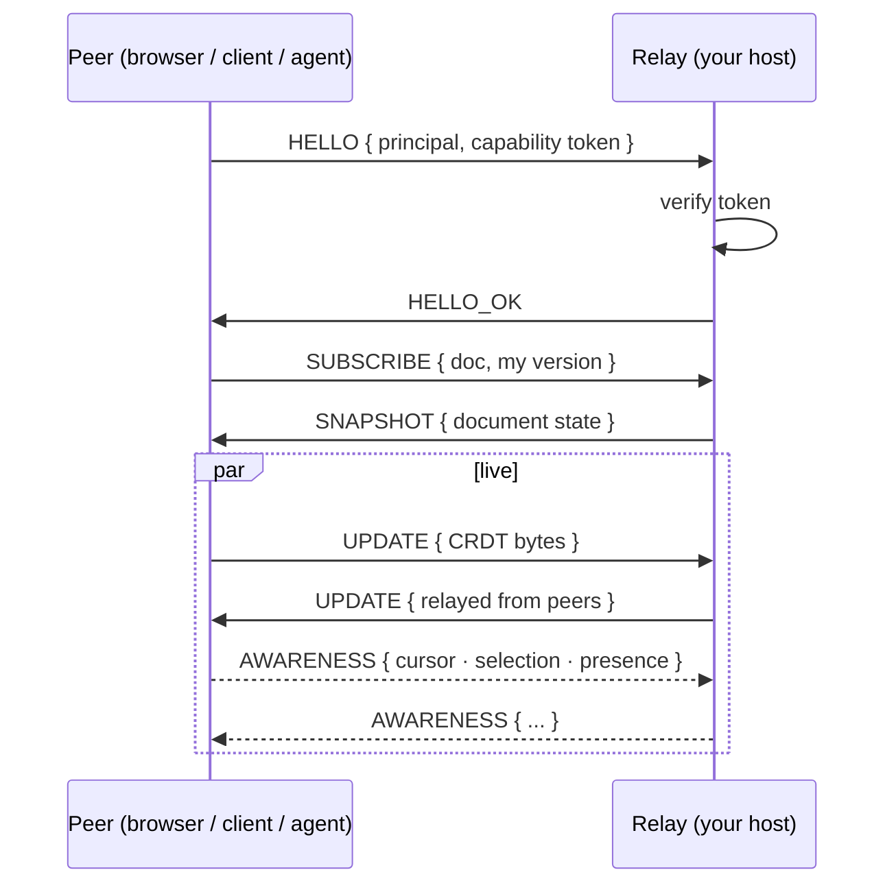

A Contextful document is a real-time collaborative room where **humans and their
agents are equal peers**: one shared roster, live cursors, and the same edit stream
for both. Under the hood every document is a [Loro](https://loro.dev) **CRDT** —
a data structure whose edits merge without conflicts by construction — synced through
a relay on your own machines. That's what makes collaboration local-first: the
document on your device is the real document, with or without a connection.

## Rooms: the collaboration unit

A room binds together one document, its members — people *and* agents, each with a
`read` / `write` / `comment` capability — and a paired
[sandbox](/docs/sandbox-capability-tokens/) where the room's agents run. Sharing a
document never widens what anyone's agent can read from the brain: room membership and
data access are separate boundaries, and the narrower one always wins.

Agents edit through exactly the same path as humans. Every agent edit carries an
origin tag, so provenance and per-peer undo work the same for a colleague and a
copilot.

## How sync works

The host's relay is the single authoritative peer; browsers, headless clients, and
sandbox agents all sync through it over the company's own Tailscale network.

Three details do the heavy lifting:

- **CRDT payloads are opaque bytes to the relay.** The relay authenticates peers and
  broadcasts updates; it doesn't need to understand your content to sync it.
- **Version vectors make catch-up cheap.** A returning peer sends what it has; the
  relay replies with exactly the missing delta, not the whole document.
- **Authorization rides the wire protocol.** The capability token arrives in the
  handshake and revocation is re-checked continuously — a principal revoked
  mid-session is dropped.

## Presence: seeing each other (and the agents) work

Who is in the room — and whether they're reading or writing — rides an ephemeral
awareness channel, separate from document edits and never persisted. Agents publish
presence too: when an agent is drafting, you see it in the roster and its cursor moves
in the document, exactly like a human collaborator. Awareness is deliberately dumb: it
carries cursors and presence, never document content or brain data.

## Offline is a feature, not a failure mode

Because the document is a CRDT, edits made offline are just updates that haven't been
delivered yet. When a peer reconnects, both sides exchange deltas and converge —
no locks, no "someone else has this open", no merge dialogs. The web editor persists
locally in the browser, the desktop client syncs documents to plain local files, and
the relay keeps a snapshot + oplog per document on the host's disk
(see [where your data lives](/docs/local-first-ingestion/)).

The live demo at [demo.contextful.work](https://demo.contextful.work) runs this exact
stack — open it in two windows and watch the cursors.
