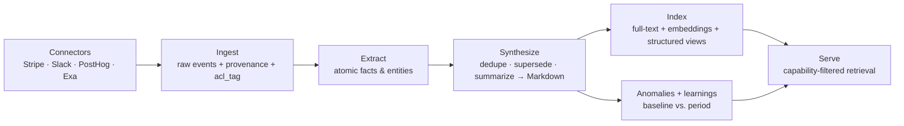

Contextful is local-first in the literal sense: the authoritative copy of every
document, every synthesized memory, and every access-control key lives on a machine
**you** run — a Mac Studio in the office, a box in your rack — under `~/.contextful`.
Connectors pull your company's real surfaces (Stripe, Slack, PostHog, and more) into
that store, and the brain synthesizes them into **human-readable Markdown memory** you
can open, edit, and `git diff`. Cloud services are optional accelerators, never the
home of your data.

## Where your data lives

The host runs one binary (`sync serve`) on your own hardware. Everything it knows sits
in one directory:

```
~/.contextful/
  control/        # principals, keys, policy envelopes
  docs/           # per-document CRDT snapshots + oplogs
  brain/          # synthesized memory — Markdown files, per topic
  brain.duckdb    # raw events, index, embeddings, anomalies
  caps/           # issued/attenuated token records (audit trail)
```

Peers — browsers, teammates' machines, agents — reach the host over your own
[Tailscale](https://tailscale.com) network (a WireGuard mesh). There is no Contextful
cloud in the data path: the network is yours, the disk is yours.

## How ingestion works

Every source goes through one connector contract: a connector declares the **views**
it exposes (the unit of access control) and pulls raw events, each stamped with
provenance and an access tag (`acl_tag`) at the moment it enters the system.



Three properties matter:

- **Memory is Markdown, not a vector dump.** Synthesized knowledge is a tree of
  Markdown cards a human can read. Cards self-wire: typed wikilinks in the prose
  become graph edges, so the brain is a navigable knowledge graph.
- **Access tags travel with the data.** A derived memory inherits the *strictest*
  access requirement of its sources (taint propagation) — synthesis can never launder
  a private fact into a public card.
- **Nothing is destroyed.** Stale facts are superseded with a timestamp, never
  overwritten, so the brain's history is auditable.

Ingestion runs on demand (`sync ingest --source stripe`) or on a cron schedule that
keeps the brain fresh — nightly Stripe, hourly web enrichment, and an off-peak
**daydream cycle** in which the brain proposes and grounds new connections between
cards on its own.

## The world stays outside, on purpose

Agents ground answers in public knowledge — list prices, benchmarks, vendor
changelogs — via the Exa search API. Those world facts are cached locally with their
source URLs, so every external figure is cited. Outbound queries pass an **egress
firewall**: only public-tainted terms may leave the host, so a private value can never
be smuggled out inside a search string.

## What happens when the cloud goes away

Local-first is tested, not aspirational. With no cloud credentials at all, Contextful
degrades to an on-host floor — never to fakes:

- Structured brain queries and field/row redaction need **no LLM** and keep working.
- Inference falls back to a local model server (LM Studio) on the host.
- Already-fetched world knowledge serves from cache; only fresh lookups pause.
- Documents remain editable offline and merge cleanly when peers reconnect — see
  [Collaboration & CRDT](/docs/collaboration-crdt/).

The boundary that protects your data — described in
[Sandbox & capability tokens](/docs/sandbox-capability-tokens/) — is deterministic
code on the host, so it holds with or without an internet connection.
