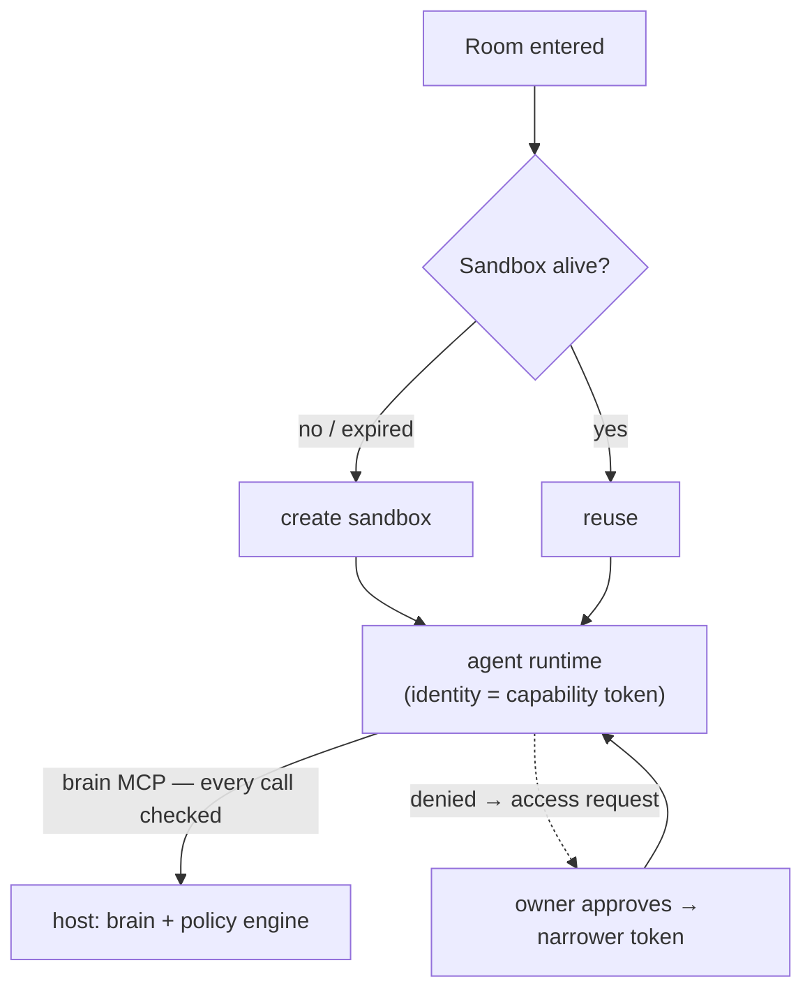
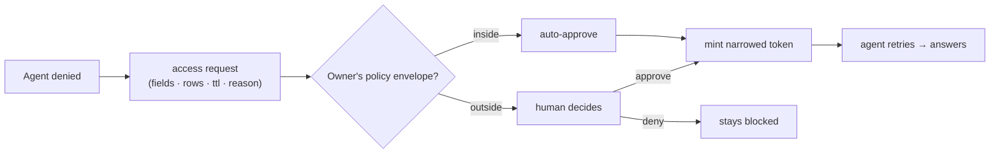

Every Contextful document is paired 1:1 with an **isolated, disposable sandbox** where
that room's agents run. An agent inside holds **no ambient authority** — no filesystem,
no open network; its only door to data is the brain's MCP interface, and every call
through that door is checked against a cryptographic **capability token** before a
single field crosses. The sandbox stores nothing durable and expires with the room.

## One sandbox per document

The sandbox opens when someone enters the room and expires when the last member
leaves. Provisioning is owned by the **host** — entering a room only signals presence;
it carries no authority to spin up compute. The host mints each agent's identity at
launch.



The trust boundary is **data egress, not compute locality**: whether the sandbox is a
cloud microVM or a constrained on-host process, it only ever receives the redacted,
capability-filtered slice the host's brain returns. Findings flow back through a
taint-tracked write path; nothing private accumulates in the sandbox itself.

## Capability tokens: authority you can only narrow

Access control is built on [Biscuit](https://www.biscuitsec.org/) tokens —
cryptographically signed, **attenuable** credentials whose policy is written in
Datalog and verified on every query.

Two design rules remove the usual single point of failure:

- **No super-root.** The control plane can register people and share documents, but it
  cannot mint authority over data. Each sensitive resource — say Stripe's
  `finance_private` view — has its **own root key, held by its owner** (the CFO).
- **Attenuation only narrows.** Delegating appends a block to the token that can add
  restrictions but never authority. An agent's capability is provably a subset of its
  owner's.

A delegation that passes on finance access while redacting salary looks like this:

```datalog
check if operation($op), $op == "query";
check if resource(view("stripe", $v));
deny if field("stripe", $any, "employee_salary");
allow_field("stripe", "finance_private", "discount_tier");
allow_field("stripe", "finance_private", "credits");
```

Because blocks are append-only and checks accumulate, no downstream holder can regain
what a parent denied.

## Enforcement happens before data moves

The host's brain query layer authorizes **each field and each row** against the
caller's token — structured results are column-redacted and row-filtered; prose memory
cards are all-or-nothing against their access tag. Redactions are *signaled*, never
silent, so an agent knows it may ask for more. All of this is deterministic code with
no LLM in the loop — the boundary is a policy engine, not a model's good manners.

When an agent is denied outright, it raises a structured **access request** naming
exactly the fields, rows, and time-to-live it needs. The owner's policy envelope
auto-approves safe, in-scope requests; anything beyond it escalates to the human.
Approval mints a fresh token narrowed to exactly the requested slice.



## The salary invariant

The property the whole design defends: **no token and no approval path outside the
CFO's own root ever yields `employee_salary`.** It is enforced at every layer — the
token grammar, the query-time authorizer, the request flow (which never even renders
an approve button for it), background synthesis (derived memories inherit the
strictest tag of their parents), and the egress firewall (a salary-tainted term is
blocked before it can reach the network). It is proven by property tests, not promised
by a prompt.

Every minted token, attenuation, and access request is recorded under
`~/.contextful/caps/` — the audit trail is part of the
[local-first store](/docs/local-first-ingestion/), on your disk.
