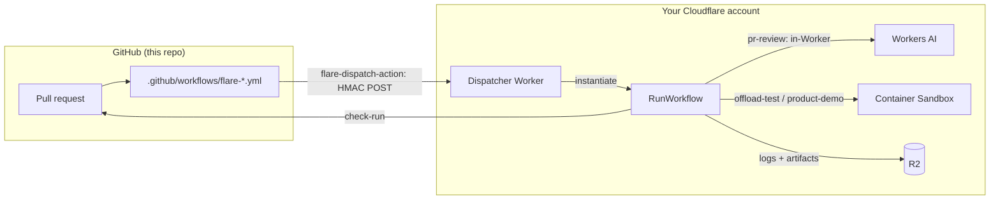

# FlareDispatch for superai2026

[FlareDispatch](https://github.com/OpenHackersClub/flare-dispatch) is a
"Bring Your Own Cloudflare" CI/CD platform: it offloads the expensive half of
GitHub Actions (agentic code review, test suites, browser-driven demos) onto a
Cloudflare stack **you** own — Workflows for orchestration, Containers for
execution, Browser Rendering for the demo, R2 for logs/artifacts. The GitHub
Actions job finishes in seconds; the real work runs on Cloudflare and reports
back to the PR as a check-run.

This directory adapts it to run three things for superai2026:

| Run | What it does | Workflow |
|---|---|---|
| **`pr-review`** | Multi-agent **code review** of every PR diff, posted as inline check-run annotations | [`flare-pr-review.yml`](../../.github/workflows/flare-pr-review.yml) |
| **`offload-test`** | **Runs the tests** — `cargo test -p sync` plus the JS build/typecheck gates — green/red check-run | [`flare-test.yml`](../../.github/workflows/flare-test.yml) |
| **`product-demo`** | AI-driven **walkthrough video** (rrweb replay + per-story summary) of the deployed site | [`flare-product-demo.yml`](../../.github/workflows/flare-product-demo.yml) |

We **do not fork** FlareDispatch. We carry one operator overlay
([`wrangler.jsonc`](./wrangler.jsonc)) plus a pinned upstream commit
([`UPSTREAM_SHA`](./UPSTREAM_SHA)); the [deploy workflow](../../.github/workflows/flare-deploy.yml)
checks upstream out at that SHA, swaps in our overlay, and `wrangler deploy`s.
Bump upstream by editing `UPSTREAM_SHA` in a reviewable one-line PR.

## How it fits together



## Two ways to point at a dispatcher

- **Option A — your own dispatcher (BYOC).** Run the one-time setup below to
  deploy `flare-dispatch-superai2026` into your Cloudflare account.
- **Option B — a shared hosted dispatcher.** If a dispatcher is already running,
  skip the deploy entirely. Just set three repo settings and you're done:
  - Variable `FLAREDISPATCH_ENDPOINT` = the hosted Worker URL.
  - Secret `FLAREDISPATCH_HMAC` = the hosted Worker's `HMAC_SECRET` (verify with
    `printf %s "<value>" | openssl dgst -sha256 | cut -c1-8` — it must equal the
    `dispatcher_secret_fingerprint` that the Worker returns on a bad-signature
    `POST /v1/dispatch/<run>`).
  - Variable `FLAREDISPATCH_INSTALLATION_ID` = the FlareDispatch GitHub App's
    installation id on this repo (the App must be installed on
    `fractalboxdev/superai2026`; get it with
    `gh api repos/fractalboxdev/superai2026/installation --jq .id`). Without it,
    the run can't open the check-run callback.

## One-time setup (Option A — BYOC)

Everything below is **operator-only** — it needs your Cloudflare Workers Paid
account and GitHub App, which can't be scripted from the repo. It's a
~20-minute setup, done once.

### 1. Provision Cloudflare resources

```sh
pnpm dlx wrangler@4 login                 # or export CLOUDFLARE_API_TOKEN + CLOUDFLARE_ACCOUNT_ID
bash infra/flare-dispatch/provision.sh    # creates R2 + D1 + KV, fills wrangler.jsonc
git add infra/flare-dispatch/wrangler.jsonc && git commit -m "chore: fill flare-dispatch resource ids"
```

`provision.sh` patches the four `__SET_ME__` placeholders in `wrangler.jsonc`
(account id, R2 bucket, D1 id, KV id). Inspect the diff before committing.

### 2. Install the FlareDispatch GitHub App

Deploy the dispatcher once (step 4) to get its URL, then open
`https://<worker-url>/v1/github/install/new` — it renders a form that creates
the `FlareDispatch` GitHub App from
[`infra/github-app-manifest.json`](https://github.com/OpenHackersClub/flare-dispatch/blob/main/infra/github-app-manifest.json)
and walks you through installing it on `fractalboxdev/superai2026`. The callback
stores the App credentials; copy `GITHUB_APP_ID` / `GITHUB_APP_PRIVATE_KEY` into
the Worker secrets below.

### 3. Set Worker secrets (out of band)

```sh
WR="pnpm dlx wrangler@4"
cd "$(mktemp -d)" && git clone --depth 1 https://github.com/OpenHackersClub/flare-dispatch . \
  && git checkout "$(cat -)" <<<"$(cat /path/to/superai2026/infra/flare-dispatch/UPSTREAM_SHA)"
cp /path/to/superai2026/infra/flare-dispatch/wrangler.jsonc ./wrangler.jsonc

$WR secret put HMAC_SECRET            # openssl rand -base64 32 — MUST equal repo secret FLAREDISPATCH_HMAC
$WR secret put GITHUB_APP_ID          # numeric App id from step 2
$WR secret put GITHUB_APP_PRIVATE_KEY < ./app.pem   # the App's PEM
# Optional: GITHUB_WEBHOOK_SECRET (enables Webhook mode), ADMIN_TOKEN, BROWSER_CDP_* (product-demo over a self-hosted browser)
```

(The deploy workflow in step 4 does the `clone + overlay + deploy` for you — the
snippet above is only if you set secrets by hand.)

### 4. Deploy the dispatcher

Add these to the repo (Settings → Secrets and variables → Actions):

| Kind | Name | Value |
|---|---|---|
| Secret | `CLOUDFLARE_API_TOKEN` | token scoped for Workers + Workflows + D1 + R2 + KV |
| Secret | `CLOUDFLARE_ACCOUNT_ID` | your 32-hex account id |
| Secret | `FLAREDISPATCH_HMAC` | same value as the Worker's `HMAC_SECRET` |
| Variable | `FLAREDISPATCH_ENDPOINT` | the deployed Worker URL (set **after** the first deploy) |
| Variable | `FLAREDISPATCH_INSTALLATION_ID` | the App's installation id on this repo (`gh api repos/fractalboxdev/superai2026/installation --jq .id`) |
| Variable | `FLAREDISPATCH_DEMO_URL` | deployed site URL `product-demo` drives on PRs (optional) |

Then run the deploy:

```sh
gh workflow run flare-deploy.yml          # or the Actions tab → "flare / deploy dispatcher"
```

It prints the Worker URL. Set `FLAREDISPATCH_ENDPOINT` to it
(`https://flare-dispatch-superai2026.<account>.workers.dev`) and re-run to enable
the health check. Verify:

```sh
curl -fsS "$FLAREDISPATCH_ENDPOINT/health"
# {"status":"ok","runs":["...","offload-test","pr-review","product-demo",...]}
```

## After setup — it just runs

Once `FLAREDISPATCH_ENDPOINT` is set, the three workflows wake up automatically
(they're guarded with `if: vars.FLAREDISPATCH_ENDPOINT != ''`, so they stay
dormant — green skips — until the dispatcher exists):

- **Every PR** → `pr-review` annotates the diff, `offload-test` posts a tests
  check-run.
- **PRs touching `apps/**`** (or `gh workflow run flare-product-demo.yml`) →
  `product-demo` posts a replay link + summary.

Require the **check-runs** (`flare-dispatch/pr-review`,
`flare-dispatch/offload-test`) in branch protection — not the GHA jobs, which
only fire-and-forget the dispatch.

## Tuning

- **Code-review model** — `pr-review` defaults to the Workers AI backend (no API
  key). Repoint it without redeploy:
  `wrangler kv key put --binding=CONFIG_KV pr-review.backend anthropic` (then set
  `pr-review.anthropic.model` + an AI Gateway BYOK key). See the upstream
  [ai-code-review recipe](https://github.com/OpenHackersClub/flare-dispatch/tree/main/recipes/ai-code-review).
- **Test command** — edit the `command` in `flare-test.yml`.
- **Demo stories** — edit [`demo-stories.md`](./demo-stories.md); the workflow
  passes it as `storiesMarkdown`.

## Bumping upstream

```sh
gh api repos/OpenHackersClub/flare-dispatch/commits/main --jq '.sha' > infra/flare-dispatch/UPSTREAM_SHA
git checkout -b chore/bump-flare-dispatch
git commit infra/flare-dispatch/UPSTREAM_SHA -m "chore: bump flare-dispatch"
# Review https://github.com/OpenHackersClub/flare-dispatch/compare/<old>...<new>, merge, then:
gh workflow run flare-deploy.yml
```
