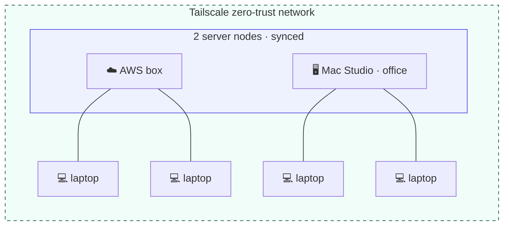

# Contextful

## Workspace with your agents. Your data. Your rules.

It knows everything — and lets no one ask everything.

<!--
🎤 SAY (placeholder — edit me):
"Last quarter, a CEO stood up at an all-hands and said: we built one AI that knows
everything about the company. The room applauded. Then an intern typed: 'what's the
CEO's salary?' — and it answered. This talk is about getting the brain without the leak."

COLD OPEN (~12s, one continuous gag — keep it to a single beat):
CEO: "Last quarter we gave every employee one AI that knows everything about the company."
[beat] An intern types: "What's the CEO's salary?" → it answers.
SLAP (Batman meme): "Why did you give it ALL the access?"
That slap is the whole talk in one frame: all context in one place = all access in one place.
-->

---
layout: center
class: text-center
---

<SlidevVideo class="demo-film" autoplay controls :poster="'/assets/contextful_sv_demo-poster.jpg?v=2'">
  <source :src="'/assets/contextful_sv_demo.mp4?v=2'" type="video/mp4" />
  
Your browser can't play this video. <a href="/assets/contextful_sv_demo.mp4">Download the demo film</a>.

</SlidevVideo>

<a href="/assets/contextful_sv_demo.mp4" target="_blank">/assets/contextful_sv_demo.mp4</a>

<!--
🎤 DEMO FILM (~27s) — the whole story in one sting.
Let it play; no narration over it. The film is the cold open's punchline in motion:
the all-knowing agent brags, leaks, and acts — then Contextful scopes it.
Plays automatically when this slide becomes active (SlidevVideo), with controls as backup.
-->

---
layout: center
class: text-center
---

# Do you…

<v-clicks>

💥 &nbsp; Give AI **all your context**? — one careless query spills everything

🚫 &nbsp; **Block AI usage**? — safety by amputation

📦 &nbsp; Hand your company brain to **some startup**? — your context, someone else's infra

</v-clicks>

All three are bad. That's the point.

<!--
🎤 SAY (placeholder — edit me):
"So ask yourself — what does your company actually do today? Do you give AI all your
context, and accept that one careless query spills everything? Do you block AI entirely —
safety by amputation, you lose every bit of the upside? Or do you hand your company brain
to some startup, and your most sensitive context now lives on someone else's
infrastructure? Those are the three options on the table today. All of them are bad.
That's the point."

Source: Act 1 Beat 3 + Act 4 Beat 1. Ask the room — hands up for each option if the
energy is right. This is the slide where the blocked-AI companies in the audience
recognize themselves; the ask slide pays this off later.
-->

---
layout: center
class: text-center
---

# Contextful

## Local-first, privacy-aware workspace on your company brain

**Your data. Your rules.**

<!--
🎤 SAY (placeholder — edit me):
"Take a step back. Do you trust ingesting all your company data into someone's cloud?
That's what every 'company brain' on the market asks you to do. Contextful is the
reframe: not one pool everyone queries — a boundary at every person. Your agent holds
your context, and nothing crosses a boundary without the owner's approval, scoped to
that one question. The brain gets smarter precisely because it gets more careful."

This is the reframe: not one pool everyone queries, but a boundary at every person.
Cross-boundary answers are requested, approved, and scoped — for that one question only.
Everything runs in a trusted environment the company chooses — on-prem or its own cloud.
-->

---

# For demo, we let agents run a company

  
  
"Pied Pipers" - Compression-as-a-Service SaaS with 100+ employees

a **living simulation run by agents**:

  <figure><logos-slack-icon />Slack — team chatter</figure>
  <figure><logos-stripe />Stripe — revenue events</figure>
  <figure><logos-posthog-icon />PostHog — product analytics</figure>

  

    
    
screenshot — Stripe sandbox, "Pied Pipers" test mode gross volume + balances from the simulated revenue events

  

  

    
  

<!--
🎤 SAY (placeholder — edit me):
"Before I show you the product — a word about the world it runs in. We didn't seed a
demo database. We let agents run a mock company: in Slack the team is actually talking —
standups, a thread arguing about agent costs; Stripe has revenue events flowing in per
product; PostHog holds the product analytics the outcome evals read. Real messy surfaces,
like any real company. Everything you're about to see is answered from this living world,
not from a spreadsheet we prepared."

Source: Act 3 demo beat 1 (the context pan) + production notes "Demo data — the simulated
company". Stripe events are mock data seeded from a Kaggle dataset; Slack chatter is
generated; agents keep the simulation alive. Realistic surfaces without exposing anything
real — and it makes the later answers falsifiable rather than canned.
-->

---

# Context for collaboration matters

  

  <figure><figcaption><b>Richard</b>CEO</figcaption></figure>
  <figure><figcaption><b>Monica</b>CFO</figcaption></figure>
  <figure><figcaption><b>Dinesh</b>CTO</figcaption></figure>
  
Dinesh is trying…

<!--
🎤 SAY (placeholder — edit me):
"Context for collaboration matters. The CEO writes in the shared doc — let's improve AI
optimization spending for 2026 Q3. The COO adds the nuance: we're growing, we need unit
economics — what does a compressed kilobyte actually cost us at the client? Simple
question, and nobody can answer it alone: engineering knows what the tools are worth but
not what they cost; finance holds the credits and the discount tier and can't share them
with the room."

Source: Act 2. Keep it jargon-free on stage; the $/KB line is the COO's own words.
-->

---
layout: center
class: text-center
---

# 💻 The CTO's laptop

<b>Dinesh</b> — CTO

<!--
🎤 SAY (placeholder — edit me):
"Now I switch laptops. This one is Dinesh's — the CTO. Same room, same shared doc.
I type the exact same question Monica just asked… and watch what happens."

Stage marker for the laptop switch (demo beat 3), parked here right after the shared-doc
slide — 'Dinesh is trying…' pays off on his machine. Show this slide while picking up
the second laptop so the room knows whose machine is on screen; the denial lands in the
live product, not on the slide.
-->

---

  

  Agents need context but <b>only what is necessary</b>

<!--
🎤 SAY (placeholder — edit me):
"The obvious fix is one AI that knows everything — but that's the world where an engineer
can query everyone's salary. The thing that would answer the question is exactly the
thing you can't allow to exist."

SCREENSHOT: the Q3 AI Spend Review shared-doc capture
(slides/public/assets/q3-spend-review.png). Badges: on-prem · tailnet, salary · redacted.
Bottom of the doc: someone asked Monica's analyst agent for the CEO's salary —
Denied · no_grant, the token carries no grant for that view. That denial is the money
shot — let it land before moving on.
-->

---
layout: center
class: text-center
---

# 🖥️ The CFO's on-prem — Mac Studio

<b>Monica</b> — CFO

<!--
🎤 SAY (placeholder — edit me):
"First machine: the Mac Studio — this is Monica's, the CFO. It's the host: her brain
lives here as readable Markdown files, and she's been ingesting Stripe into it for
months. She types her question live, and her agent answers from those files."

Stage marker for the on-prem host (demo beats 1–2). Show while at the Mac Studio:
ls ~/.contextful (filesystem proof), then Monica's live typed query answered from the
cards. The local model on this box is what's answering — say so.
-->

---

  

  Her machine, her token — <b>her agent answers in full</b>

<!--
🎤 SAY (placeholder — edit me):
"This is Monica's screen. Same shared doc, same question — let me share the unit
economics of our compression product. Her agent answers in full: four teams, gross,
credits, the Enterprise discount tier. Nothing is redacted here, because this is her
brain on her machine — the owner sees everything she owns."

SCREENSHOT: the Q3 AI Spend Review doc on the CFO host
(slides/public/assets/q3-spend-review-monica-answer.png). Monica (CFO) · 4 row(s) —
gross $165,000, net of credits $134,000, Enterprise (Tier 3). The contrast slide:
the full answer on the owner's machine, before Dinesh's redacted view makes the point.
-->

---
layout: center
class: text-center
---

# Connectors ingesting from your services

Brings your stack into one capability-scoped brain.

  <figure>Notion</figure>
  <figure>Slack</figure>
  <figure>Stripe</figure>
  <figure>web research</figure>

<!--
🎤 SAY (placeholder — edit me):
"Where does the brain come from? Connectors, ingesting from the services you already
run — Notion, Slack, Stripe — plus policy-gated web research through Exa. Every ingest
synthesizes new cards into the brain you're about to see."

Source: landing trust strip ("Brings your stack into one capability-scoped brain" —
Notion · Slack · Stripe · Exa). Logos copied from apps/landing/public/logos. On stage:
say "the open web", not "Exa".
-->

---

# Growing Brain. Locally

  

    
  

  

    
📥 &nbsp; Every <b>ingest</b> synthesizes new cards

    
🌙 &nbsp; <b>Daydreams</b> when idle — revisits cards, connects the dots, asks the questions nobody typed

    
🔎 &nbsp; <b>Researches the web with Exa</b> — policy-gated egress; findings land as new cards 

  

  Organized by <b>Agent</b>. Read by <b>Human</b> too

<!--
🎤 SAY (placeholder — edit me):
"And here's what that brain actually is. ~/.contextful — a folder you can open. Synthesized
Markdown cards — this one is unit economics for May: gross, credits, net, contribution
margin — with the access policy right in the frontmatter: which view it belongs to, which
fields a grant can release. Next to it: the capability tokens, the signing keys, and the
local index. No black box — files you can read, on a machine you own. And it grows three
ways: every ingest synthesizes new cards; when it's idle it daydreams — rereads the brain,
connects cards, asks the questions nobody typed; and when it's missing world context it
researches the open web through Exa — behind the egress firewall, so only policy-approved
queries leave — and the findings come back as cards too."

The filesystem proof beside the growth story. Point at the frontmatter line — acl_view:
stripe/finance_private, acl_fields: [gross, credits] — that's the policy the denial
enforces. brain/ = synthesized cards, caps/ = capability grants, control/keys = Biscuit
keys, brain.db = local FTS index. Daydream loop + Exa world memory are the crates/sync
features; on stage say "the open web", not "Exa" (the logo on the slide says it).
Asset: slides/public/assets/brain-locally.png.
-->

---
layout: center
class: text-center
---

# Context, with consent

The opposite of one all-knowing agent — partial, attenuated, auditable context per person and per agent.

  <figure v-click>
    
    <figcaption><b>Capability-scoped access</b>Agents inherit a subset of your permissions — never more. Delegation is attenuation, not trust.</figcaption>
  </figure>
  <figure v-click>
    
    <figcaption><b>A brain that grows</b>Ingests your tools, synthesizes context, flags anomalies — answers over MCP.</figcaption>
  </figure>
  <figure v-click>
    
    <figcaption><b>Local-first &amp; on-prem</b>Runs on your machine over Tailscale. Cloud optional — your context stays yours.</figcaption>
  </figure>
  <figure v-click>
    
    <figcaption><b>Real-time collaboration</b>Humans and agents edit the same doc as peers — CRDT sync that works offline.</figcaption>
  </figure>

Give every agent its own lane.

<!--
🎤 SAY (placeholder — edit me):
"Concretely, four things. Access is capability-scoped: an agent inherits a subset of its
owner's permissions, never more — the CTO's agent can't read the CEO's salary, provably.
The brain grows: it ingests your tools, synthesizes context, flags anomalies. It's
local-first: it runs on your machines, over your network — cloud is optional. And it's
collaborative: humans and agents edit the same document as peers, live. Put together:
every agent gets its own lane."

Source: landing "Why Contextful — Context, with consent" feature cards + the CTA line
("Give every agent its own lane."). Art: apps/landing feature-*.png, halftone-teal comic
set. Click through the four cards, land on the lane line.
-->

---
layout: center
class: text-center
---

# Document paired with Sandbox

  <figure><logos-vercel-icon />Vercel Sandbox</figure>

Capability access control takes place <em>before</em> data can leak.

<!--
🎤 SAY (placeholder — edit me):
"Every document pairs with its own isolated sandbox — the room's agents run inside it,
with no ambient authority. And the order matters: capability access control happens
before anything enters that sandbox. Policy filters the data first; the sandbox only
ever sees what was already approved — so by construction, there's nothing in there to
leak."

TECHNICAL 1/3, simplified after review: one idea per slide. Per-doc sandbox runs on
Vercel Sandbox (cloud) or Docker/OrbStack (local) — the BYOC slide covers the choices.
The load-bearing claim: enforcement is BEFORE the agent/sandbox boundary (deterministic
policy engine, not an LLM being polite), so a compromised or careless agent has nothing
out-of-scope to exfiltrate.
-->

---
layout: two-cols
---

# Three layers, one brain · technical

- **Collaboration** — humans and agents edit the same documents as peers, live.
- **Access control** — every query passes the capability filter on its way down.
- **Memory** — synthesized, queryable company context at the base.

  <b>01</b> Share a document
  →
  <b>02</b> Delegate scoped access
  →
  <b>03</b> Ask the company brain

::right::

<!--
🎤 SAY (placeholder — edit me):
"The whole product is three layers on one brain. On top, collaboration — humans and
agents in the same document, as peers, live. In the middle, access control — every query
passes the capability filter on its way down, no exceptions. At the base, memory —
synthesized, queryable company context. Day to day it's three verbs: share a document and
invite teammates and their agents; delegate a narrow slice of your permissions; ask — and
agents answer from synthesized context, capability-filtered, with the parts you can't see
redacted."

TECHNICAL — the stack picture. Source: landing "The stack — Three layers, one brain"
(layers.png) + the "Share. Delegate. Ask." steps. Each verb maps to a layer:
share → collaboration, delegate → access control, ask → memory.
-->

---
layout: two-cols
---

# Bring your own cloud — and connectors

**Deploy where you trust:**

  <figure><logos-aws />AWS</figure>
  <figure><logos-vercel-icon />Vercel</figure>
  <figure><logos-apple />Local · Mac</figure>
  <figure>Tailscale</figure>

**One binary** that is easy to run locally or deploy to cloud.

<v-clicks>

- **Sandboxes too:** each document's isolated sandbox runs on **Vercel Sandbox**, **Docker**, or **OrbStack** — cloud or fully local, your pick.
- **Agents build connectors and run them locally for you.** Stop paying **$200 × N** to SaaS for *your* data.

</v-clicks>

::right::

Sample setup — hardware you already own:

<!--
🎤 SAY (placeholder — edit me):
"Deployment is a choice, not an architecture change: run it on an AWS box, on your Vercel
projects, or fully local on a Mac — same binary, same policy engine. And whichever you
pick, every node joins over a Tailscale zero-trust network: your machines talk to each
other on your network, never across the public internet. Same for the per-document
sandboxes the agents run in: Vercel Sandbox in the cloud, or Docker or OrbStack fully
local — your pick. One more thing about cost.
Today, reaching your own data means renting connectors — two hundred dollars a tool, every
month, multiplied by every tool you run. With Contextful, your agent writes the connector
once, and it runs on hardware you already own. This is a real setup: two server nodes — a
small AWS box and the Mac Studio in the office — and every employee laptop is just a
client. The meter stops. You stop renting access to your own data."

Source: Act 4 Beat 5 (BYOC: AWS · Vercel · Local) + the ad-hoc connectors beat. Two jabs
in one: the recurring per-connector tax AND the missing-connector problem — your agent
writes the long-tail connector nobody sells. Keep numbers honest: "$200 × N" is the order
of magnitude of managed-connector/ETL pricing, not a quote.
SAMPLE TOPOLOGY: server nodes run `sync serve` (relay + connectors; AWS box and/or a Mac
Studio over Tailscale), employee laptops run the menu-bar client.
-->

---
layout: two-cols
class: self-center text-center
---

## Your Agents. Your Data. Your Rules.

Contextful power your command center.

::right::

<!--
🎤 SAY (placeholder — edit me):
"So — Contextful. Your agents, finally working with context. Your data, in a trusted
environment you choose. Your rules, enforced at every boundary — you watched them hold.
We power your command center. Thank you."

Source: Act 4 Beat 6 — the close. End on the name; let the last line sit on screen
through Q&A. The three pillars (trusted environment / access control / agents with
context) live in the spoken line, not on screen.
-->

---
layout: two-cols
class: self-center fractalbox
---

# I've seen this at many companies.

**👋 I'm Vincent** — Fractional CTO / CISO to startups.

Let's solve it. Be Contextful.

::right::

  <a href="https://www.linkedin.com/in/vincentlaucy" target="_blank" class="flex flex-col items-center">
    
    linkedin.com/in/vincentlaucy
  </a>
  <a href="https://fractalbox.dev/" target="_blank" class="fb-lockup mt-8">
    FractalBox
  </a>

<!--
🎤 SAY (placeholder — edit me):
"Quick word on why I'm the one up here. I'm Vincent — I work as a fractional CTO and
CISO for startups. I've seen this exact story in many companies: the all-knowing agent,
the blanket ban, the company brain on someone else's cloud. In order to address this,
I built Contextful."

Source: Act 1 Beat 4 — the earned-insight beat, now parked after the close as the
contact/Q&A card. AVATAR: slides/public/cast/vincent.jpg (exported LinkedIn photo); the
image links to https://www.linkedin.com/in/vincentlaucy and hides itself if the file is
missing.
-->

---
layout: center
class: text-center
---

# Appendix — full product demo

<SlidevVideo class="demo-film demo-film--appendix" controls>
  <source src="https://contextful-releases.s3.us-west-2.amazonaws.com/demos/contextful-product-demo-2026-06-10.mp4" type="video/mp4" />
  
Your browser can't play this video. <a href="https://contextful-releases.s3.us-west-2.amazonaws.com/demos/contextful-product-demo-2026-06-10.mp4">Download the full demo</a>.

</SlidevVideo>

<a href="https://contextful-releases.s3.us-west-2.amazonaws.com/demos/contextful-product-demo-2026-06-10.mp4" target="_blank">contextful-releases.s3.us-west-2.amazonaws.com/demos/contextful-product-demo-2026-06-10.mp4</a>

<!--
🎤 APPENDIX (~80s) — the full scripted product demo of demo.contextful.work, for
Q&A or follow-up viewing; not part of the talk flow. Hosted on the public S3
releases bucket (contextful-releases, us-west-2) so the deck stays light and the
hosted deck streams it. Source recording:
demos/recordings/story-2026-06-10T15-11-31.mp4 (3super worktree).
-->
