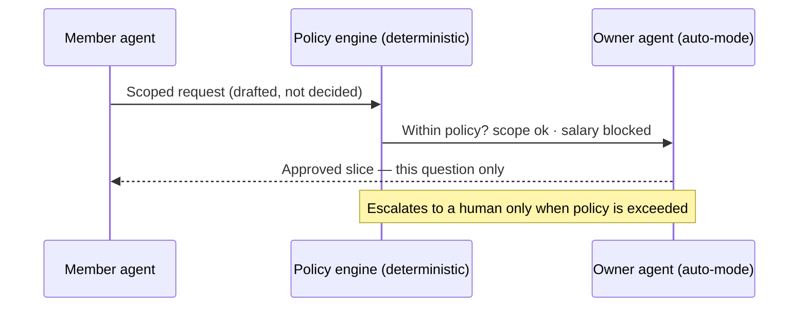
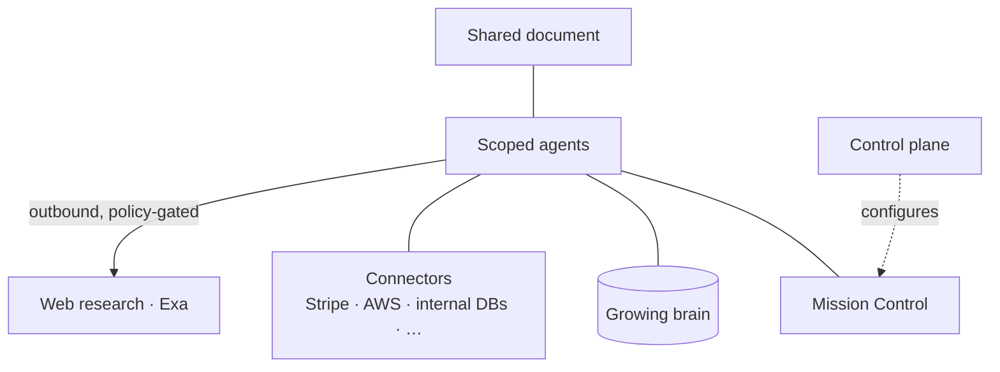

# Contextful

## Workspace for Your agents. Your data. Your rules.

It knows everything — and lets no one ask everything.

<!--
🎤 SAY (placeholder — edit me):
"Last quarter, a CEO stood up at an all-hands and said: we built one AI that knows
everything about the company. The room applauded. Then an intern typed: 'what's the
CEO's salary?' — and it answered. This talk is about getting the brain without the leak."

COLD OPEN (~12s, one continuous gag — keep it to a single beat):
CEO: "Last quarter we gave every employee one AI that knows everything about the company."
[beat] An intern types: "What's the CEO's salary?" → it answers.
SLAP (Batman meme): "Why did you give it ALL the access?"
That slap is the whole talk in one frame: all context in one place = all access in one place.
-->

---
layout: center
class: text-center
---

# Two ways to get it wrong

<v-clicks>

🧠 &nbsp; **Too little context** — useless.

🔓 &nbsp; **Too much access** — dangerous.

</v-clicks>

Today you're forced to pick one.

<!--
🎤 SAY (placeholder — edit me):
"Every company AI today fails one of two ways. Give it too little context and it's
useless — it can't answer anything that matters. Give it too much access and it's
dangerous — anyone can ask anything, including that salary. Today you have to pick one.
We don't think you should."

Too little context: it can't answer the real question. Too much access: anyone can ask
anything — including the CEO's salary. Useless OR dangerous — every "company brain" today
sits on one side of this line. Contextful refuses the trade-off — that's the promise the
rest of the talk pays off.
-->

---

# One question nobody can answer alone

50 people. 7 tools. **"Is the spend worth it?"**

<v-clicks>

- Engineering knows the **value** — not the cost.
- Finance sees the **bill** — not the why.
- The CFO holds the rest — and can't share it.

</v-clicks>

The obvious fix is the one you can't allow.

<!--
🎤 SAY (placeholder — edit me):
"Picture a 50-person company on seven tools, and the board asks: is all this AI and cloud
spend actually worth it? Engineering knows what the tools are worth but not what they cost.
Finance sees the bill but not the why. The CFO holds the deciding pieces and can't share
them with the room. The obvious fix is one AI that knows everything — but this is not how
organizations work. Organizations run on need-to-know boundaries, and the one thing that
could answer the question is exactly the thing you can't allow to exist."

A 50-person company runs on Claude, Notion, Slack, Linear, AWS, Vercel, Stripe — and the
question on the table is "is all this AI and cloud spend actually worth it?" Simple question,
and nobody can answer it alone: each person holds one piece, and no one is allowed to hold
all of them. The tempting fix is a single all-knowing agent — but that's the world where an
engineer can query everyone's salary. The thing that would answer the question is the thing
you can't permit to exist. Keep it jargon-free: no "FinOps" on screen.
-->

---
layout: center
class: text-center
---

# Contextful

## A boundary at every person

Your agent holds **your** context — and crosses a boundary only with approval.

The brain gets <b>smarter</b> as it gets more <b>careful</b>.

<!--
🎤 SAY (placeholder — edit me):
"So here's the reframe. Contextful is not one pool everyone queries — it's a boundary
at every person. Your agent holds your context, and nothing crosses a boundary without
the owner's approval, scoped to that one question. The brain gets smarter precisely
because it gets more careful."

This is the reframe: not one pool everyone queries, but a boundary at every person.
Cross-boundary answers are requested, approved, and scoped — for that one question only.
Everything runs on the company's own machines.
-->

---

# Live demo — the answer assembles itself

<v-clicks>

1. The CIO asks: *"Justify the spend."*
2. Engineering's agent brings **value** + market rates (cited) — hits a wall on cost.
3. The CFO's agent approves **one scoped slice**.
4. A data-scientist agent joins **revenue × cost** — on request, scoped.
5. A **sourced** answer assembles.

</v-clicks>

And the engineer still can't see anyone's salary.

<!--
🎤 SAY (placeholder — edit me):
"Let me show you, live. The CIO drops the question in the shared doc: justify the spend.
Engineering's agent brings the value and pulls the going market rate from the open web —
cited — then hits a wall: it doesn't know the real cost. So it asks the CFO's agent, and
gets exactly one approved slice — nothing more. A data-scientist agent joins revenue
against cost on request. And the answer assembles itself, every claim vouched for by its
owner. [pause] Now watch: the engineer in the same room asks for a salary… denied. Every
time. That's the whole product in one moment."

MONEY SHOT: the salary denial. Make this the climax and give it air.
Narration detail: step 2 checks the open web for the going market rate, every figure cited;
step 3 is approved for just that slice; step 4 aggregates per-product performance — revenue,
cost, margin — scoped to Stripe + internal data, nothing more; step 5 = every claim vouched
for by its owner, every web figure cited.
IMPORTANT: that denial must be a hard-coded, deterministic policy rule — NEVER a live
model call — so it is 100% reproducible on stage. Demo the agent's reasoning only on the
safe path. (One-line flourish if there's time: "and it flagged a runaway AWS job humans missed.")
WEB RESEARCH (Exa, separate PR): step 2 = inline grounding while the doc is edited; step 5 =
a research pass during synthesis — each external figure cited. For a reliable stage run,
cache/replay the lookups so it's deterministic. Don't say "Exa" on stage — say "the open web".
DATA SCIENTIST (step 4): a specialist agent invoked on request — joins Stripe + internal data
into per-product performance; it holds NO standing access, only the scoped slice for this question.
-->

---

# How it works · technical

- **Nothing holds everything** — scoped agents, partial access per person.
- **Deterministic policy** decides — the agent only *drafts*.
- **Auto-mode** clears safe requests; escalates the rest.

<!--
🎤 SAY (placeholder — edit me):
"For the technical folks: how does that denial actually work? No single agent holds
everything — each one has partial, scoped access. And the boundary is not an LLM being
polite — it's a deterministic policy engine. The agent only drafts the request; policy
decides. Safe requests clear automatically, so there's no permission fatigue — only the
exceptions reach a human."

TECHNICAL 1/3. Auto-mode means no permission fatigue: safe requests clear automatically,
only policy-exceeding ones reach a human. The key correction from review: the boundary is enforced by deterministic
policy, not by an LLM in the trust path. The agent composes/routes the scoped request; the
policy engine approves or denies. Worst case is a denied request — which still proves the point.
-->

---
layout: two-cols
---

# Where it runs · technical

- **On-prem, over Tailscale** — data stays home.
- **Mission Control** — prompts + pinned guardrails.
- **One control plane** sets policy centrally.
- The **brain grows** — learns baselines, flags anomalies.
- **One outbound path** — cited web research; only the *query* leaves.

::right::

<!--
🎤 SAY (placeholder — edit me):
"And where does all this run? On your machines, over your own private network — the data
never leaves. One control plane sets the policy centrally; Mission Control lets you steer
with a prompt and pin hard guardrails. The brain keeps growing — it learns your baselines
and flags anomalies. There is exactly one outbound path: web research, policy-gated, where
only the query leaves and every result comes back cited."

TECHNICAL 2/3. On-prem + Tailscale is the trust story; be ready for the "single coordination
plane" question. The growing brain = durable, approved reasoning + learned baselines that make
next month's same question faster. Keep this to ≤3 technical slides total.
WEB RESEARCH (Exa, separate PR) is the ONE outbound path — only the query leaves the network,
never private context; results are cited. Reconciles with "data never leaves" via the hybrid story.
-->

---
layout: center
class: text-center
---

# Most companies just blocked AI entirely

Safety by amputation — they lose all the upside.

<v-clicks>

**Others: one shared cloud pool — all-or-nothing.**

**Contextful: boundaried, local-first.**

</v-clicks>

Keep the upside. Scope the risk.

<!--
🎤 SAY (placeholder — edit me):
"Most companies looked at this risk and just blocked AI entirely — safety by amputation.
The alternatives on the market are one shared cloud pool: all-or-nothing. Contextful is
the third option — boundaried and local-first. You keep the upside and scope the risk."

The third option: keep the upside, scope the risk. Don't name a specific competitor on stage —
"one shared cloud pool, all-or-nothing" makes the contrast without the swipe. Spoken close:
the work runs on your machines, sensitive context stays home; the local stack is more capable
than ever, workloads are going hybrid — and Contextful is built for it.
-->

---
layout: center
class: text-center
---

# The ask

## We're looking for design partners

Companies that already blocked AI — and want the upside back, safely.

It answers the question. And the brain keeps growing.

<!--
🎤 SAY (placeholder — edit me):
"We're looking for design partners — companies that already blocked AI and want the
upside back, safely. Come run it on your own machines, on your own rules. It answers
the question — and the brain keeps growing. Thank you."

Replace with the REAL ask once decided (pilot / raise / hires). A keynote without an ask is a
magic trick with no "...and that's why you should act." One slide, one verb.
-->
