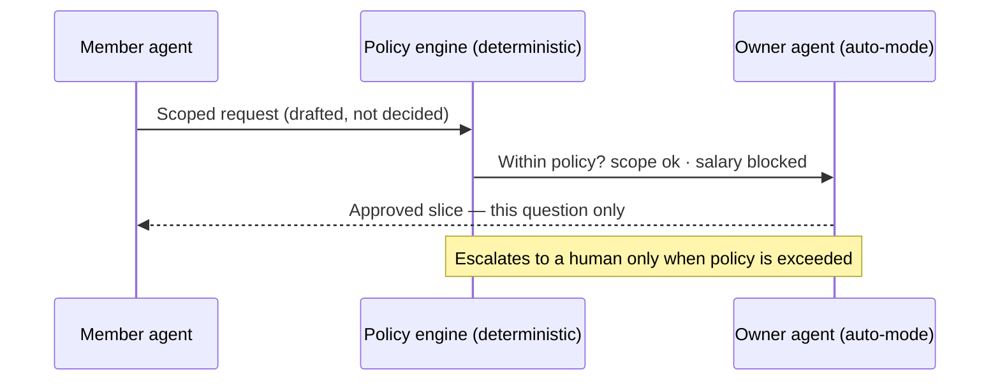
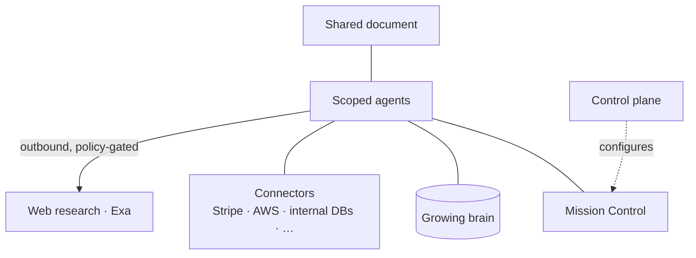

# Contextful

## Let your agents work with your data, on your infra

It knows everything — and lets no one ask everything.

<!--
COLD OPEN (~12s, one continuous gag — keep it to a single beat):
CEO: "Last quarter we gave every employee one AI that knows everything about the company."
[beat] An intern types: "What's the CEO's salary?" → it answers.
SLAP (Batman meme): "Why did you give it ALL the access?"
That slap is the whole talk in one frame: all context in one place = all access in one place.
-->

---
layout: center
class: text-center
---

# Two ways to get it wrong

<v-clicks>

🧠 &nbsp; **Too little context** — the AI is *useless*. It can't answer the real question.

🔓 &nbsp; **Too much access** — the AI is *dangerous*. Anyone can ask anything — including the CEO's salary.

</v-clicks>

Today you're forced to pick one.

<!--
Useless OR dangerous. Every "company brain" today sits on one side of this line.
Contextful refuses the trade-off — that's the promise the rest of the talk pays off.
-->

---

# One question nobody can answer alone

A 50-person company runs on Claude, Notion, Slack, Linear, AWS, Vercel, Stripe.

The question on the table: **"Is all this AI and cloud spend actually worth it?"**

<v-clicks>

- Engineering knows the **value** — not the real cost.
- Finance sees the **bill** — not whether it's reasonable.
- Only the CFO holds the deciding pieces — and won't expose them to everyone.

</v-clicks>

The obvious fix — one AI that knows everything — is the one you can't allow.

<!--
Simple question, and nobody can answer it alone: each person holds one piece, and no one
is allowed to hold all of them. The tempting fix is a single all-knowing agent — but that's
the world where an engineer can query everyone's salary. The thing that would answer the
question is the thing you can't permit to exist. Keep it jargon-free: no "FinOps" on screen.
-->

---
layout: center
class: text-center
---

# Contextful

## A boundary at every person

Each person's agent holds only **their** context.
It crosses a boundary only with the owner's approval — for that one question.

The brain gets <b>smarter</b> as it gets more <b>careful</b>.

<!--
This is the reframe: not one pool everyone queries, but a boundary at every person.
Cross-boundary answers are requested, approved, and scoped — for that question only.
Everything runs on the company's own machines.
-->

---

# Live demo — the answer assembles itself

<v-clicks>

1. The CIO asks the room: *"Justify the spend."*
2. Engineering's agent brings the **value** — and checks the **open web** for the going market rate (cited). Then hits a wall on real cost.
3. It asks the CFO's agent for **one scoped slice**. Approved — just that slice.
4. A **data-scientist agent** aggregates **per-product performance** on request — revenue, cost, margin — scoped to Stripe + internal data, nothing more.
5. A **sourced** answer assembles — every claim vouched for by its owner, every web figure cited.

</v-clicks>

And the engineer in the same room still can't see anyone's salary.

<!--
MONEY SHOT: the salary denial. Make this the climax and give it air.
IMPORTANT: that denial must be a hard-coded, deterministic policy rule — NEVER a live
model call — so it is 100% reproducible on stage. Demo the agent's reasoning only on the
safe path. (One-line flourish if there's time: "and it flagged a runaway AWS job humans missed.")
WEB RESEARCH (Exa, separate PR): step 2 = inline grounding while the doc is edited; step 5 =
a research pass during synthesis — each external figure cited. For a reliable stage run,
cache/replay the lookups so it's deterministic. Don't say "Exa" on stage — say "the open web".
DATA SCIENTIST (step 4): a specialist agent invoked on request — joins Stripe + internal data
into per-product performance; it holds NO standing access, only the scoped slice for this question.
-->

---

# How it works · technical

- **Scoped agents** — partial access per person; nothing holds everything.
- **Deterministic policy** decides the boundary; the agent only *drafts* the request.
- **Auto-mode** clears safe requests; raises the rest to a human — no permission fatigue.

<!--
TECHNICAL 1/3. The key correction from review: the boundary is enforced by deterministic
policy, not by an LLM in the trust path. The agent composes/routes the scoped request; the
policy engine approves or denies. Worst case is a denied request — which still proves the point.
-->

---
layout: two-cols
---

# Where it runs · technical

- **On-prem**, over your own **Tailscale** network — data never leaves your machines.
- **Mission Control** — steer with a prompt *and* pin deterministic guardrails.
- **Control plane** sets policy & topology once, centrally.
- The **brain grows** — learns baselines, flags anomalies next month.
- **Open-web research (Exa)** — the one outbound path: policy-gated and cited; only the *query* leaves.

::right::

<!--
TECHNICAL 2/3. On-prem + Tailscale is the trust story; be ready for the "single coordination
plane" question. The growing brain = durable, approved reasoning + learned baselines that make
next month's same question faster. Keep this to ≤3 technical slides total.
WEB RESEARCH (Exa, separate PR) is the ONE outbound path — only the query leaves the network,
never private context; results are cited. Reconciles with "data never leaves" via the hybrid story.
-->

---
layout: center
class: text-center
---

# Most companies just blocked AI entirely

Safety by amputation — they lose all the upside.

<v-clicks>

**Other "company brains" are one shared cloud pool — all-or-nothing.**

**Contextful is boundaried and local-first** — the work runs on your machines; sensitive context stays home.

</v-clicks>

The local stack is more capable than ever. Workloads are going hybrid — and Contextful is built for it.

<!--
The third option: keep the upside, scope the risk. Don't name a specific competitor on stage —
"one shared cloud pool, all-or-nothing" makes the contrast without the swipe.
-->

---
layout: center
class: text-center
---

# The ask

## We're looking for design partners

Companies that already blocked AI — and want the upside back, safely.

It answers the question. And the brain keeps growing.

<!--
Replace with the REAL ask once decided (pilot / raise / hires). A keynote without an ask is a
magic trick with no "...and that's why you should act." One slide, one verb.
-->
