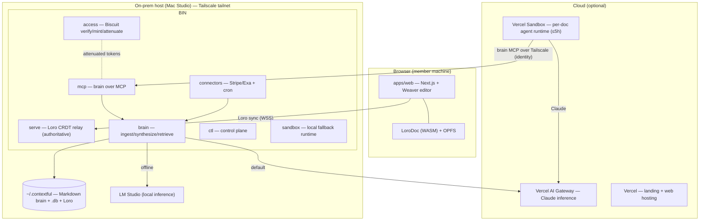
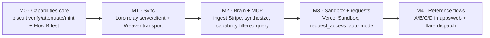

# 00 · Overview

**Status:** Draft v1 · **Product:** Contextful · **Repo:** `2super` (`superai2026` workspace)

## 1. What Contextful is

A **local-first company brain** where humans and AI agents collaborate in shared documents, and every agent sees **exactly what it is permitted to** — nothing more. Three pillars:

1. **Attenuated, capability-based access.** Access is delegated by [Biscuit](https://www.biscuitsec.org/) tokens that can only be *narrowed*, never widened. A person grants their agent a strict subset of their own authority. There is no company-wide "SuperAgent" that can read everything.
2. **A brain that synthesizes context.** It ingests SaaS + document data, extracts atomic facts, synthesizes human-readable memory, detects anomalies, and learns from corrections — in the spirit of mem0 / GBrain / LLMWiki, but the memory is **human-readable Markdown**.
3. **Local-first, cloud-optional.** Everything runs on-host (on-prem) over a Tailscale tailnet. Cloud is optional: managed inference (Vercel AI Gateway), agent compute (Vercel Sandbox), and web hosting (Vercel). **Raw source data and un-redacted brain content stay on-host**; only already-permitted, capability-redacted content is ever sent to cloud — and that path can be turned off entirely (Flow D).

> **The one-line claim:** *"The CTO's agent can't read the CEO's salary — provably."*

## 2. Problem & scenario

A 100-person software company runs a **FinOps** initiative to improve utilization and justify spend across many AI + SaaS tools (Claude, Notion, Slack, Linear, AWS, Vercel, Stripe). The pain:

- **Engineering** knows whether using Claude Code makes sense, but has no visibility into pricing, discount tiers, or credits.
- **Operations** owns workflow outcomes and evaluations, but has no spend visibility.
- **Finance** sees a $100k/month token bill but can't tell if it's reasonable.
- **CTO** has more visibility but won't commit invoices to a shared GitHub repo.
- **CIO** sees the burn but not what it's for.
- Per-cloud tools (AWS Budgets, vantage.sh) are siloed and miss connectors; only the **CFO** knows which spend is offset by credits, the discount tier, and team budgets.

Obviously you **cannot** solve this with a single shared context store the whole company can query — an engineer must not be able to read everyone's salary. Contextful's answer is one brain with **per-principal attenuated access**.

## 3. Personas & the access problem

Six personas, encoded directly as Biscuit token scopes (see [03 · Access Control](./03-access-control.md)):

| Persona | Can read | Notes |
|---|---|---|
| **Engineering** | usage views | no finance-private fields |
| **Operations** | outcome / eval views | can comment on spend |
| **Finance** | spend aggregates | not employee-level |
| **CTO** | broad read | mints scoped agent tokens for the team |
| **CIO** | total burn, drill-down by grant | |
| **CFO** | finance-private (sole authority root) | approves attenuated grants; owns `employee_salary`, `discount_tier`, `credits` |

(The **CEO** is the persona who naively wanted a single all-context "SuperAgent" — the storyline's antipattern. The salary invariant below is exactly what such a SuperAgent would violate.)

**The salary invariant (acceptance):** an engineer's agent can never obtain `employee_salary` — there is no token and no approval path outside the CFO's own root that yields it. Proven, not promised (see [09](./09-testing-acceptance.md) Flow B).

## 4. What we showcase

The demo proves two things: **you can answer real questions with the company brain**, and **the brain actually grows**. Four reference flows (full detail in [09](./09-testing-acceptance.md)):

- **Flow A — request → approve → scoped pull.** A CTO question hits a denied finance-private query; the agent raises a structured `request_access`; the CFO approves a narrowed grant (credits + discount tier, salary redacted, 7-day TTL); the agent retries and answers net-of-credits.
- **Flow B — the salary invariant (negative test).** An engineering agent's attempt to read `employee_salary` is denied at the field level and has no approval path. It stays blocked.
- **Flow C — the brain grows.** End-of-month ingest + synthesis flags a token-spend spike; a human annotates "one-off backfill, not a trend"; the correction is stored as a *learning* and suppresses the re-flag next month.
- **Flow D — local-first proof.** Disconnect the cloud uplink; editing and the brain keep working. Offline mode swaps **both** cloud defaults — Vercel Sandbox → the on-host local runtime, and the Vercel AI Gateway → **local LM Studio** — and structured query + redaction need no LLM at all. Re-enable cloud to switch synthesis back to the Vercel AI Gateway (Claude) for higher quality. (The offline runtime relies on OS-enforced isolation; see [04 §2](./04-sandbox-agents.md).)

Collaboration is shown live: members + their agents co-edit a room (a "meeting room"); presence shows who is reading vs. writing; the CFO's agent pulls from the right context after approval.

## 5. Design principles

The brand stands for **Trust, Clarity, Security, Collaboration, Fluid**. These map to concrete tokens and components in [08 · Design System](./08-design-system.md). Voice: plain-spoken and precise — lead with the direct claim, then explain; no fear-mongering.

## 6. Tech stack

| Layer | Choice |
|---|---|
| Editor | [Weaver](https://github.com/OpenHackersClub/weaver) (headless TS, Loro source of truth, Effect-TS plugins, agents-as-peers) |
| CRDT | [Loro](https://loro.dev) (`loro` crate / `loro-crdt` npm) |
| Web | Next.js 15 / React 19; landing on Astro |
| Workflow / app code | TypeScript, [Effect-TS](https://effect.website) (reactive FP) |
| Binary / connectors / sandbox control | Rust (tokio, clap) — owns lifecycle/identity; Vercel call via `packages/sandbox-bridge` (Node) |
| Capabilities | Biscuit (`biscuit-auth` crate / `@biscuit-auth/biscuit-wasm`) |
| MCP | `rmcp` (official Rust MCP SDK) |
| Inference | Vercel AI Gateway → Claude (default; Vercel AI SDK `@ai-sdk/gateway` in TS, `async-openai` in Rust) · LM Studio OpenAI-compat (on-prem/offline) |
| Storage | Markdown brain + SQLite / DuckDB (file-based); Loro per-doc snapshots |
| Agent compute | Vercel Sandbox (default, from anywhere) · local constrained process (offline) |
| Web enrichment | [Exa](https://exa.ai) |
| Networking | Tailscale (external to this system, on the host) |
| IaC | Pulumi |
| Tests | [flare-dispatch](https://github.com/OpenHackersClub/flare-dispatch) + `cargo test` |

## 7. Repo map

| Component | Location | Notes |
|---|---|---|
| Sync / brain / MCP / agent binary | `crates/sync` | one Rust binary, 7 subcommands |
| Web app (editor host + UI) | `apps/web` | Next.js, Weaver, Effect-TS — spec-only this pass |
| Landing | `apps/landing` | Astro static (`www.contextful.work`) |
| Shared protocol types | `packages/protocol` | `@superai2026/protocol` — built this pass |
| Design system | `packages/design-system` | `@superai2026/design-system` — spec'd here, port from reference |
| Vercel Sandbox bridge | `packages/sandbox-bridge` | `@superai2026/sandbox-bridge` — thin `@vercel/sandbox` wrapper the Rust driver spawns; spec-only this pass |
| Tests | `flare-dispatch` (external) | acceptance + e2e |

## 8. Architecture

**Trust boundary:** the host is authoritative and holds the data; the browser holds only what it was granted; sandboxes have **zero ambient authority** — their only data egress is the brain MCP, every call capability-checked.

## 9. Build milestones

## 10. Glossary

- **Room** — a document + its members (humans + agents) + a paired sandbox and brain scope.
- **Principal** — a human or an agent identity. Agents are owned by exactly one human; id `agent:<owner>/<n>`.
- **Attenuation** — appending a Biscuit block that strictly narrows authority. `caps(agent) ⊆ caps(owner)`.
- **View** — a named, field-typed projection of a source (e.g. `stripe/spend_by_team`). The unit of finance privacy.
- **Brain scope** — the set of sources/views a document's sandbox may draw on.
- **Envelope** — an owner's auto-mode policy describing which requests auto-approve vs. escalate.
- **The salary invariant** — the provable property that no non-CFO path yields `employee_salary`.

## 11. Scaffold / Status

This overview maps onto the whole repo. The Rust binary subcommands and modules that anchor each subsystem are listed per spec file.

**Built and verified this pass** (`cargo test`: 11 passing; `turbo run test`: 9 protocol unit + 4 acceptance e2e; clippy `-D warnings` clean):

- `crates/sync` — a working library + 7-subcommand binary (`serve`, `client`, `ingest`, `cron`, `mcp`, `agent`, `ctl`). Real capability engine (M0), brain ingest/synthesis/retrieval over a file index + Markdown cards (M2), JSON-RPC MCP server (M6), Loro WS relay with presence + revocation (M1), control plane (M7), and the sandbox/agent/inference traits with `StubInference` (M3).
- `packages/protocol` — capability engine + brain query (TS), and wire/MCP mirrors (`sync.ts`, `brain.mcp.ts`).
- `apps/web` — interactive capability console (Flows A & B) + opt-in live presence against the relay.
- `tests/acceptance` — end-to-end flows against the built binary.
- `infra/` — Pulumi recipes (standalone; `pulumi preview` to apply).

**Interface-complete but gated off** (the spec's "Future" edges; need external accounts/creds, so the default build is offline-capable): real Biscuit-WASM Datalog, AWS Bedrock + LM Studio inference, Exa HTTP, Vercel Sandbox SDK, Weaver transport plugin, DuckDB/SQLite + sqlite-vec index, Pulumi `apply`, flare-dispatch browser e2e.
