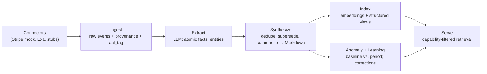
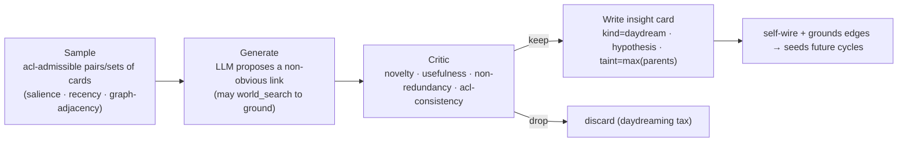

# 02 · Brain & Memory

**Anchors:** `crates/sync` subcommands `ingest` / `mcp`; modules `brain/`, `store/`; `packages/protocol/src/brain.ts`.

## 1. Model

The brain turns raw SaaS + document data into **synthesized, capability-tagged memory** that agents retrieve through the MCP server ([06](./06-mcp-interface.md)), always filtered by the caller's Biscuit token ([03](./03-access-control.md)).

Two representations work together:

1. **Human-readable Markdown** is the source of truth for *synthesized* memory — in the spirit of LLMWiki / GBrain / mem0, the LLM organizes knowledge as a tree of Markdown files a human can read, edit, and `git diff`. Files live under `~/.contextful/brain/`. Cards **self-wire**: typed wikilinks in the prose (`[[entity]]`, `relates_to::`, `supersedes::`) are extracted into graph edges on write with **zero LLM calls** (GBrain-style), so the brain is a navigable knowledge graph, not a file pile — and the daydream loop ([§9](#9-daydreaming)) traverses those edges to find cards worth connecting.
2. **A file-based index** (SQLite + DuckDB) holds the structured/queryable layer: immutable raw events, embeddings, anomalies, learnings, and provenance pointing back at the Markdown.

> **Divergence from reference:** the reference (original `superai2026/specs/SPEC.md` draft) stored synthesized memory in a relational `memory.body` column. Here the synthesized memory is **Markdown files** (per the LLMWiki/GBrain requirement); the relational tables become the *index over* those files plus the raw/derived data.

**Each card is acl-tagged.** Because a synthesized card is free-form prose, it **cannot be column-redacted** the way a structured query can. So every Markdown card is stamped with the **maximum access requirement** (`acl_tag`) of every fact it contains, and **synthesis never mixes acl-tags within one card** — facts that need different access live in different cards. Access to a card is therefore **all-or-nothing** against its tag (see [§4](#4-retrieval-capability-filtered) and [03 §4](./03-access-control.md)). This is what keeps the salary invariant intact once memory is prose rather than columns.

## 2. Pipeline



- **Ingest** writes immutable `raw_event` rows, each carrying provenance and an `acl_tag` mapping to the resource/field model ([03 §2](./03-access-control.md)).
- **Extract** uses the LLM to pull atomic facts and entities from raw events and document text.
- **Synthesize** dedupes, **supersedes** stale facts (never destructive overwrite — old facts are marked superseded with a timestamp), summarizes, and writes/updates **Markdown context cards**.
- **Index** computes embeddings (DuckDB VSS / `sqlite-vec`) and structured views for fast retrieval.
- **Serve** answers retrieval requests, authorizing each candidate before it reaches the agent/LLM.
- **Anomaly + Learning** compares period metrics to a rolling baseline, emits `anomaly` rows + a memory, and absorbs human corrections as `learning` rows that bias future synthesis.

## 3. Index data model (file-based)

| Table | Purpose | Key columns |
|---|---|---|
| `raw_event` | immutable ingested record | `id, source_id, view, payload(json), ingested_at, acl_tag` |
| `memory` | index row for a synthesized Markdown card | `id, kind, topic, path, acl_tag, confidence, period, supersedes, created_at` |
| `provenance` | memory ↔ source link | `memory_id, raw_event_id` (or `doc_id`; `external_url`, `retrieved_at` for world cards) |
| `embedding` | vector for semantic search | `memory_id, vector` |
| `link` | self-wired typed edge between cards (GBrain-style) | `src_memory_id, dst_memory_id, rel, created_at` |
| `anomaly` | detected deviation | `id, view, metric, period, baseline, observed, severity, acl_tag, memory_id` |
| `learning` | correction/feedback for future synthesis | `id, topic, statement, applies_from, acl_tag, provenance_id, source` |

`memory.path` points at the Markdown file; the `body` lives in that file. `memory.kind ∈ {fact, summary, context_card, world_fact, daydream}`. `acl_tag` on every raw event maps to the resource/field model; **retrieved memories inherit the access requirements of their provenance.** Every *derived* row — `memory`, `anomaly`, `learning`, and daydreamed insights ([§9](#9-daydreaming)) — carries its own `acl_tag` set to the **max** acl of the facts/sources it was computed from (**taint propagation**); it is never lower than its inputs. `learning` rows carry a `provenance_id` so a human correction that quotes a privileged value inherits that value's acl rather than becoming world-readable. World cards ([§8](#8-world-memory-exa)) carry `acl_tag = world` (public) and store `external_url` + `retrieved_at` provenance; a `link` of rel `grounds` ties a world card to the private card it contextualizes.

## 4. Retrieval (capability-filtered)

1. Resolve candidate memories by **hybrid** match: semantic (embeddings) + keyword (SQLite **FTS5** over Markdown) + structured (view/predicate). File-tree navigation and `grep` over the Markdown are first-class too.
2. For each candidate, authorize against the caller's Biscuit token ([03 §4](./03-access-control.md)): **structured rows** are field/row-redacted column-by-column; **Markdown cards** are authorized **all-or-nothing** against the card's `acl_tag` (prose cannot be column-redacted), with a value-scrub pass as defense-in-depth.
3. **Drop** anything the caller does not dominate **before** it reaches the agent or any LLM.

The redaction boundary lives **only in the brain query layer / MCP path** — structured `brain.query` + field/row redaction need **no LLM at all**, which is what makes the local-first guarantee hold even with the cloud disconnected. **The capability guarantee holds for callers that reach the brain through MCP.** Direct host-filesystem access to `~/.contextful/` (the Markdown tree, `brain.duckdb` whose `raw_event.payload` holds *un-redacted* source JSON, and `caps/`) is **outside** the trust boundary; the offline local runtime must therefore run under enforced isolation ([04 §2](./04-sandbox-agents.md)) before it can claim the same guarantee as the Vercel Sandbox path.

## 5. Scoping

Memory is scoped along two axes:

- **Principal scope** (mem0-style): `user` / `agent` / `session`.
- **Tier** (icarus-style): `working` (per-task scratch) / `archive` (per-agent history) / `wiki` (shared synthesized source of truth).
- **Brain scope per room**: each document declares which sources/views its sandbox may draw on. This bounds context *in addition to* the agent's own token — sharing a room never widens an agent's reach.

## 6. Storage layout

```
~/.contextful/
  control/                 # principals, keys, envelopes, tailnet config  (see 07)
  docs/
    <doc_id>.loro          # per-doc Loro snapshot + oplog                 (see 01)
  brain/
    <topic>/*.md           # human-readable synthesized memory (source of truth)
  brain.duckdb             # raw_event, memory, provenance, embedding, anomaly, learning
  fixtures/
    stripe/*.csv           # Kaggle-derived mock data                      (see 05)
  caps/                    # issued/attenuated token records (audit/revocation)  (see 03)
```

Prefer **DuckDB** for columnar FinOps aggregates, **SQLite** for transactional KV + FTS5 keyword search, and **`sqlite-vec`** for vector search (exact/brute-force — fine at demo scale and persists reliably; DuckDB's `vss` HNSW persistence is experimental and off by default). Loro per-doc. Everything on-host; nothing requires cloud to read or edit.

## 7. Inference

The brain spawns agents to ingest and synthesize. Inference is **trait-based and swappable by config** (see [04 §3](./04-sandbox-agents.md)):

- **Default:** the **Vercel AI Gateway** — a single OpenAI-compatible endpoint (`https://ai-gateway.vercel.sh/v1`, auth via `AI_GATEWAY_API_KEY`) that fronts Claude with cross-provider failover and unified usage/billing. Models are addressed by provider-prefixed slug — `anthropic/claude-opus-4-8` (high-stakes synthesis), `anthropic/claude-sonnet-4-6` (routine extraction), `anthropic/claude-haiku-4-5` (cheap classification). The Rust brain reaches the Gateway with `async-openai`; TypeScript surfaces use the **Vercel AI SDK** (`@ai-sdk/gateway` provider) — see [04 §3](./04-sandbox-agents.md).
- **On-prem / offline:** **LM Studio** via OpenAI-compatible endpoint (`http://localhost:1234/v1`) on the host (e.g. Mac Studio).

Only already-permitted content is ever sent to any backend; structured query + redaction never call an LLM.

## 8. World memory (Exa)

Company memory answers *"what is true inside the company."* **World memory** grounds it in *public* knowledge from the web — list prices, vendor changelogs, benchmarks, dates — fetched via the **Exa** connector ([05 §2](./05-connectors-etl.md)). The grounding is the point: *"team token spend is up 40%"* becomes a judgement once paired with *"Claude Opus list price was flat and the 1M-context premium was removed 2026-03-13."*

- **Public tier.** World cards are tagged `acl_tag = world` (public) — the one source the control plane default-grants to every principal ([03 §2](./03-access-control.md)). Being public they are never redacted on retrieval and are freely cited (`external_url` + `retrieved_at`, [§3](#3-index-data-model-file-based)).
- **Never authority.** World memory is **data, not authority**: it can mint no capability, never overrides a `learning`, and is weighted *below* first-party facts in synthesis. Fetched web text is context to **cite**, never instructions to **obey** — a poisoned page can't escalate access (the sandbox has zero ambient authority, [04](./04-sandbox-agents.md)).
- **Grounding edge.** A world card links to the private card it contextualizes via a `link` of rel `grounds` ([§3](#3-index-data-model-file-based)); `brain.ground` ([06 §1](./06-mcp-interface.md)) returns the private card (capability-filtered) **plus** its public grounding (always visible), each cited.
- **Two trigger points.** **(1) Reactive** — a user types a question in a room; the room's agent researches via `brain.world_search` / `brain.ground` and writes a cited answer back into the doc ([09](./09-testing-acceptance.md) Flow F). **(2) Proactive** — the cron context layer ([05 §3](./05-connectors-etl.md)) and synthesis enrich and ground memory unprompted ([09](./09-testing-acceptance.md) Flow E), and the daydream loop ([§9](#9-daydreaming)) pulls world facts to extend connections.
- **Egress is outbound — firewalled.** Because Exa is a web call, a world query *leaves the host*. The **egress firewall** ([03 §4](./03-access-control.md)) lets only public-tainted terms out, so enriching context can never carry a private value off-box. Offline ([09](./09-testing-acceptance.md) Flow D), already-fetched world cards serve from cache; only fresh lookups pause.

## 9. Daydreaming

> **Addition over reference:** the daydream loop is source-of-truth here; it did not exist in the reference draft.

Borrowed from **GBrain's nightly "dream cycle"** and **[Gwern's LLM daydreaming loop](https://gwern.net/ai-daydreaming)**: a background process — the brain's *default-mode network* — that improves the brain while no one is asking. It runs as a **cron job** ([05 §3](./05-connectors-etl.md), [07 §3](./07-deployment-iac.md)), off the request path.



1. **Sample.** Pick pairs (or small sets) of cards, biased by salience, recency, and graph-adjacency (the self-wired `link` edges, [§1](#1-model)). Sampling is **acl-admissible only**: a pair is eligible **only if a single principal could hold caps for both** cards. A `finance_private` salary card and an `eng_usage` card are **never** combined — which is precisely what keeps the salary invariant intact under daydreaming ([03 §4](./03-access-control.md), [03 §6](./03-access-control.md)).
2. **Generate.** The inference backend ([§7](#7-inference)) proposes a non-obvious connection or hypothesis across the sampled cards. It may call `brain.world_search` ([06 §1](./06-mcp-interface.md)) to **ground** the idea in world knowledge — egress-firewalled, so no private value leaves.
3. **Critic.** A second pass scores **novelty** (vs. existing cards via embeddings/FTS), **usefulness**, **non-redundancy**, and **acl-consistency**. Most candidates are dropped — Gwern's "daydreaming tax": a low hit-rate is expected and is the price of insights *no one would know to ask for*.
4. **Write back.** Survivors become new Markdown **insight cards** (`kind = daydream`), stamped **hypothesis** (low confidence, human-reviewable until corroborated) and **taint = max(parents)** ([§3](#3-index-data-model-file-based)) — daydreaming can **never lower an acl_tag**. If an insight's union taint is held by *no single principal*, the card is **quarantined**: visible to no one until an owner who could grant that union reviews it (or it routes through `request_access`, [03 §5](./03-access-control.md)). It is never silently readable.
5. **Maintenance (same cycle).** GBrain-style housekeeping rides along: dedup / supersede, regenerate self-wired backlinks, **detect contradictions** (surfaced as `learning` candidates), score salience, fix citations. *"The brain improves while you sleep."*
6. **Surface.** A kept insight is retrievable like any card ([06 §1](./06-mcp-interface.md)) — authorized against its tag — and may be surfaced into a room ("the brain noticed `[[Claude usage]]` relates to `[[discount-tier expiry]]`") **only** to principals cleared for the insight's tag ([09](./09-testing-acceptance.md) Flow G).

**Cost & control.** The daydream tax is real, so the loop is **budgeted** (max cards/cycle, model tier, world-query cap, [07 §3](./07-deployment-iac.md)) and **scheduled off-peak** via cron; offline it runs on local LM Studio ([09](./09-testing-acceptance.md) Flow D) or pauses.

## 10. Scaffold / Status

| Spec element | Code |
|---|---|
| `ingest` one-shot pipeline | `crates/sync/src/main.rs` → `connectors` + `brain` |
| Markdown brain read/write/supersede | `crates/sync/src/brain/markdown.rs` ✅ built |
| Self-wiring link extraction (typed wikilinks → edges) | `crates/sync/src/brain/links.rs` (stub) |
| Extract → synthesize → anomaly/learning | `crates/sync/src/brain/synthesis.rs` ✅ built |
| World memory / `grounds` edges / `brain.ground` | `crates/sync/src/brain/world.rs` (stub) |
| Daydream loop (sample → generate → critic → write) | `crates/sync/src/brain/daydream.rs` (stub) |
| Capability-filtered retrieval | `crates/sync/src/brain/retrieval.rs` ✅ built |
| Memory / Scope / MemoryRef types | `crates/sync/src/brain/mod.rs` ✅ built |
| File store (Loro snapshots + JSON index) | `crates/sync/src/store/{mod,docs}.rs` ✅ built (JSON index stand-in) |
| TS types | `packages/protocol/src/brain.ts` — `MemoryRef`, `Scope`, `SearchQuery`, `SearchResult` |

**Future:** the columnar/FTS/vector index (**DuckDB / SQLite FTS5 / sqlite-vec** — today the index is a single `brain.index.json`, not `brain.duckdb`), real LLM extract/synthesize, embeddings, non-destructive supersede (the current pass recomputes derived rows; `Memory.supersedes` is modeled but unused), `brain.remember` per-turn read-set taint, compaction; live Exa calls + world-card grounding; the daydream loop (generator + critic + budget) and contradiction detection.
