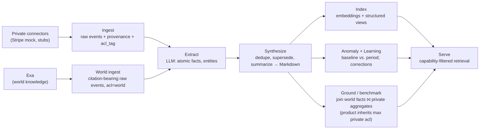

# 02 · Brain & Memory

**Anchors:** `crates/sync` subcommands `ingest` / `mcp`; modules `brain/`, `store/`; `packages/protocol/src/brain.ts`.

## 1. Model

The brain turns raw SaaS + document data into **synthesized, capability-tagged memory** that agents retrieve through the MCP server ([06](./06-mcp-interface.md)), always filtered by the caller's Biscuit token ([03](./03-access-control.md)).

Two representations work together:

1. **Human-readable Markdown** is the source of truth for *synthesized* memory — in the spirit of LLMWiki / GBrain / mem0, the LLM organizes knowledge as a tree of Markdown files a human can read, edit, and `git diff`. Files live under `~/.contextful/brain/`.
2. **A file-based index** (SQLite + DuckDB) holds the structured/queryable layer: immutable raw events, embeddings, anomalies, learnings, and provenance pointing back at the Markdown.

> **Divergence from reference:** the reference (original `superai2026/specs/SPEC.md` draft) stored synthesized memory in a relational `memory.body` column. Here the synthesized memory is **Markdown files** (per the LLMWiki/GBrain requirement); the relational tables become the *index over* those files plus the raw/derived data.

**Each card is acl-tagged.** Because a synthesized card is free-form prose, it **cannot be column-redacted** the way a structured query can. So every Markdown card is stamped with the **maximum access requirement** (`acl_tag`) of every fact it contains, and **synthesis never mixes acl-tags within one card** — facts that need different access live in different cards. Access to a card is therefore **all-or-nothing** against its tag (see [§4](#4-retrieval-capability-filtered) and [03 §4](./03-access-control.md)). This is what keeps the salary invariant intact once memory is prose rather than columns.

**Two provenance classes — private vs. world.** Memory carries a `class`:

- **Company (private) memory** is synthesized from internal SaaS + document sources. It is tagged to the **maximum** acl of its facts (taint *up*; [§3](#3-index-data-model-file-based)).
- **World memory** is synthesized from **public world knowledge** pulled via the Exa connector ([05 §2](./05-connectors-etl.md)) — pricing references, market comps, FinOps benchmarks, vendor/regulatory facts. It is tagged to the **floor**: `acl_tag = world`, dominated by every principal's token, so any agent may read it.

The asymmetry is deliberate and is what makes world knowledge safe to fold in: a world fact alone never *raises* any agent's reach, and the moment world memory is **joined** with private facts to produce a grounded/benchmarked card, the join product inherits `max(private)` by the same taint rule — grounding never *lowers* a private aggregate's acl. World memory enriches; it cannot launder. The new surface world memory introduces is the **outbound** one — the Exa query itself ([§8](#8-world-memory--grounding)).

## 2. Pipeline



- **Ingest** writes immutable `raw_event` rows, each carrying provenance and an `acl_tag` mapping to the resource/field model ([03 §2](./03-access-control.md)). **World ingest** is the same path for Exa-sourced events, except every event is tagged `acl = world` and must carry a **citation** (canonical URL + retrieved-at + content hash) and a freshness cursor ([§8](#8-world-memory--grounding)).
- **Extract** uses the LLM to pull atomic facts and entities from raw events and document text.
- **Synthesize** dedupes, **supersedes** stale facts (never destructive overwrite — old facts are marked superseded with a timestamp), summarizes, and writes/updates **Markdown context cards** — private cards under `brain/<topic>/`, world cards under `brain/world/<topic>/`.
- **Index** computes embeddings (DuckDB VSS / `sqlite-vec`) and structured views for fast retrieval.
- **Serve** answers retrieval requests, authorizing each candidate before it reaches the agent/LLM.
- **Anomaly + Learning** compares period metrics to a rolling baseline, emits `anomaly` rows + a memory, and absorbs human corrections as `learning` rows that bias future synthesis.
- **Ground / benchmark** joins world memory to private aggregates to produce *grounded* cards (e.g. "net-of-credit spend is 30% above the published FinOps benchmark [cite]"). The grounded card inherits `max(private inputs)` by taint propagation, so contextualizing a private number with public data never widens who can read it ([§8](#8-world-memory--grounding)).

## 3. Index data model (file-based)

| Table | Purpose | Key columns |
|---|---|---|
| `raw_event` | immutable ingested record | `id, source_id, view, payload(json), ingested_at, acl_tag` |
| `memory` | index row for a synthesized Markdown card | `id, kind, class, topic, path, acl_tag, confidence, period, supersedes, created_at` |
| `world_fact` | freshness/citation index for world cards | `memory_id, query, url, content_hash, retrieved_at, stale_after, corroborations` |
| `provenance` | memory ↔ source link | `memory_id, raw_event_id` (or `doc_id` for doc-derived) |
| `embedding` | vector for semantic search | `memory_id, vector` |
| `anomaly` | detected deviation | `id, view, metric, period, baseline, observed, severity, acl_tag, memory_id` |
| `learning` | correction/feedback for future synthesis | `id, topic, statement, applies_from, acl_tag, provenance_id, source` |

`memory.path` points at the Markdown file; the `body` lives in that file. `memory.class` is `private` or `world` ([§1](#1-model)). `acl_tag` on every raw event maps to the resource/field model; **retrieved memories inherit the access requirements of their provenance.** Every *derived* row — `memory`, `anomaly`, `learning` — carries its own `acl_tag` set to the **max** acl of the facts/sources it was computed from (**taint propagation**); it is never lower than its inputs. `learning` rows carry a `provenance_id` so a human correction that quotes a privileged value inherits that value's acl rather than becoming world-readable.

World cards are the one place taint floors rather than peaks: a `class = world` memory is stamped `acl_tag = world` regardless of which (always public) source it came from, and a `world_fact` row tracks its **freshness** — `retrieved_at` + `stale_after` drive cron re-fetch and supersession, `content_hash` + `url` key the dedupe, and `corroborations` counts how many independent sources assert the same fact (it raises `memory.confidence`). A world card whose `stale_after` has passed is marked superseded and excluded from grounding until refreshed, so the brain never benchmarks against a stale public number.

## 4. Retrieval (capability-filtered)

1. Resolve candidate memories by **hybrid** match: semantic (embeddings) + keyword (SQLite **FTS5** over Markdown) + structured (view/predicate). File-tree navigation and `grep` over the Markdown are first-class too.
2. For each candidate, authorize against the caller's Biscuit token ([03 §4](./03-access-control.md)): **structured rows** are field/row-redacted column-by-column; **Markdown cards** are authorized **all-or-nothing** against the card's `acl_tag` (prose cannot be column-redacted), with a value-scrub pass as defense-in-depth.
3. **Drop** anything the caller does not dominate **before** it reaches the agent or any LLM.

The redaction boundary lives **only in the brain query layer / MCP path** — structured `brain.query` + field/row redaction need **no LLM at all**, which is what makes the local-first guarantee hold even with the cloud disconnected. **The capability guarantee holds for callers that reach the brain through MCP.** Direct host-filesystem access to `~/.contextful/` (the Markdown tree, `brain.duckdb` whose `raw_event.payload` holds *un-redacted* source JSON, and `caps/`) is **outside** the trust boundary; the offline local runtime must therefore run under enforced isolation ([04 §2](./04-sandbox-agents.md)) before it can claim the same guarantee as the Vercel Sandbox path.

## 5. Scoping

Memory is scoped along several axes:

- **Class**: `private` (company memory, tainted up) / `world` (public world knowledge from Exa, floored to `acl = world`; [§1](#1-model), [§8](#8-world-memory--grounding)). Retrieval may return both; `brain.search` can filter to one class.
- **Principal scope** (mem0-style): `user` / `agent` / `session`.
- **Tier** (icarus-style): `working` (per-task scratch) / `archive` (per-agent history) / `wiki` (shared synthesized source of truth).
- **Brain scope per room**: each document declares which sources/views its sandbox may draw on. This bounds context *in addition to* the agent's own token — sharing a room never widens an agent's reach.

## 6. Storage layout

```
~/.contextful/
  control/                 # principals, keys, envelopes, tailnet config  (see 07)
  docs/
    <doc_id>.loro          # per-doc Loro snapshot + oplog                 (see 01)
  brain/
    <topic>/*.md           # private company memory (source of truth)
    world/<topic>/*.md     # world memory — public knowledge from Exa, acl=world  (see 05 §2, §8)
  brain.duckdb             # raw_event, memory, world_fact, provenance, embedding, anomaly, learning
  fixtures/
    stripe/*.csv           # Kaggle-derived mock data                      (see 05)
  caps/                    # issued/attenuated token records (audit/revocation)  (see 03)
```

Prefer **DuckDB** for columnar FinOps aggregates, **SQLite** for transactional KV + FTS5 keyword search, and **`sqlite-vec`** for vector search (exact/brute-force — fine at demo scale and persists reliably; DuckDB's `vss` HNSW persistence is experimental and off by default). Loro per-doc. Everything on-host; nothing requires cloud to read or edit.

## 7. Inference

The brain spawns agents to ingest and synthesize. Inference is **trait-based and swappable by config** (see [04 §3](./04-sandbox-agents.md)):

- **Default:** AWS **Bedrock + Claude** via the Converse API. On Bedrock the model ids are inference-profile ids with a region prefix — `us.anthropic.claude-opus-4-8` (high-stakes synthesis), `us.anthropic.claude-sonnet-4-6` (routine extraction), `us.anthropic.claude-haiku-4-5` (cheap classification); the bare `claude-*` ids are first-party-API only.
- **On-prem / offline:** **LM Studio** via OpenAI-compatible endpoint (`http://localhost:1234/v1`) on the host (e.g. Mac Studio).

Only already-permitted content is ever sent to any backend; structured query + redaction never call an LLM.

## 8. World memory & grounding

World memory is how the brain uses **world knowledge** to enhance its memory: public facts that contextualize the private company numbers. It is fed by the Exa connector ([05 §2](./05-connectors-etl.md)) and lives in its own `brain/world/` subtree, `acl = world`.

### 8.1 The egress dual (the new trust surface)

Contextful's read path is capability-filtered **inbound** — the brain drops anything the caller doesn't dominate before it reaches an agent or LLM ([§4](#4-retrieval-capability-filtered)). World enrichment introduces the mirror-image concern **outbound**: an Exa query is a request leaving the host, so **the query string is itself a capability-checked egress channel.** The same trust boundary, opposite direction.

- **Queries are built from non-private terms only** — public entity/product names, generic metric names, periods — **never from private field values.** No actual salary, spend figure, discount tier, or credit balance may appear in an Exa query. A benchmark is fetched by asking "published FinOps net-of-credit spend benchmark for AI tooling, 2026", *not* by sending our own number to be compared.
- **Query construction is bounded by the authoring agent's capabilities**, exactly as `declare_acl` is for ad-hoc connectors ([05 §4](./05-connectors-etl.md)): an agent cannot embed in a query a value it could only have read under a privileged token. A query-sanitization pass (deny-list of private view/field tokens + a taint check on interpolated values) gates every outbound call; offline/local-first mode ([00 §4](./00-overview.md) Flow D) disables the Exa egress entirely.
- World ingest writes **only world-readable raw events**, so even a buggy or adversarial query can never *return* private data into the brain — Exa sees the public web, not `~/.contextful`.

### 8.2 Grounding

Grounding is a synthesis step that **joins** world memory to private aggregates to produce benchmarked cards: "net-of-credit Claude spend is 1.3× the published enterprise-tier benchmark [cite]", "this discount tier trails the market reference by ~10pts [cite]". Rules:

- The grounded card cites its world source (URL + retrieved-at) and inherits **`max(private inputs)`** by taint propagation ([§3](#3-index-data-model-file-based)) — joining a public number with `employee_salary` yields a CFO-only card, never a world-readable one. **The salary invariant is unaffected:** world memory adds context, never reach.
- Grounding skips world facts whose `stale_after` has passed; a benchmark is only as trustworthy as its freshness.
- World facts can also feed **anomaly baselines** (is a spike out of line *with the market*, not just with our own history?) and **learning** corroboration, without ever lowering an anomaly's acl below its private inputs.

## 9. Scaffold / Status

| Spec element | Code |
|---|---|
| `ingest` one-shot pipeline | `crates/sync/src/main.rs` → `connectors` + `brain` |
| Markdown brain read/write/supersede | `crates/sync/src/brain/markdown.rs` ✅ built |
| Extract → synthesize → anomaly/learning | `crates/sync/src/brain/synthesis.rs` ✅ built |
| Capability-filtered retrieval | `crates/sync/src/brain/retrieval.rs` ✅ built |
| Memory / Scope / MemoryRef types | `crates/sync/src/brain/mod.rs` ✅ built |
| File store (Loro snapshots + DuckDB/SQLite) | `crates/sync/src/store/{docs,db}.rs` ✅ built |
| TS types | `packages/protocol/src/brain.ts` — `MemoryRef`, `Scope`, `SearchQuery`, `SearchResult` |
| World-memory class + `brain/world/` tree | `crates/sync/src/brain/{mod,markdown}.rs` — spec'd here |
| World ingest (Exa, citations, freshness) | `crates/sync/src/connectors/exa.rs` (canned today; see [05 §2](./05-connectors-etl.md)) |
| Egress query-sanitization + grounding synthesis | `crates/sync/src/brain/synthesis.rs` — spec'd, not built |

**Future:** real LLM extract/synthesize, embeddings, FTS indexing, anomaly thresholds, learning suppression, compaction; **world memory** — `class`/`world_fact` columns, freshness-driven re-fetch + supersession, corroboration scoring, egress query-sanitization, and grounding/benchmark synthesis.
