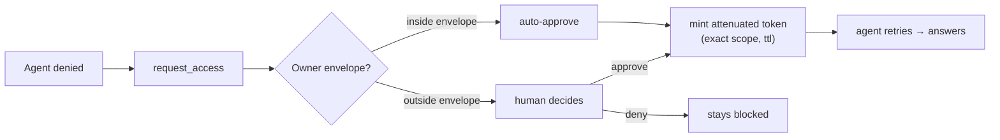

# 03 · Access Control

**Anchors:** `crates/sync` modules `access/`, `identity.rs`; subcommand `ctl`; `packages/protocol/src/access.ts`.

Access control is the heart of Contextful: **capability-based, attenuable, field- and row-level**, enforced with [Biscuit](https://www.biscuitsec.org/).

## 1. Principals & identity

- **Human principal** — an identity in the control-plane registry: `id`, display name, public key.
- **Agent principal** — always owned by exactly one human; id format `agent:<owner>/<n>`. An agent has **no root authority** — it only holds attenuated tokens minted by its owner.

**Hybrid key model (no super-root):**

- The **control plane** is the Biscuit root for **identity & document membership only**. It can register principals and grant document access, but **cannot mint authority over data resources**.
- Each sensitive **resource** (e.g. `stripe/finance_private`) has **its own resource root key, held by its owner** (the CFO). Only that root can mint authority over that resource.

Consequence: `caps(agent) ⊆ caps(owner)` by attenuation, **and** no single key holds authority over all data.

A Biscuit has exactly **one** root keypair, so "per-resource root" means **one token per resource-root**: the CFO's `finance_private` token and the control-plane identity/membership token are *distinct* Biscuits with distinct roots. The authorizer selects the verifying root public key per resource, and a principal holds one token per resource-root it has authority under. (Biscuit *third-party blocks* could embed cross-key facts in a single token, but Contextful does not use them.)

## 2. Resource model

```
resource  := document(<doc_id>) | source(<source_id>) | view(<source_id>, <view_name>)
operation := read | write | comment | query | admin
field     := named column        (e.g. employee_salary, discount_tier, credits)
row       := predicate           (e.g. team in {eng, ops})
```

**Views are the unit of finance privacy.** `stripe/spend_by_team` exposes `team, period, gross, net`; `stripe/finance_private` additionally exposes `discount_tier, credits, employee_salary` and is rooted at the CFO.

## 3. Tokens & attenuation

A first-party token from the CFO resource root (Datalog):

```datalog
right("query", view("stripe","finance_private"));
right("query", view("stripe","spend_by_team"));
field("stripe","finance_private","discount_tier");
field("stripe","finance_private","credits");
field("stripe","finance_private","employee_salary");
```

Attenuation appends a block that can only **narrow** (CFO → CTO, redacting salary):

```datalog
check if operation($op), $op == "query";
check if resource(view("stripe", $v));
deny if field("stripe", $any, "employee_salary");
allow_field("stripe","finance_private","discount_tier");
allow_field("stripe","finance_private","credits");
row_scope("stripe","spend_by_team","team", ["eng","ops","sales","finance"]);
```

Because Biscuit blocks are append-only and checks accumulate, an attenuated token can never regain authority the parent didn't grant.

## 4. Field- & row-level enforcement

The brain query layer ([02 §4](./02-brain-memory.md)) authorizes **each field and each row-scope separately** via a Biscuit `Authorizer`:

- **Redaction vs. denial is signaled, never silent.** A field the caller partially covers but is not cleared for is **dropped from the projection and listed in a `redacted: [...]` field** on the result, so the agent knows it could raise `request_access`. A resource/view with **no grant at all** returns a typed **denial** (not an empty result) — that denial is the trigger for the request flow ([§5](#5-permission-requests--auto-mode)).
- denied **rows** are filtered out.
- **Free-form Markdown cards cannot be column-redacted**, so they are authorized **all-or-nothing** against the card's `acl_tag` ([02 §3](./02-brain-memory.md)); synthesis keeps facts of different acl in different cards, with a value-scrub pass as defense-in-depth.
- enforcement happens **before** any data reaches the agent or LLM.

## 5. Permission requests & auto-mode

When an agent is **denied** (no grant, not merely redacted), it raises a structured `access_request`:

```
access_request {
  kind:      "access_request",
  requester: agent("cto","1"),            // who is asking
  resource:  view("stripe","finance_private"),
  fields:    ["credits","discount_tier"],
  row_scope: { team: ["eng","ops"] } | all,
  reason:    "<why>",
  doc:       <doc_id>,
  ttl:       <duration>
}
```

Routing:



**Auto-mode** avoids permission fatigue: an owner sets a **policy envelope**, e.g. *"auto-approve read of `spend_by_team` aggregates to internal agents, max ttl 7d; always escalate `employee_salary` or `finance_private`."* Requests inside the envelope are granted by the agent runtime automatically; anything outside escalates to the human.

## 6. Security model summary

- **Least authority by construction** — `caps(agent) ⊆ caps(owner)` via append-only blocks.
- **No capability super-root** — control-plane root covers identity/membership; sensitive resources are rooted at their owners.
- **Enforcement at the data boundary** — field/row redaction in the brain query layer, before agent/LLM.
- **No ambient authority** — sandboxes egress only through the brain MCP, every call capability-checked ([04](./04-sandbox-agents.md)).
- **Confidential transport** — Tailscale WireGuard.
- **Auditable grants** — every minted/attenuated token and `access_request` recorded under `~/.contextful/caps/`.
- **The salary invariant** — no token and no approval path outside the CFO's own root yields `employee_salary` (proven in [09](./09-testing-acceptance.md) Flow B).

## 7. Scaffold / Status

| Spec element | Code |
|---|---|
| Principal / Agent identity, `agent:<owner>/<n>` | `crates/sync/src/identity.rs` ✅ built |
| Capability / Resource / Operation / Field / Row | `crates/sync/src/access/mod.rs` ✅ built |
| mint / attenuate / authorize, field/row authorizer | `crates/sync/src/access/biscuit.rs` ✅ built |
| `access_request` + grant + auto-mode envelope | `crates/sync/src/access/request.rs` ✅ built |
| Principal registry / root keys / envelopes (`ctl`) | `crates/sync/src/controlplane/` ✅ built |
| TS types + helper signatures | `packages/protocol/src/access.ts` — `Capability`, `Action`, `Resource`, `PermissionRequest`/`Grant`, `attenuate()`/`authorize()` |

**Future:** real Biscuit Datalog policies + `Authorizer`, `@biscuit-auth/biscuit-wasm` integration in the web for client-side checks, revocation, audit UI.
