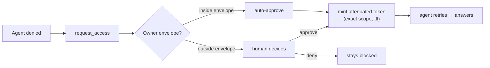
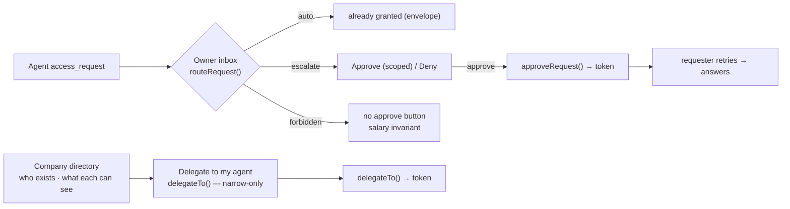

# 03 · Access Control

**Anchors:** `crates/sync` modules `access/`, `identity.rs`; subcommand `ctl`; `packages/protocol/src/access.ts`.

Access control is the heart of Contextful: **capability-based, attenuable, field- and row-level**, enforced with [Biscuit](https://www.biscuitsec.org/).

## 1. Principals & identity

- **Human principal** — an identity in the control-plane registry: `id`, display name, public key.
- **Agent principal** — always owned by exactly one human; id format `agent:<owner>/<n>`. An agent has **no root authority** — it only holds attenuated tokens minted by its owner.

**Hybrid key model (no super-root):**

- The **control plane** is the Biscuit root for **identity & document membership only**. It can register principals and grant document access, but **cannot mint authority over data resources**.
- Each sensitive **resource** (e.g. `stripe/finance_private`) has **its own resource root key, held by its owner** (the CFO). Only that root can mint authority over that resource.

Consequence: `caps(agent) ⊆ caps(owner)` by attenuation, **and** no single key holds authority over all data.

A Biscuit has exactly **one** root keypair, so "per-resource root" means **one token per resource-root**: the CFO's `finance_private` token and the control-plane identity/membership token are *distinct* Biscuits with distinct roots. The authorizer selects the verifying root public key per resource, and a principal holds one token per resource-root it has authority under. (Biscuit *third-party blocks* could embed cross-key facts in a single token, but Contextful does not use them.)

## 2. Resource model

```
resource  := document(<doc_id>) | source(<source_id>) | view(<source_id>, <view_name>)
operation := read | write | comment | query | admin
field     := named column        (e.g. employee_salary, discount_tier, credits)
row       := predicate           (e.g. team in {eng, ops})
```

**Views are the unit of finance privacy.** `stripe/spend_by_team` exposes `team, period, gross, net`; `stripe/finance_private` additionally exposes `discount_tier, credits, employee_salary` and is rooted at the CFO.

## 3. Tokens & attenuation

A first-party token from the CFO resource root (Datalog):

```datalog
right("query", view("stripe","finance_private"));
right("query", view("stripe","spend_by_team"));
field("stripe","finance_private","discount_tier");
field("stripe","finance_private","credits");
field("stripe","finance_private","employee_salary");
```

Attenuation appends a block that can only **narrow** (CFO → CTO, redacting salary):

```datalog
check if operation($op), $op == "query";
check if resource(view("stripe", $v));
deny if field("stripe", $any, "employee_salary");
allow_field("stripe","finance_private","discount_tier");
allow_field("stripe","finance_private","credits");
row_scope("stripe","spend_by_team","team", ["eng","ops","sales","finance"]);
```

Because Biscuit blocks are append-only and checks accumulate, an attenuated token can never regain authority the parent didn't grant.

## 4. Field- & row-level enforcement

The brain query layer ([02 §4](./02-brain-memory.md)) authorizes **each field and each row-scope separately** via a Biscuit `Authorizer`:

- **Redaction vs. denial is signaled, never silent.** A field the caller partially covers but is not cleared for is **dropped from the projection and listed in a `redacted: [...]` field** on the result, so the agent knows it could raise `request_access`. A resource/view with **no grant at all** returns a typed **denial** (not an empty result) — that denial is the trigger for the request flow ([§5](#5-permission-requests--auto-mode)).
- denied **rows** are filtered out.
- **Free-form Markdown cards cannot be column-redacted**, so they are authorized **all-or-nothing** against the card's `acl_tag` ([02 §3](./02-brain-memory.md)); synthesis keeps facts of different acl in different cards, with a value-scrub pass as defense-in-depth.
- enforcement happens **before** any data reaches the agent or LLM.

### Egress firewall (the inverse boundary)

§4 above governs data flowing **in** to an agent. World enrichment ([02 §8](./02-brain-memory.md)) and daydream grounding ([02 §9](./02-brain-memory.md)) flow a query **out** to Exa — the inverse risk: an agent could smuggle `employee_salary = 412000` into a search string and exfiltrate it in plain sight. The **egress firewall** applies the same Biscuit boundary to **outbound** terms:

- every term in a `world_search` / `ground` query is checked against its **provenance taint**, and **any term carrying a private `acl_tag` is blocked before it reaches the network** — exactly as a denied field is dropped from a projection.
- only `world` / public-tainted terms leave the host; world queries are built from public entities (vendor, product, metric name), **never from a private value**. There is no "ask nicely" path.
- the allowlist (which term classes count as public) and the Exa cost cap are control-plane config ([07 §3](./07-deployment-iac.md)).

## 5. Permission requests & auto-mode

When an agent is **denied** (no grant, not merely redacted), it raises a structured `access_request`:

```
access_request {
  kind:      "access_request",
  requester: agent("cto","1"),            // who is asking
  resource:  view("stripe","finance_private"),
  fields:    ["credits","discount_tier"],
  row_scope: { team: ["eng","ops"] } | all,
  reason:    "<why>",
  doc:       <doc_id>,
  ttl:       <duration>
}
```

Routing:



**Auto-mode** avoids permission fatigue: an owner sets a **policy envelope**, e.g. *"auto-approve read of `spend_by_team` aggregates to internal agents, max ttl 7d; always escalate `employee_salary` or `finance_private`."* Requests inside the envelope are granted by the agent runtime automatically; anything outside escalates to the human.

## 6. Web access-control UI

The web app ([`apps/web`](../apps/web)) surfaces the access-control model so **people** — not just agents over MCP — can see who exists, delegate authority to their own agents, and decide on incoming requests. Three surfaces, all backed by `@superai2026/protocol` (`access.ts`, `requests.ts`) so the browser computes the same `caps(child) ⊆ caps(parent)` result the host enforces. The host stays authoritative: a browser-side "approve" or "delegate" is a **request to mint**, re-verified and recorded on the host (`ctl`, [07](./07-deployment-iac.md)) — the UI never holds a minting key.

### 6.1 Company directory

A roster of the control-plane **principal registry** ([§1](#1-principals--identity)): every human (id, display name, role) and, nested under each, the agents they own (`agent:<owner>/<n>`). For each principal it summarizes **effective capability** — the views, fields, and row-scopes their token grants, computed via `effectiveCapability()` — rendered as quiet capability chips (`.cf-badge`); any principal holding `employee_salary` shows it as a **danger** chip, so *"who can see salary"* is answerable at a glance. The directory reads identity/membership from the control plane only and never exposes token secrets — only the computed scope. It is membership-rooted, so **no data authority is mintable here** ([§1](#1-principals--identity)).

### 6.2 Delegation — a member grants their agent a subset

From a principal's detail in the directory, a member delegates authority to one of **their own** agents. This is intra-owner and needs **no approval** — you are narrowing your own token. The delegation form lets the owner pick a view they already hold, choose a subset of its fields and a row-scope, and set a TTL. It can only **narrow**: fields outside `effectiveCapability(owner)` are not selectable, and `employee_salary` / any [`NEVER_DELEGABLE`](#5-permission-requests--auto-mode) field is never offered. Submitting calls `delegateTo(ownerCap, agentId, { allowFields, denyFields, rows, ttl })`, handing a fresh attenuated token to the agent and recording it in the audit trail. The result — `caps(agent) ⊆ caps(owner)` — is visible, not just asserted.

### 6.3 Inbox — accept or decline agent access requests

When an agent is denied a resource it does not hold (typically owned by someone else — e.g. the CFO's `finance_private`), it raises an `access_request` ([§5](#5-permission-requests--auto-mode)). The **owner of that resource** sees it in their **inbox**. Each item shows the requester (with a presence dot), the requested view / fields / row-scope, the reason, the doc, and the requested TTL, plus the **routing decision** (`routeRequest()`) as a badge:

- **auto** — inside the owner's envelope; already granted by the runtime, shown for the record.
- **escalate** — outside the envelope; the owner decides. **Approve (scoped)** calls `approveRequest(ownerCap, req)` — mints exactly the requested scope, salary always denied — and delegates the token to the requester, who retries and answers. **Deny** leaves it blocked.
- **forbidden** — names a `NEVER_DELEGABLE` field; **no approve action is rendered at all**. The salary invariant is enforced as a UI affordance too, not only as a server check ([§7 summary](#7-security-model-summary)).

Request lifecycle: `pending → {auto | approved | denied | forbidden} → expired` (on TTL). The inbox is the human end of **Flow A**; **Flow B**'s salary request lands here as a forbidden item with no approve button (see [09](./09-testing-acceptance.md)).



## 7. Security model summary

- **Least authority by construction** — `caps(agent) ⊆ caps(owner)` via append-only blocks.
- **No capability super-root** — control-plane root covers identity/membership; sensitive resources are rooted at their owners.
- **Enforcement at the data boundary** — field/row redaction in the brain query layer, before agent/LLM.
- **No ambient authority** — sandboxes egress only through the brain MCP, every call capability-checked ([04](./04-sandbox-agents.md)).
- **Egress firewall** — outbound world/daydream queries carry only public terms; a privately-tainted term is blocked before the network (§4, *Egress firewall*), so web enrichment can't exfiltrate a private value.
- **Daydreaming stays in-bounds** — the background synthesis loop ([02 §9](./02-brain-memory.md)) samples only acl-admissible card pairs and stamps insights with `max(parents)` taint, so it can neither cross owners nor lower an acl_tag; the salary invariant holds under daydreaming too ([09](./09-testing-acceptance.md) Flow B/G).
- **Confidential transport** — Tailscale WireGuard.
- **Auditable grants** — every minted/attenuated token and `access_request` recorded under `~/.contextful/caps/`.
- **The salary invariant** — no token and no approval path outside the CFO's own root yields `employee_salary` (proven in [09](./09-testing-acceptance.md) Flow B), and the [delegation form](#62-delegation--a-member-grants-their-agent-a-subset) / [inbox](#63-inbox--accept-or-decline-agent-access-requests) never even offer it.

## 8. Scaffold / Status

| Spec element | Code |
|---|---|
| Principal / Agent identity, `agent:<owner>/<n>` | `crates/sync/src/identity.rs` ✅ built |
| Capability / Resource / Operation / Field / Row | `crates/sync/src/access/mod.rs` ✅ built |
| mint / attenuate / authorize, field/row authorizer | `crates/sync/src/access/biscuit.rs` ✅ built |
| `access_request` + grant + auto-mode envelope | `crates/sync/src/access/request.rs` ✅ built |
| Egress firewall (outbound term taint check) | `crates/sync/src/access/egress.rs` (stub) |
| Principal registry / root keys / envelopes (`ctl`) | `crates/sync/src/controlplane/` ✅ built |
| TS types + helper signatures | `packages/protocol/src/access.ts` — `Capability`, `Action`, `Resource`, `PermissionRequest`/`Grant`, `attenuate()`/`authorize()` |
| Web UI logic — route/approve/delegate | `packages/protocol/src/{requests,access}.ts` — `routeRequest()`, `approveRequest()`, `delegateTo()`, `effectiveCapability()`, `delegableFields()` ✅ built |
| Web UI surfaces — directory · delegation · inbox | `apps/web/app/routes/{directory,delegate,inbox}.tsx` over a shared `app/lib/accessStore.tsx` ✅ built — each route folds the same `caps(child) ⊆ caps(parent)` result; the `_index.tsx` console keeps its embedded request panel + audit trail |

**Future:** real Biscuit Datalog policies + `Authorizer`, `@biscuit-auth/biscuit-wasm` integration in the web for client-side checks, revocation, and host-persisted audit (the surfaces of [§6](#6-web-access-control-ui) are built but compute against in-browser fixtures; a browser "delegate"/"approve" is still a *request to mint* that the real control plane re-verifies and records).
