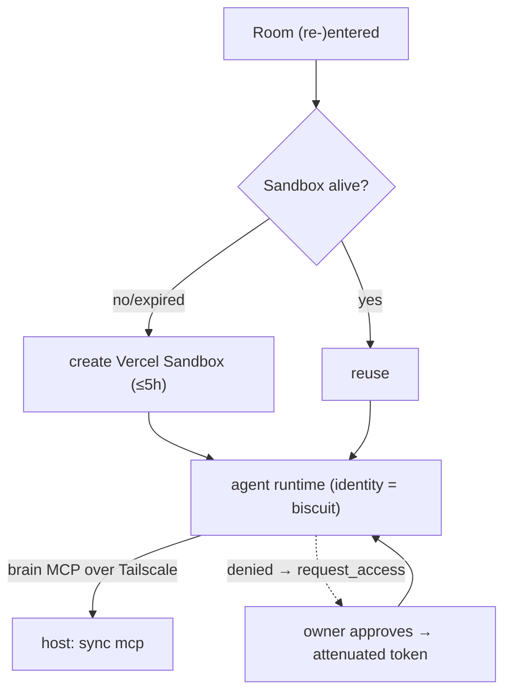

# 04 · Sandbox & Agents

**Anchors:** `crates/sync` subcommand `agent`; modules `sandbox/`, `agent/`.

## 1. Per-document sandbox

Each document is paired 1:1 with a **secure sandbox** in which that room's agents run. Inside the sandbox an agent can query the brain to fetch relevant data; where it has insufficient access it raises a permission request to the resource/agent owner ([03 §5](./03-access-control.md)).

Invariants (independent of where the sandbox runs):

- **No ambient authority.** The agent's *only* data egress is the **brain MCP** ([06](./06-mcp-interface.md)); there is no arbitrary network or filesystem access. Every call is capability-checked.
- **Insufficient-access path.** A denied query → `request_access` → on approval the owner mints an attenuated token → the sandbox receives it → the agent retries.
- **Ephemeral, no durable private state.** Sandboxes are created and torn down with the room session; anything durable must be written back to the brain via `brain.remember`.

## 2. Runtime: Vercel Sandbox (default) + local fallback

The sandbox runtime is **pluggable** behind a `Sandbox` trait.

- **Vercel Sandbox — default ("agents from anywhere").** Members run agents from anywhere, local or cloud, with **any harness** (Claude Code, OpenClaw, …) — just provide an **identity** (a Biscuit token). The agent runs in a Vercel Sandbox microVM and connects back to the host's brain MCP over Tailscale.
  - **5-hour cap.** A sandbox lives at most ~5 hours (Pro/Enterprise). We **recreate the sandbox whenever someone re-enters the room** (and may `extendTimeout` an active one), so the limit is invisible in normal use.
  - **Created/torn down with room presence.** Entering a room provisions (or reuses) its sandbox; leaving lets it expire.
- **Local constrained process — offline fallback.** On-host, an agent runs as a constrained child process whose only socket is the brain MCP, with resource limits. This is the path used for the **fully-offline / on-prem proof** (Flow D), and the path *architected for* `wasmtime` isolation of untrusted agent/connector code with a capability-shaped host API.

> **Divergence from reference:** the reference (original `superai2026/specs/SPEC.md` draft) ran agents only in an on-host process. Here **Vercel Sandbox is the default** runtime (to support "run agents from anywhere with any harness"); the on-host constrained process is retained as the offline fallback.
>
> The trust boundary is **data-egress, not compute-locality**: a cloud sandbox holds **no ambient authority** and only ever sees the redacted, capability-filtered slice the brain returns — so cloud compute does not widen data exposure. Both runtimes share MCP-only-egress and ephemerality, but they are **not** equally isolated *yet*: the Vercel microVM is enforced today, whereas the local process's filesystem isolation is the future `wasmtime`/OS-sandbox work. Until that lands, the local fallback must run under OS-enforced isolation before it can claim the Vercel path's guarantee (see [02 §4](./02-brain-memory.md) — direct host-FS access bypasses the capability layer).

## 3. Agent runtime & inference

An agent is an **LLM loop** whose only tool surface is the brain MCP. The runtime carries the agent's identity, queries the brain, raises permission requests, and writes durable findings back via `brain.remember`. It also drives ingestion and synthesis jobs ([02](./02-brain-memory.md)).

Write-back is **taint-tracked**: a memory written via `brain.remember` is stamped with at least the max `acl_tag` of every source the agent read in that turn, so privileged context can't be laundered into a low-acl card ([06 §1](./06-mcp-interface.md)).

Inference is **trait-based**, swapped by config:

| Backend | Crate | Use |
|---|---|---|
| **Bedrock + Claude** (default) | `aws-sdk-bedrockruntime` (Converse API) | high-quality synthesis & agent turns |
| **OpenAI-compatible** (LM Studio) | `async-openai` pointed at `http://localhost:1234/v1` | on-prem / offline mode |
| `StubInference` | — | default when no backend feature is enabled (keeps the scaffold compiling) |

> **Divergence from reference:** the reference defaulted to LM Studio + Gemma. Here the **default is Bedrock + Claude**, with LM Studio as the explicit on-prem/offline backend. The local-first guarantee still holds because the data boundary (field/row redaction, structured query) needs **no** LLM — and the offline demo runs on LM Studio.

## 4. Learning from past mistakes & anomalies

Agents improve month-over-month: the synthesis pipeline detects anomalies against a rolling baseline, and human corrections in the document are captured as `learning` rows that suppress false re-flags and bias future synthesis ([02 §2](./02-brain-memory.md), [09](./09-testing-acceptance.md) Flow C).

## 5. Scaffold / Status

| Spec element | Code |
|---|---|
| `agent` subcommand | `crates/sync/src/main.rs` → `agent::runtime::run` |
| Agent loop (MCP-only tool surface, request_access) | `crates/sync/src/agent/runtime.rs` ✅ built (trait + stub driver) |
| Inference trait + StubInference (+ Bedrock/OpenAI features) | `crates/sync/src/agent/inference.rs` ✅ built (trait + stub driver) |
| Sandbox trait + lifecycle | `crates/sync/src/sandbox/mod.rs` ✅ built (trait + stub driver) |
| Vercel Sandbox driver | `crates/sync/src/sandbox/vercel.rs` ✅ built (trait + stub driver) |
| Local constrained-process driver | `crates/sync/src/sandbox/local.rs` ✅ built (trait + stub driver) |

**Future:** real Vercel Sandbox SDK orchestration (`@vercel/sandbox`), recreate-on-re-entry wiring, `wasmtime` isolation, Bedrock/LM Studio calls, agent harness adapters (Claude Code / OpenClaw).
