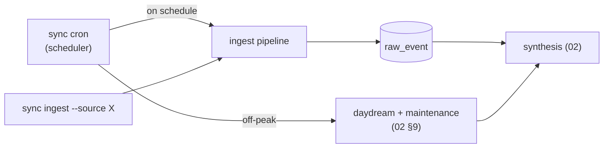

# 05 · Connectors & ETL

**Anchors:** `crates/sync` subcommands `ingest` / `cron`; modules `connectors/`, `cron/`.

## 1. Connector trait

All ingestion goes through one trait. A connector declares its source id, the **views** it exposes (the unit of access control, [03 §2](./03-access-control.md)), and a `pull` that yields raw events tagged with provenance and `acl_tag`:

```rust
trait Connector {
    fn source_id(&self) -> &str;                  // "stripe"
    fn views(&self) -> &[ViewSchema];             // spend_by_team, finance_private, ...
    fn pull(&self, since: Cursor) -> EventStream;  // raw events + acl_tag + provenance
}
```

`ViewSchema` names the view and its typed fields; `acl_tag` on each event maps to resource/field/row so that downstream memories inherit the right access requirements.

## 2. Demo connectors

- **Stripe (mock) — primary.** Stripe-shaped FinOps data — **charges, invoices, subscriptions, balance transactions, payouts, credits, discounts** — sourced from a **Kaggle dataset** and mapped to views:
  - `stripe/spend_by_team` → `team, period, gross, net`
  - `stripe/finance_private` → adds `discount_tier, credits, employee_salary` (CFO-rooted)
- **Exa — web enrichment (world memory).** A **real, key-based** connector using [Exa](https://exa.ai) (`/search`, `/contents`, `/answer` for cited RAG) to ground the brain in public knowledge — pricing, benchmarks, vendor events ([02 §8](./02-brain-memory.md)). Results are normalized into raw events tagged `acl_tag = world` (public) with `external_url` + `retrieved_at` provenance. Every query first passes the **egress firewall** ([03 §4](./03-access-control.md)) — only public-tainted terms leave the host, never a private value. It fires **reactively** (an agent answering a doc question) and **proactively** (cron enrichment + the daydream loop, [02 §9](./02-brain-memory.md)); results are cached so world memory serves offline ([09](./09-testing-acceptance.md) Flow D).
- **Slack — workspace context.** A **real, token-based** connector polling the Slack Web API (`conversations.list` + `conversations.history`) into `slack/channel_messages` (`channel, user, text, ts`). Poll-based by design — no Event Subscriptions, no inbound webhook, no public URL — so ingestion stays local-first. The read-only app manifest lives at `infra/slack/manifest.yaml` (install steps in `infra/slack/README.md`). Live vs. offline is selected at runtime by `SLACK_BOT_TOKEN`; without it the connector reads `<fixtures>/slack/messages.json`, else embedded rows, with zero egress.
- **Stubs.** Notion / Linear / AWS / Vercel — trait impls with small fixtures, to show the shape generalizes.

> **Additions over reference:** the **Exa** connector and **cron scheduling** below are source-of-truth here; the reference covered only manual `sync ingest` of Stripe + stubs.

## 3. Ingestion commands & cron

- **One-shot:** `sync ingest --source stripe` runs the connector's `pull`, writes `raw_event` rows, and triggers the synthesis pipeline ([02 §2](./02-brain-memory.md)). `--watch` re-ingests on fixture change (dev).
- **Scheduled:** `sync cron` runs a scheduler that triggers ETL pipelines on a cron expression — this is the **context layer** that keeps the brain fresh (e.g. Stripe nightly, Exa enrichment hourly). Schedules are declared in config ([07](./07-deployment-iac.md)).
- **Daydream / dream cycle:** `sync cron` also schedules the background **daydream + maintenance** cycle ([02 §9](./02-brain-memory.md)) off-peak (e.g. nightly) — it synthesizes new insight cards and runs GBrain-style housekeeping (dedup, backlinks, contradiction detection, citation fixing). Budget + schedule are control-plane config ([07 §3](./07-deployment-iac.md)).



## 4. Ad-hoc connectors (growth path)

Agents can author connectors at runtime using a **constrained primitive API** inside the sandbox — `fetch`, `parse`, `map_to_view`, `declare_acl`. The `ViewSchema` / `acl_tag` contract is defined so an authored connector slots straight into the ingest path. `declare_acl` is **bounded by the authoring agent's own capabilities** — an authored connector can only tag ingested data **at or above** its author's authority, never tag-down to widen access — and authored connectors are reviewable before they run. Specced, not built for the demo.

## 5. Scaffold / Status

| Spec element | Code |
|---|---|
| `Connector` trait, `ViewSchema`, `Cursor`, `Record`, `acl_tag` | `crates/sync/src/connectors/mod.rs` ✅ built |
| Stripe mock connector | `crates/sync/src/connectors/stripe.rs` ✅ built |
| Exa web-enrichment connector | `crates/sync/src/connectors/exa.rs` ✅ built |
| Slack workspace-context connector (+ app manifest `infra/slack/`) | `crates/sync/src/connectors/slack.rs` ✅ built |
| Cron scheduler | `crates/sync/src/cron/scheduler.rs` ✅ built |
| `ingest` / `cron` subcommands | `crates/sync/src/main.rs` |

**Future:** real Kaggle→views mapping, Exa HTTP calls (`/search`/`/answer`) behind the egress firewall, cron expression parsing + pipeline triggers (incl. the nightly daydream cycle), ad-hoc connector primitives, Slack incremental cursors + user-id→name enrichment, a Slack-owned root key / multi-view capabilities so `slack/channel_messages` is grantable ([03](./03-access-control.md)), OAuth connectors (Notion/Linear/AWS/Vercel).
