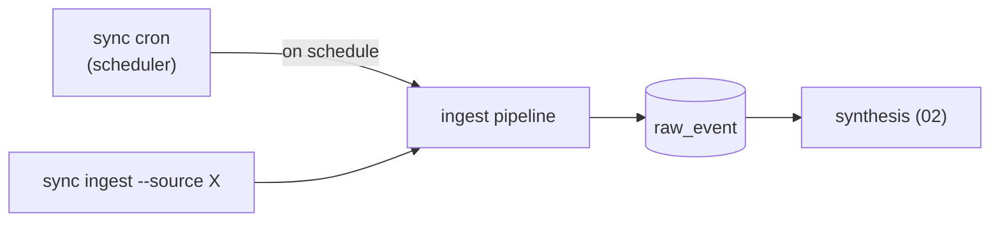

# 05 · Connectors & ETL

**Anchors:** `crates/sync` subcommands `ingest` / `cron`; modules `connectors/`, `cron/`.

## 1. Connector trait

All ingestion goes through one trait. A connector declares its source id, the **views** it exposes (the unit of access control, [03 §2](./03-access-control.md)), and a `pull` that yields raw events tagged with provenance and `acl_tag`:

```rust
trait Connector {
    fn source_id(&self) -> &str;                  // "stripe"
    fn views(&self) -> &[ViewSchema];             // spend_by_team, finance_private, ...
    fn pull(&self, since: Cursor) -> EventStream;  // raw events + acl_tag + provenance
}
```

`ViewSchema` names the view and its typed fields; `acl_tag` on each event maps to resource/field/row so that downstream memories inherit the right access requirements.

## 2. Demo connectors

- **Stripe (mock) — primary.** Stripe-shaped FinOps data — **charges, invoices, subscriptions, balance transactions, payouts, credits, discounts** — sourced from a **Kaggle dataset** and mapped to views:
  - `stripe/spend_by_team` → `team, period, gross, net`
  - `stripe/finance_private` → adds `discount_tier, credits, employee_salary` (CFO-rooted)
- **Exa — world knowledge.** A **real, key-based** connector using [Exa](https://exa.ai) (`/search`, `/contents`) to query the web and feed the brain's **world memory** ([02 §8](./02-brain-memory.md)) — pricing/discount references, market comps, published FinOps benchmarks, vendor and regulatory facts that contextualize the private company numbers. Results are normalized into raw events like any other source, with three differences that make them world memory rather than company memory:
  - **Tagged `acl = world`** — the `exa/web_enrichment` view is fully public, so every event is dominated by every principal's token (the taint *floor*, vs. the private-source *peak*).
  - **Citation-bearing** — each event carries the canonical `url`, `retrieved_at`, and a `content_hash`; synthesis dedupes by `url`+`content_hash` and counts independent corroborations into `memory.confidence` ([02 §3](./02-brain-memory.md)).
  - **Freshness-cursored** — the `Cursor` tracks `retrieved_at`/`stale_after` per query so `sync cron` re-fetches expiring facts and supersedes stale ones; the brain never benchmarks against a stale public number.

  **Egress is capability-checked.** An Exa query is an outbound channel, so it is built from **non-private terms only** and passes a query-sanitization gate before any HTTP call — private view/field values (salary, actual spend, discount tier, credits) may never appear in a query. This is the outbound mirror of the brain's inbound redaction; full rules in [02 §8.1](./02-brain-memory.md). Exa sees the public web, not `~/.contextful`, so world ingest can only ever return world-readable data.
- **Stubs.** Notion / Slack / Linear / AWS / Vercel — trait impls with small fixtures, to show the shape generalizes.

> **Additions over reference:** the **Exa** connector and **cron scheduling** below are source-of-truth here; the reference covered only manual `sync ingest` of Stripe + stubs.

## 3. Ingestion commands & cron

- **One-shot:** `sync ingest --source stripe` runs the connector's `pull`, writes `raw_event` rows, and triggers the synthesis pipeline ([02 §2](./02-brain-memory.md)). `--watch` re-ingests on fixture change (dev).
- **Scheduled:** `sync cron` runs a scheduler that triggers ETL pipelines on a cron expression — this is the **context layer** that keeps the brain fresh (e.g. Stripe nightly, Exa world-knowledge refresh hourly). For Exa, cron is also what keeps **world memory** current: it re-fetches facts whose `stale_after` has passed and supersedes the stale cards so grounding ([02 §8.2](./02-brain-memory.md)) always benchmarks against live public data. Schedules are declared in config ([07](./07-deployment-iac.md)).



## 4. Ad-hoc connectors (growth path)

Agents can author connectors at runtime using a **constrained primitive API** inside the sandbox — `fetch`, `parse`, `map_to_view`, `declare_acl`. The `ViewSchema` / `acl_tag` contract is defined so an authored connector slots straight into the ingest path. `declare_acl` is **bounded by the authoring agent's own capabilities** — an authored connector can only tag ingested data **at or above** its author's authority, never tag-down to widen access — and authored connectors are reviewable before they run. Specced, not built for the demo.

## 5. Scaffold / Status

| Spec element | Code |
|---|---|
| `Connector` trait, `ViewSchema`, `Cursor`, `Record`, `acl_tag` | `crates/sync/src/connectors/mod.rs` ✅ built |
| Stripe mock connector | `crates/sync/src/connectors/stripe.rs` ✅ built |
| Exa world-knowledge connector | `crates/sync/src/connectors/exa.rs` ✅ built (canned offline; live behind `exa-http`) |
| Cron scheduler | `crates/sync/src/cron/scheduler.rs` ✅ built |
| `ingest` / `cron` subcommands | `crates/sync/src/main.rs` |

**Future:** real Kaggle→views mapping, Exa HTTP calls + citation/freshness fields + egress query-sanitization ([02 §8.1](./02-brain-memory.md)), cron expression parsing + freshness-driven world refresh, ad-hoc connector primitives, OAuth connectors (Notion/Slack/Linear/AWS/Vercel).
