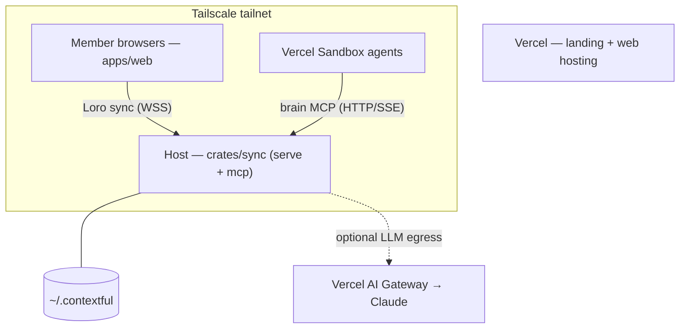

# 07 · Deployment & IaC

**Anchors:** `crates/sync` subcommand `ctl`; module `controlplane/`; Pulumi recipes (spec-only).

## 1. Topology

Local-first. The **host** (e.g. a Mac Studio) is authoritative and runs the `crates/sync` binary; **browsers** hold only what they were granted; **cloud is optional** (managed inference, agent sandboxes, web hosting).

## 2. Networking (Tailscale)

- Everything runs on the tailnet; the host advertises the **sync WS** and **MCP** endpoints on its tailnet address.
- **Tailscale ACLs** restrict which nodes can reach the sync/MCP ports.
- Cloud touches the tailnet only for coordination and **optional** inference/sandbox egress; **raw source data and un-redacted brain content never leave the host** — only already-permitted, capability-redacted content is sent to cloud inference (the Vercel AI Gateway) or cloud agent compute (Vercel Sandbox), and that path can be disabled entirely ([09](./09-testing-acceptance.md) Flow D).
- Tailscale is set up **externally** on the host — this system assumes the tailnet exists and does not manage `tailscaled` itself (open question from reference §20: `tsnet` embedding deferred).

## 3. Control plane (`sync ctl`)

The control plane configures a deployment and seeds identity. It is **identity-root only** — it can register principals and document membership but **cannot mint authority over data resources** (those are rooted at their owners, [03 §1](./03-access-control.md)).

- **Tailnet config** — register the host; emit a Tailscale ACL stanza for the sync/MCP ports.
- **Principal registry** — seed humans + agents with keypairs.
- **Envelopes** — register each owner's auto-mode policy envelope ([03 §5](./03-access-control.md)).
- **Schedules, daydream budget & egress policy** — cron schedules for ETL and the off-peak **daydream cycle** ([02 §9](./02-brain-memory.md), [05 §3](./05-connectors-etl.md)); the daydream budget (max cards/cycle, model tier, world-query cap); and the **egress allowlist** + Exa cost cap that bound world queries ([03 §4](./03-access-control.md)). Declared in config under `~/.contextful/control/`.
- **CLI verbs** — `seed`, `mint`, `revoke`, `show`. `revoke` records a token id in a revocation list under `~/.contextful/caps/` that the MCP/relay auth path checks on every session and tool call. Backed by a config file under `~/.contextful/control/`.

## 4. Vercel projects

Two Vercel projects from the same repo (unchanged from the repo baseline):

- **Landing** — Root Directory `apps/landing`, Astro preset → `www.contextful.work`.
- **Web** — Root Directory `apps/web`, **React Router 7 (Vite)** build → `demo.contextful.work`. (Vercel preset via `vercelPreset()` in `react-router.config.ts` with `ssr: true`; Vercel splits the app across Functions + static assets.)

`crates/sync` is **not** deployed to Vercel — it runs on the host. **Vercel Sandbox** (agent compute, [04](./04-sandbox-agents.md)) is a separate Vercel capability, provisioned on demand by the agent runtime.

## 5. Pulumi IaC recipes

> **Addition over reference:** the reference described manual setup via `sync ctl`. Here **Pulumi** automates the cloud-side and bootstrap steps; `sync ctl` remains for on-host identity/control-plane seeding.

Pulumi recipes (TypeScript, to match the workspace) provision, idempotently:

- Vercel projects + custom domains (`www` / `demo`) and env vars (`AI_GATEWAY_API_KEY`, Exa key, tailnet auth key).
- Tailscale ACL/tag policy for sync/MCP ports.
- Vercel AI Gateway API key (`AI_GATEWAY_API_KEY`) provisioned for inference.
- A bootstrap that lays down `~/.contextful/` and invokes `sync ctl seed` for the demo principals + envelopes.

Pulumi is **spec-only** this pass (recipes described, not built).

## 6. Scaffold / Status

| Spec element | Code |
|---|---|
| `ctl` subcommand | `crates/sync/src/main.rs` → `controlplane` |
| Principal registry / root keys | `crates/sync/src/controlplane/registry.rs` ✅ built |
| Auto-mode envelopes | `crates/sync/src/controlplane/envelope.rs` ✅ built |
| Config (paths, sources, inference, tailnet) | `crates/sync/src/config.rs` ✅ built |
| Pulumi recipes | spec-only (future `infra/` package) |

**Future:** Pulumi `infra/` package, real `ctl` seed/mint/revoke, Tailscale ACL emission, Vercel Sandbox provisioning glue.
