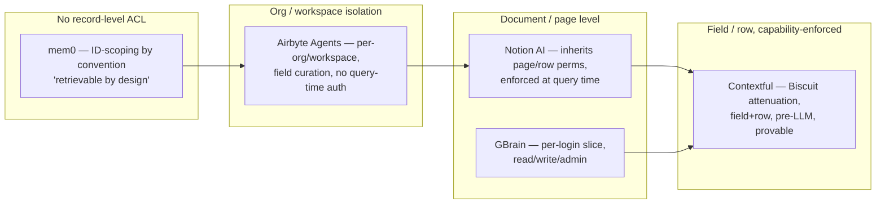

# 10 · Comparison — Contextful vs. GBrain, mem0, Notion AI, Airbyte Agents

**Status:** Draft v1 · **Product:** Contextful · **Anchors:** [00 · Overview](./00-overview.md), [02 · Brain & Memory](./02-brain-memory.md), [03 · Access Control](./03-access-control.md), [05 · Connectors & ETL](./05-connectors-etl.md), [06 · MCP Interface](./06-mcp-interface.md)

Contextful's [overview](./00-overview.md) places it "in the spirit of mem0 / GBrain / LLMWiki, but the memory is human-readable Markdown." This spec makes that comparison precise and honest. It is written for an evaluator deciding whether Contextful's capability-scoped model is worth its added moving parts versus shipping, popular alternatives.

Four products span two categories: **GBrain, mem0, and Notion AI** are *memory / knowledge* layers (they synthesize or retrieve what the agent knows); **Airbyte Agents** is a *data-movement / context-plumbing* layer (it replicates and indexes source data for agents to query). Contextful spans both — it has a [connectors/ETL layer](./05-connectors-etl.md) *and* a synthesizing brain — which is why all four are relevant.

> **The one axis that separates them.** Every one of these systems answers *"what data can the AI reach?"* Only Contextful and (partially) Notion AI also answer *"what is this particular agent **provably allowed** to reach?"* — and only Contextful enforces it at **field and row** granularity, before any data reaches the LLM. That is the whole thesis: [the salary invariant](./03-access-control.md#7-the-salary-invariant), proven not promised.

## 1. The contenders at a glance

| | **Contextful** | **GBrain** (`garrytan/gbrain`) | **mem0** | **Notion AI** | **Airbyte Agents** |
|---|---|---|---|---|---|
| **What it is** | Local-first company brain with capability-scoped agents | Markdown-native personal/company brain for agents | Universal memory layer for agents (SDK + cloud) | Built-in workspace AI (RAG over your docs) | Context layer for agents — replicate + index source data |
| **License** | (this repo) | MIT — OSS, no paid product | Apache-2.0 core + managed cloud | Proprietary SaaS | OSS classic platform + proprietary hosted Agents |
| **Memory format** | Human-readable **Markdown** cards + file index (SQLite/DuckDB) | **Markdown** pages (truth) + pgvector + graph | Extracted facts in **vector + graph + KV** | **Vectors/RAG** over existing Notion + connected content | **No memory** — replicated/indexed copy of source rows + embeddings |
| **Access model** | **Capability (Biscuit), attenuable, field/row-level**, enforced pre-LLM | login-slice + read/write/admin tiers (agent-instruction-driven) | **ID-scoping only** (`user/agent/run/app_id`); "retrievable by design" | **Inherits Notion perms**, page/row-level, enforced at query time | **Org/workspace isolation only**; field *curation* but no query-time auth |
| **Data residence** | **On-host by default**; cloud optional & redacted | Local / self-host / cloud (git-owned data) | Lib (local) / self-host / managed cloud | Notion cloud + LLM providers | Your store (classic) **or** Airbyte-managed Context Store (Agents) |
| **Agent/MCP** | MCP-native brain, every call cap-checked | **MCP-native, 30+ tools** | SDK/API/CLI (+ ecosystem MCP) | Notion Agents + AI Connectors | **MCP-native**, search + live read/**write** actions |
| **Learns from corrections** | Yes — `learning` rows suppress re-flags ([Flow C](./09-testing-acceptance.md)) | Yes — nightly "dream cycle" consolidation | Yes — extract→consolidate→update | Re-indexes source; no separate memory store | No — "performs no learning or synthesis"; refreshes on schedule |
| **Maturity** | Core built + tested; cloud edges gated ([00 §11](./00-overview.md#11-scaffold--status)) | Shipping OSS (Apr 2026) | Shipping OSS + cloud, ~58k★ | Shipping enterprise SaaS | Classic platform mature; Agents GA May 2026 |

> **GBrain disambiguation.** "GBrain" is ambiguous in the wild. We mean **Garry Tan's `garrytan/gbrain`** (MIT, Apr 2026) — the markdown-native agent brain the overview references, and the closest architectural cousin to Contextful. It is *not* the unrelated `company-brain.ai` SaaS (a per-company shared pool) or DevRev's "Computer Memory." Where a claim is GBrain-specific we say so.

> **Airbyte Agents disambiguation.** Airbyte has two AI surfaces: the **classic 600+ connector ELT platform** (moves data into *your* vector DB / warehouse, with chunking + embeddings on sync) and the new **Airbyte Agents** product (GA May 2026) — a hosted "Context Layer" whose **Context Store** replicates a curated subset of source data into *Airbyte-managed* storage, exposed to agents over MCP with live read/**write**. Unless noted, "Airbyte Agents" means the latter. Its own docs are explicit: the Context Store *"performs no learning or synthesis"* — it is governed plumbing + a discovery index, not a brain.

## 2. The axis that matters: access control

This is where Contextful is differentiated, so we lead with it.

- **mem0** has, by its own docs, **no field-level or role-based access control**. Isolation is purely a matter of filtering on `user_id` / `agent_id` / `run_id` / `app_id` at query time, and the docs explicitly warn *not to store secrets* because memory is "retrievable by design." For Contextful's motivating FinOps scenario ([00 §2](./00-overview.md#2-problem--scenario)) this is a non-starter — an engineer's agent and the CFO's agent would draw from the same undivided pool.
- **GBrain** offers a "company brain" mode with per-login slices and `read/write/admin` MCP tiers — closer, but granularity is **login/slice level, not field/row**, and an independent review notes the access logic is implemented largely as *markdown instructions that guide the driving agent* rather than enforced in code. That is a different trust model from a cryptographic capability that the agent **cannot** widen.
- **Airbyte Agents** isolates at the **org / workspace** level — "each organization's data is only accessible to agents within that organization," each source in its own isolated store. You can *curate which fields* get replicated into the Context Store, but that is a pipeline config, not a **per-query, per-principal** authorization: once a field is in the store, any agent in that workspace can read it. There is no field/row authorization at retrieval time. Coarser than Notion AI, and a different thing entirely from a capability the agent cannot widen.
- **Notion AI** is the strongest of the off-the-shelf set: it genuinely **inherits Notion's permission model**, enforces it at **query time** (not just at index time), and respects page- and database-row-level access — "the models cannot see information the user does not already have access to." Its ceiling is that granularity stops at the **page/row** level (no property/field-level AI permissioning), and enforcement is Notion's to define, not a delegable, attenuable capability an agent carries into a sandbox.
- **Contextful** is the only one where access is a **capability** ([03](./03-access-control.md)): a Biscuit token that can only be *narrowed* (`caps(agent) ⊆ caps(owner)`), scoped to **specific fields and row predicates**, verified **before any data reaches the agent or LLM**, with **no super-root** (each sensitive resource is rooted at its owner). Denied columns are dropped and listed in a `redacted: [...]` field so the agent knows to `request_access`; denied rows are filtered. The salary invariant is a **property test**, not a marketing line.

**Net:** if your requirement is "the CTO's agent provably cannot read the CEO's salary," mem0 cannot express it, Airbyte Agents can only keep the field out of the store or split workspaces (no in-store field auth), GBrain expresses it as agent guidance, Notion AI expresses it at page granularity if you structure pages correctly, and Contextful enforces it cryptographically at the field level.

## 3. Memory format & synthesis

| | Truth lives as | Index | Synthesis |
|---|---|---|---|
| **Contextful** | Markdown cards, one `acl_tag` per card ([02 §4](./02-brain-memory.md)) | SQLite/DuckDB + embeddings | Extract → synthesize → supersede (non-destructive); taint-propagated `acl_tag` |
| **GBrain** | Markdown pages in a git repo | Postgres + pgvector + self-wiring graph | Continuous + nightly "dream cycle" (dedup, contradiction, citation repair) |
| **mem0** | Extracted facts | Vector + graph + KV | Streaming extract → consolidate/UPDATE |
| **Notion AI** | Your existing Notion pages/DBs | Vectors (Turbopuffer) over content | None separate — RAG retrieves & cites source |
| **Airbyte Agents** | Your source systems (CRM, tickets, …) | Replicated rows + embeddings in Context Store | **None** — replicate + index only; no derived knowledge |

Airbyte sits apart: it holds **no memory at all** — the Context Store is a fast, searchable *replica* of source rows, refreshed on a schedule, that the agent reasons over. There is nothing to "learn from corrections" because nothing is synthesized. That makes it the cleanest contrast for the *connector* half of Contextful ([05](./05-connectors-etl.md)): both ingest from SaaS sources over a connector abstraction and expose results over MCP, but Contextful's connectors write `raw_event` rows that the **brain then synthesizes into acl-tagged cards**, whereas Airbyte stops at the indexed replica and hands reasoning entirely to the calling agent.

Contextful and GBrain share the **markdown-as-source-of-truth** philosophy — auditable, git-diffable, human-editable memory rather than opaque embeddings. The decisive difference is Contextful's **per-card `acl_tag` with taint propagation**: because free-form prose cannot be column-redacted, every synthesized card is stamped with the *maximum* access requirement of every fact it contains, synthesis **never mixes acl-tags within one card**, and every derived row (`memory`, `anomaly`, `learning`) inherits the max acl of its inputs. Markdown memory is only safe to share with scoped agents *because* the acl model rides along with it — which is exactly the piece GBrain's markdown brain does not have.

mem0's vector/graph store is the most sophisticated retrieval substrate of the four, but its facts are not human-auditable in the same way and carry no access metadata. Notion AI does no separate synthesis — it is retrieval over content you already wrote.

## 4. Data residence & offline

- **Contextful** is **on-host by default** over Tailscale; raw data and un-redacted brain content never leave the host, and only already-permitted, capability-redacted content is sent to cloud — a path that can be turned off entirely ([Flow D](./09-testing-acceptance.md)). Critically, **`brain.query` is deterministic and needs no LLM**, so structured query + redaction keep working fully offline.
- **GBrain** is self-host-first (PGLite local, Postgres self-host, or Supabase cloud) with git-owned data — strong user control, comparable residence story, but no field-level redaction layer to make cloud inference safe-by-construction.
- **mem0** can run fully local (library) or managed; residence is your choice, but with no record-level ACL the local/cloud decision is the *only* confidentiality lever.
- **Notion AI** processes in Notion's cloud + third-party LLM providers (Anthropic/OpenAI). Strong contractual posture (no training on your data; Enterprise zero-retention) but **not** local-first; there is no offline mode.
- **Airbyte** splits by product. *Classic* OSS/Enterprise moves data into *your* store and can run fully self-hosted ("no data leaves your environment"). The new *Agents* Context Store is the opposite: Airbyte **copies a curated subset of your source data into Airbyte-managed storage**, refreshed hourly-to-daily. So the "your data stays in your store" framing holds for classic Airbyte but **not** for Airbyte Agents — and the Agents Context Store appears cloud-only at launch (residency/retention/deletion policy not documented; flagged as uncertain).

## 5. Collaboration & agents

Contextful is the only one of the four built around **humans and agents co-editing the same CRDT document** ([01 · Rooms & Sync](./01-room-sync.md)) — agents are first-class Loro peers scoped by `write`/`comment` capability, with live presence. The others are memory/retrieval layers an agent *calls*, not shared workspaces agents *inhabit*. (Notion AI lives inside a collaborative product, but the AI itself is a retrieval/assistant surface, not a co-editing peer.)

All five speak to agents, but the surface differs: GBrain is the most agent-tool-rich (30+ MCP tools); Airbyte Agents is MCP-native with both **search and live read/write actions** (an agent can update a CRM record or open a ticket through it) — powerful, but those writes flow to source systems with only workspace-level isolation; Contextful exposes a tighter brain MCP ([06](./06-mcp-interface.md)) where **every tool call is capability-checked** and a denied query yields a structured `request_access` rather than an error; mem0 is SDK/API-first; Notion AI ships Agents + Connectors inside its own product.

## 6. Honest limitations

Stated plainly so this spec is decision-grade, not a sales sheet:

- **Maturity.** Notion AI is a mature enterprise product; mem0 and GBrain are shipping OSS with real traction. Contextful's **core is built and tested** (capability engine, brain, MCP, relay, control plane) but several cloud edges — real Biscuit-WASM Datalog, managed inference, Vercel Sandbox, Exa HTTP — are **interface-complete and gated off** ([00 §11](./00-overview.md#11-scaffold--status)). Do not compare a demo's breadth to a shipped suite's.
- **Retrieval depth.** mem0's vector+graph+temporal retrieval and GBrain's hybrid search + dream-cycle enrichment are more mature retrieval engines than Contextful's current file index. Contextful's bet is that *correct scoping* matters more than *maximal recall* for the FinOps use case — but for a single-tenant personal assistant with no confidentiality boundary, mem0/GBrain may simply be the better memory.
- **Setup cost.** Contextful's per-resource roots, envelopes, and attenuation are more to operate than "drop in a memory SDK" (mem0) or "point an MCP client at a brain" (GBrain). The complexity buys the invariant; if you don't need the invariant, it's overhead.
- **Ecosystem.** Notion AI inherits Notion's connectors (Slack, Drive, Jira, GitHub, Teams) and enterprise compliance (SOC 2, HIPAA-capable) out of the box. **Airbyte** is in a different league on connector breadth — 600+ classic connectors, ~50 curated for Agents, a Connector Builder, and PyAirbyte. Contextful ships a Stripe mock + Exa ([05](./05-connectors-etl.md)); connector breadth is squarely a place where Airbyte wins and Contextful's roadmap is thin. Contextful's bet is not breadth of ingestion but **what happens after** ingestion — synthesis + field/row capability — so the honest read is that Airbyte and Contextful are complementary as often as competitive (Airbyte could *be* a connector source feeding a Contextful-style governed brain).

## 7. When to choose which

- **Choose Contextful** when multiple principals with **different rights** must draw on **one brain** and you need a *provable* boundary between them (regulated data, finance, multi-department FinOps, on-prem mandates). It is the only option that makes "this agent cannot read that field" a tested invariant.
- **Choose mem0** for a single-tenant agent that needs strong, framework-agnostic long-term memory and you control the confidentiality boundary yourself.
- **Choose GBrain** for a personal or small-team markdown brain with rich MCP tooling and git-owned data, where login-slice scoping is sufficient.
- **Choose Notion AI** if your knowledge already lives in Notion, you want zero-ops enterprise RAG that respects page permissions, and cloud processing is acceptable.
- **Choose Airbyte Agents** when the problem is *reach* — you need agents to discover and act on operational data across many SaaS systems in real time, and workspace-level isolation is a sufficient boundary. It is the connector/plumbing layer, not the governance or memory layer; pair it *with* a governed brain rather than expecting it to be one.

## 8. Scaffold / Status

This spec is descriptive — no code anchor of its own. The claims it makes about Contextful are anchored in [02 · Brain & Memory](./02-brain-memory.md), [03 · Access Control](./03-access-control.md), [06 · MCP Interface](./06-mcp-interface.md), and the [salary-invariant property test](./09-testing-acceptance.md) (Flow B). Competitor facts are sourced below; revisit on each major release of the named products, as all three move quickly.

**Sources (retrieved 2026-06):**

- mem0 — [github.com/mem0ai/mem0](https://github.com/mem0ai/mem0), [docs.mem0.ai/core-concepts/memory-types](https://docs.mem0.ai/core-concepts/memory-types), [mem0.ai/pricing](https://mem0.ai/pricing), paper [arxiv 2504.19413](https://arxiv.org/abs/2504.19413).
- GBrain — [github.com/garrytan/gbrain](https://github.com/garrytan/gbrain) (MIT); independent review [vectorize.io/articles/gbrain-review](https://vectorize.io/articles/gbrain-review); disambiguation: unrelated [company-brain.ai](https://www.company-brain.ai/) and DevRev "Computer Memory."
- Notion AI — [notion.com/help/notion-ai-security-practices](https://www.notion.com/help/notion-ai-security-practices), [notion.com/help/enterprise-search-security-and-privacy-practices](https://www.notion.com/help/enterprise-search-security-and-privacy-practices), [notion.com/help/notion-ai-connectors](https://www.notion.com/help/notion-ai-connectors).
- Airbyte Agents — [docs.airbyte.com/ai-agents](https://docs.airbyte.com/ai-agents), Context Store [docs](https://docs.airbyte.com/ai-agents/platform/context-store) / [explainer](https://airbyte.com/agentic-data/context-store) ("performs no learning or synthesis"), [connectors & credentials](https://docs.airbyte.com/ai-agents/concepts/architecture/connectors-and-credentials), [MCP interface](https://docs.airbyte.com/ai-agents/interfaces/mcp), [launch blog (May 2026)](https://airbyte.com/blog/airbyte-agents), [RBAC](https://docs.airbyte.com/platform/access-management/rbac). Distinct from the classic 600+ connector ELT platform ([github.com/airbytehq/airbyte](https://github.com/airbytehq/airbyte)).
