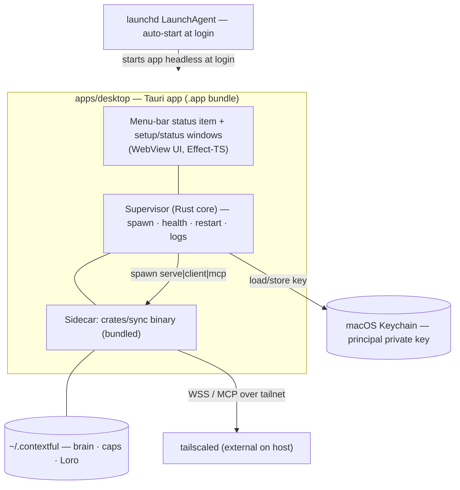
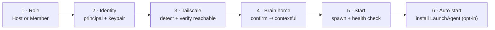

# 10 · macOS App

**Status:** Implemented v1 · **Anchors:** `apps/desktop` (Tauri shell); wraps the `crates/sync` binary (`serve`, `client`, `mcp`, `ctl`).

A native **macOS app** so a non-technical team member can **install and run Contextful without a terminal** — double-click, click through a short setup, and the host peer (`serve` + `mcp` + brain) or a member peer (`client`) is running and supervised. It is a thin, trustworthy shell around the existing Rust binary ([00 §7](./00-overview.md)); it adds **no new authority** and owns **no data** — the binary and `~/.contextful` remain the source of truth ([02](./02-brain-memory.md), [03](./03-access-control.md)).

> **Why a native app.** Today the host is started from a shell (`cargo run -p sync -- serve …`). That gates the deployment on someone comfortable with a terminal, a Rust toolchain, and launchd. The Mac app removes that gate: the binary ships **inside** the app, setup is a wizard, and the process is supervised in the background with a menu-bar status item. This is the missing on-ramp the sync spec already anticipated ([01 §3](./01-room-sync.md): "in future, a native Mac app").

## 1. Two roles, one app

The same app runs in either role; the role is chosen in first-run setup ([§4](#4-first-run-setup)) and switchable later.

| Role | Runs | Who |
|---|---|---|
| **Host** | `sync serve` (Loro relay, authoritative) + `sync mcp` + brain ingest/synthesis cron | One machine per company (e.g. the Mac Studio in [00 §8](./00-overview.md)) |
| **Member** | `sync client` — headless peer syncing rooms to local files, plus a launcher to the web app | Each team member's Mac |

A member who only ever uses the browser editor ([01](./01-room-sync.md)) needs **no app at all** — the app is for (a) running the host, and (b) members who want **local-file** room sync and an always-on presence peer outside the browser. Both roles connect over the existing **Tailscale** tailnet ([07 §2](./07-deployment-iac.md)); the app **detects** Tailscale but does not manage `tailscaled` ([§6](#6-tailscale-integration)).

## 2. Architecture

- **Tauri shell.** The app is a [Tauri](https://tauri.app) bundle: a Rust core (matches the project's Rust ownership of lifecycle/identity, [00 §6](./00-overview.md)) hosting a small WebView UI built with the same TS + Effect-TS + design-system stack as `apps/web` ([08](./08-design-system.md)). Rationale over alternatives in [§8](#8-framework-choice).
- **Sidecar binary.** `crates/sync` is compiled for `aarch64-apple-darwin` (+ `x86_64` for a universal binary) and shipped **inside** `Contextful.app/Contents/Resources` as a Tauri [sidecar](https://tauri.app/develop/sidecar/). No separate install, no `cargo`, no PATH assumptions — the app invokes its own bundled binary by absolute path.
- **Supervisor.** The Rust core spawns the chosen subcommand, tails its stdout/stderr into an in-app log view, health-checks it (relay WS reachable / MCP `tools/list` responds), and restarts on crash with backoff. It surfaces one of `starting · healthy · degraded · stopped` to the menu-bar icon.
- **No new trust surface.** The app reads/writes only what the binary already does (`~/.contextful`) plus the Keychain entry for the principal key. It mints **no** tokens and bypasses **no** capability check — every brain/relay call still goes through the binary's Biscuit path ([03](./03-access-control.md)). The salary invariant ([00 §3](./00-overview.md), [09](./09-testing-acceptance.md) Flow B) is unaffected: the app is just a process launcher.

## 3. Menu-bar UI

The app is **menu-bar-first** (status item, no Dock presence by default) so the host can run unobtrusively.

- **Status item** — color/glyph reflects supervisor state; tooltip shows role, tailnet address, room count, last-ingest time.
- **Dropdown** — Start / Stop / Restart; role + current `~/.contextful` path; "Open web app" (deep-links to `demo.contextful.work` or the local tailnet URL); "Reveal brain in Finder"; "Copy tailnet sync URL"; Logs…; Settings…; Quit.
- **Status window** — supervisor health, recent log tail, room/presence list (host), and a shortcut into the **access inbox** ([03 §6.3](./03-access-control.md)) for owners who approve `access_request`s — the app deep-links to the web inbox rather than re-implementing approval UI.
- **Settings window** — role switch, auto-start toggle, brain home path, inference mode (cloud Vercel AI Gateway vs. offline LM Studio, [00 §4](./00-overview.md) Flow D), update channel.

UI uses the design-system tokens/components ([08](./08-design-system.md)); voice is plain-spoken ([00 §5](./00-overview.md)). No fear-mongering, no raw JSON in the default views.

## 4. First-run setup

A short wizard, run once, that leaves the machine in a supervised running state.

1. **Role** — Host or Member ([§1](#1-two-roles-one-app)).
2. **Identity** — pick/enter the principal id (e.g. `agent:cto/1`'s owner, or `cfo`); generate a keypair if absent. The **private key is stored in the macOS Keychain**, never in plaintext under `~/.contextful`. For the host, this calls into the control-plane seed path (`sync ctl seed` / `mint`, [07 §3](./07-deployment-iac.md)); for a member it registers the principal against the host.
3. **Tailscale** — detect `tailscaled`; if absent, link to install and **block** until reachable (the system assumes the tailnet exists, [07 §2](./07-deployment-iac.md); the app does not embed `tsnet`). Show the resolved MagicDNS host and the sync/MCP URLs.
4. **Brain home** — confirm or relocate `~/.contextful` (`CONTEXTFUL_HOME`); host only.
5. **Start** — spawn the subcommand, wait for the health check to go green.
6. **Auto-start** — opt-in install of a launchd **LaunchAgent** ([§5](#5-lifecycle--auto-start)).

## 5. Lifecycle & auto-start

- **LaunchAgent.** Opt-in `~/Library/LaunchAgents/work.contextful.app.plist` with `RunAtLoad` + `KeepAlive`, launching the app **headless** (menu-bar only) at login. The host stays up across reboots without a logged-in terminal.
- **Supervision.** The in-app supervisor owns the binary's lifecycle while the app runs (spawn, health, restart-with-backoff, graceful stop on quit). launchd keeps the **app** alive; the app keeps the **binary** alive — two layers, clear ownership, no double-spawn (the binary is never registered directly with launchd).
- **Updates.** Tauri's built-in updater against a signed update feed (or Sparkle if we go native, [§8](#8-framework-choice)); updating the app updates the bundled `sync` binary atomically. A host update gracefully drains the relay before swapping.
- **Logs.** Rotating log under `~/Library/Logs/Contextful/`; the in-app log view tails the live process. No secrets in logs (key material lives in Keychain).

## 6. Tailscale integration

- **Detect, don't manage.** The app shells out to the `tailscale` CLI (`tailscale status --json`) to read the device's MagicDNS name and tailnet state; it never starts/stops `tailscaled` or handles auth (consistent with [07 §2](./07-deployment-iac.md)).
- **Surfaced URLs.** Host advertises sync WS + MCP on its tailnet address; the app shows and copies these so members can point browsers/peers at them.
- **Offline-aware.** If the tailnet is down, the supervisor reports `degraded` and the UI says the tailnet is offline rather than silently falling back to localhost-only.

## 7. Distribution & signing

For a team member to double-click and run, Gatekeeper must pass:

- **Universal `.app`** (arm64 + x86_64) packaged in a signed **`.dmg`**.
- **Developer ID Application** signing + **hardened runtime**; **notarized** + **stapled** so first launch shows no "unidentified developer" wall.
- **Entitlements** — minimal: outbound network (relay/MCP/Tailscale/optional cloud inference), Keychain access, user-selected file access for the brain home. No camera/mic/location. Sandbox **off** for the host (it must spawn a child process and bind the relay port); documented as a deliberate trade-off, mitigated by hardened runtime + notarization.
- **Build in CI** — sign/notarize via the project's CI (flare-dispatch, [09](./09-testing-acceptance.md)); secrets via the established CI secret path, never committed.

## 8. Framework choice

**Tauri (Rust core + WebView UI) — recommended.**

- Reuses the project's Rust toolchain and the `crates/sync` binary as a first-class **sidecar**; the supervisor is plain Rust in the same workspace.
- The UI reuses `apps/web`'s TS + Effect-TS + design-system stack ([08](./08-design-system.md)) — one component library, one voice.
- Built-in code-signing, notarization, and auto-updater tooling; small bundle.

**Alternatives considered:**

- **Native SwiftUI + Sparkle.** Most "Mac-native" feel and the lightest menu-bar story, but introduces a third language/toolchain and a parallel UI implementation; rejected to avoid a Swift silo divergent from the web UI. Revisit only if Tauri's menu-bar/Keychain ergonomics prove insufficient.
- **Electron.** Rejected. Electron would let us reuse the `apps/web` UI — but Tauri already does that (same WebView UI) *and* keeps the Rust core, so Electron's one advantage is neutralized while every cost remains:
  - **Bundle weight.** Electron ships a full Chromium + Node runtime — a ~150–250 MB `.app` and ~100 MB RAM at idle. Tauri uses the OS **WKWebView** (already on every Mac) for a ~5–15 MB bundle and a fraction of the memory. This is a background, always-on host process; idle footprint matters.
  - **Wrong-language supervisor.** The supervisor that spawns, health-checks, and restarts the `crates/sync` sidecar ([§2](#2-architecture)) is naturally Rust — same workspace, same `crates/sync` types. Under Electron it would be **Node** glue shelling out to the binary, adding a JS↔binary process boundary and a second runtime to sign, notarize, and patch (Chromium ships frequent security CVEs the host would inherit).
  - **No Rust affinity.** Electron has no first-class story for bundling a Rust binary as a sidecar or sharing code with `crates/sync`; Tauri treats both as native ([Tauri sidecar](https://tauri.app/develop/sidecar/)).
  - **Security surface.** A bundled Chromium widens the attack surface and the hardened-runtime/entitlements story ([§7](#7-distribution--signing)) for an app whose whole pitch is a *thin, trustworthy* shell that adds no new trust surface ([§2](#2-architecture)). Less runtime = less to audit.

  Net: Electron pays Tauri's only benefit back in full and adds bundle weight, a second runtime, and a larger CVE/attack surface — strictly dominated here.

## 9. Repo map

| Component | Location | Notes |
|---|---|---|
| Desktop app | `apps/desktop` | Tauri shell — Rust core (`src-tauri/`) + React/TS WebView UI (`src/`) |
| Sidecar binary | `crates/sync` (existing) | staged by `apps/desktop/scripts/prepare-sidecar.sh`; no code change to ship as sidecar |
| Shared UI | `packages/design-system` ([08](./08-design-system.md)) | menu-bar + window UI reuse tokens/components |

The app is **outside** the Vercel deploy ([07 §4](./07-deployment-iac.md)) — it is a downloadable artifact, not a hosted site.

## 10. Scaffold / Status

| Spec element | Code |
|---|---|
| Tauri shell + sidecar packaging | `apps/desktop/src-tauri/tauri.conf.json` (`externalBin`) + `apps/desktop/scripts/prepare-sidecar.sh` ✅ |
| Supervisor (spawn/health/restart) | `apps/desktop/src-tauri/src/supervisor.rs` ✅ |
| Menu-bar status item ([§3](#3-menu-bar-ui)) | `apps/desktop/src-tauri/src/tray.rs` ✅ |
| First-run wizard ([§4](#4-first-run-setup)) | `apps/desktop/src/views/Wizard.tsx` ✅ |
| Identity → Keychain | `apps/desktop/src-tauri/src/identity.rs` + `keychain.rs` (wraps `sync ctl seed`/`mint`, [07 §3](./07-deployment-iac.md)) ✅ |
| Tailscale detect ([§6](#6-tailscale-integration)) | `apps/desktop/src-tauri/src/tailscale.rs` ✅ |
| Sidecar binary | `crates/sync` ✅ built (shipped as-is) |
| LaunchAgent auto-start | `apps/desktop/src-tauri/src/launchagent.rs` ✅ |
| Sign / notarize / DMG in CI | `.github/workflows/desktop.yml` ✅ (unsigned until Developer ID secrets land) |

**Future:** real Apple Developer ID secrets in CI (today the artifact is unsigned), the Tauri updater feed ([§5](#5-lifecycle--auto-start) "Updates"), graceful relay drain on host update, and the member-registration path against a remote host's control plane (today `ctl mint` runs against the local store). The shell wraps already-built behavior — no new authority, no change to the capability path ([03](./03-access-control.md)).
