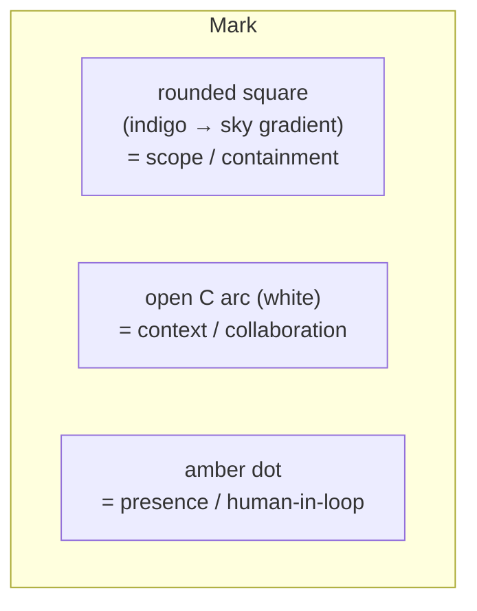
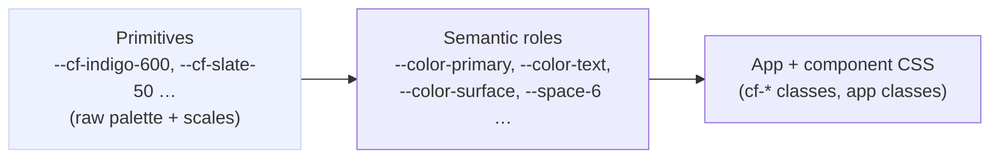

# Contextful — Design System

> **Status:** v1 · **Direction:** Trust Indigo (light-first, full dark theme)
> **Package:** `@superai2026/design-system` · **Consumed by:** `apps/web`, `apps/landing`

One design system, shared by the marketing site (Astro) and the product (Next.js), so Contextful
looks like one product everywhere. Tokens are plain CSS custom properties — framework-agnostic by
design, no build step, no Tailwind dependency.

## 1. Brand foundation

Contextful is a security product that has to feel **calm and trustworthy**, not alarming. The five
pillars map to concrete design decisions:

| Pillar | Expressed as |
| --- | --- |
| **Trust** | Deep indigo primary, generous whitespace, soft elevation, no harsh edges |
| **Clarity** | High text contrast, a strict type scale, slate neutrals, one idea per surface |
| **Security** | Confident (not loud) color, restrained palette, capability/scope shown as quiet badges |
| **Collaboration** | A warm **amber** accent reserved for *presence and people* (avatars, live cursors) |
| **Fluid** | Fluid `clamp()` type, soft gradients, smooth `ease-out` motion, rounded geometry |

**Voice & tone:** plain-spoken and precise. Lead with the direct claim ("The CTO's agent can't read
the CEO's salary — provably"), then explain. Lowercase is fine in product chrome; sentence case in
prose. Never fear-monger.

### Logo / mark

The mark is an open **"C" arc** (context, collaboration) inside a rounded indigo→sky gradient square
(containment, scope), with a single **amber dot** (a person / live presence) sitting in the opening.
It ships as `@superai2026/design-system/logo.svg`, and as the favicon for both apps. The amber dot is
the one place the accent appears in the mark — it stands for the human in the loop.



## 2. Token architecture

Two layers. Apps and components consume **only** the semantic layer, so a rebrand or theme is a
single-file change.



- **Primitives** (`--cf-*`): the raw palette and numeric scales. Theme-agnostic. Never referenced in
  app code.
- **Semantic** (`--color-*`, `--space-*`, `--radius-*`, `--shadow-*`, `--text-*`, …): role tokens.
  Dark mode only re-points semantic tokens; primitives stay fixed.

## 3. Color

### Palette (primitives)

- **Indigo** (primary / trust): `50…950`, primary = `indigo-600` `#4f46e5`.
- **Sky** (secondary / info / links): `400…600`, `sky-500` `#0ea5e9`.
- **Amber** (collaboration / presence — *use sparingly*): `amber-500` `#f59e0b`.
- **Slate** (neutrals / clarity): `0…950`, text = `slate-900`, paper bg = `slate-50`.
- **Status**: success `#16a34a`, warning `amber-600`, danger `#dc2626`.

### Semantic roles (excerpt)

| Token | Light | Role |
| --- | --- | --- |
| `--color-bg` | `slate-50` | App / page background ("paper") |
| `--color-surface` | `white` | Cards, panels, inputs |
| `--color-surface-sunken` | `slate-100` | Wells, code, inset areas |
| `--color-text` | `slate-900` | Primary text |
| `--color-text-muted` | `slate-500` | Secondary text |
| `--color-border` | `slate-200` | Hairlines, card borders |
| `--color-primary` | `indigo-600` | Primary actions, brand |
| `--color-accent` | `amber-500` | **Presence / collaboration only** |
| `--color-link` | `indigo-600` | Links |
| `--color-focus` | `indigo-500` | Focus ring (`--ring-focus`) |

**Accessibility:** body text and UI labels target **WCAG AA** (≥4.5:1 for body, ≥3:1 for large text
and non-text UI). `text-on-primary` is white on `indigo-600` (AA). Never use `--color-accent` for body
text on light surfaces — amber is for fills, dots, and large accents, not paragraphs.

### Dark theme

Activates on `prefers-color-scheme: dark`, or force with `data-theme="dark"` / `data-theme="light"`
on `<html>`. Dark re-points surfaces to `slate-900/950`, lifts primary to `indigo-400` for contrast,
and softens subtle fills via `color-mix`.

## 4. Typography

- **Family:** Inter (loaded via Google Fonts in both apps; `--font-sans` falls back to Geist →
  system-ui). Mono: Geist Mono → `ui-monospace`. Display = sans.
- **Scale:** `--text-xs … --text-6xl`. Display sizes (`4xl/5xl/6xl`) are **fluid** via `clamp()` so the
  hero scales smoothly with viewport — this is the "Fluid" pillar in type.
- **Headings:** tight leading (`1.15`), tight tracking (`-0.02em`), `text-wrap: balance`.
- **Body:** `--leading-relaxed` (1.65), `text-wrap: pretty`, max width `--container-prose` (68ch).
- **Eyebrows:** uppercase, `--tracking-caps`, `indigo-700` — the `.cf-eyebrow` primitive.

> Self-hosting note: Inter is loaded from Google Fonts for the demo. To go fully local-first/offline,
> swap to `@fontsource-variable/inter` (or `next/font` for `apps/web`) — `--font-sans` already names
> "Inter" first, so only the loading mechanism changes.

## 5. Space, radius, elevation, motion

- **Space:** 4px base scale `--space-1 … --space-32` (rem-based).
- **Radius:** `xs 4 → 2xl 28 → full`. Default UI uses `md`/`lg`; buttons `md`, cards `lg`, pills `full`.
  Rounded geometry supports "fluid/friendly".
- **Elevation:** five soft, slate-tinted shadows (`xs…xl`) plus `--shadow-ring-primary` (an indigo glow
  for primary CTAs). Shadows are diffuse and low-opacity — trust, not drama.
- **Gradients:** `--gradient-brand` (indigo→sky) for CTAs and the wordmark text; `--gradient-hero`
  (radial indigo wash) behind heroes; `--gradient-collab` (amber) for presence flourishes.
- **Motion:** `--ease-out` `cubic-bezier(.16,1,.3,1)`; durations `fast 120 / normal 200 / slow 320`.
  All durations collapse to `0ms` under `prefers-reduced-motion`.

## 6. Component primitives (`cf-*`)

Plain CSS classes in `components.css`, usable identically in Astro markup and React JSX.

| Class | Variants | Use |
| --- | --- | --- |
| `.cf-btn` | `--primary`, `--secondary`, `--ghost`, `--lg`, `--sm` | Actions. Primary = brand gradient + glow |
| `.cf-card` | `--raised`, `--interactive` | Content surfaces; interactive lifts on hover |
| `.cf-badge` | `--primary`, `--accent`, `--success`, `--danger` | Status, scope, capability chips |
| `.cf-input` | — | Text fields; tokenized focus ring |
| `.cf-eyebrow` | — | Section kicker / label |
| `.cf-presence` / `.cf-presence__dot` | — | Overlapping avatar/presence stack (collaboration) |
| `.cf-container` | `--wide`, `--prose` | Centered max-width layout |
| `.cf-text-gradient`, `.cf-text-muted`, `.cf-stack`, `.cf-visually-hidden` | — | Utilities |

Anything more complex (the editor shell, sidebar, agent panel) composes these primitives + semantic
tokens in app-local CSS — see `apps/web/src/app/globals.css`.

## 7. How apps consume it

Both apps depend on `"@superai2026/design-system": "workspace:*"` and import the bundle once at the
root:

```ts
// apps/web — src/app/layout.tsx
import "@superai2026/design-system/styles.css";
import "./globals.css";
```

```astro
---
// apps/landing — any page / layout frontmatter
import "@superai2026/design-system/styles.css";
---
```

App-specific styles live in the app and reference **semantic tokens only**. Do not redefine palette
values in an app; add or adjust tokens in the package so both surfaces move together.

## 8. SEO / brand metadata alignment

The design system carries the brand into the metadata the parent `CLAUDE.md` SEO rules require:
favicons (`favicon.svg` / `app/icon.svg`), the OG image (`apps/landing/public/og.svg`, 1200×630 —
rasterize to `og.png` before launch for Twitter/X), and the gradient wordmark used in `og:title`
contexts. Keep `og:image`, theme color, and the mark in sync with the tokens here.

## 9. Governance / extending

- **Add a color:** add the primitive scale, then map a semantic role to it. Never hardcode hex in apps.
- **Add a component:** prefer composing existing `cf-*` primitives; promote to `components.css` only
  when it's reused across both apps.
- **Change the brand:** edit semantic tokens in `tokens.css` (and `tokens.json` mirror). Because apps
  consume semantic tokens, the blast radius is one file.
- **Contrast gate:** any new color pairing must pass WCAG AA; verify before merging.
