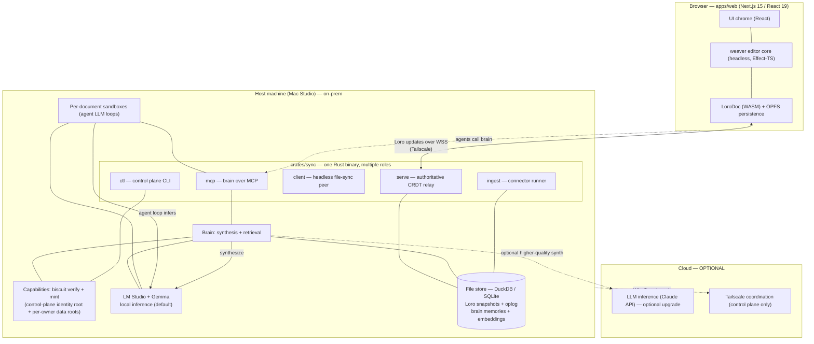
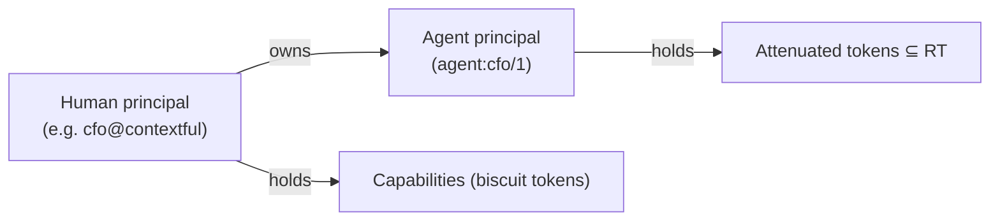
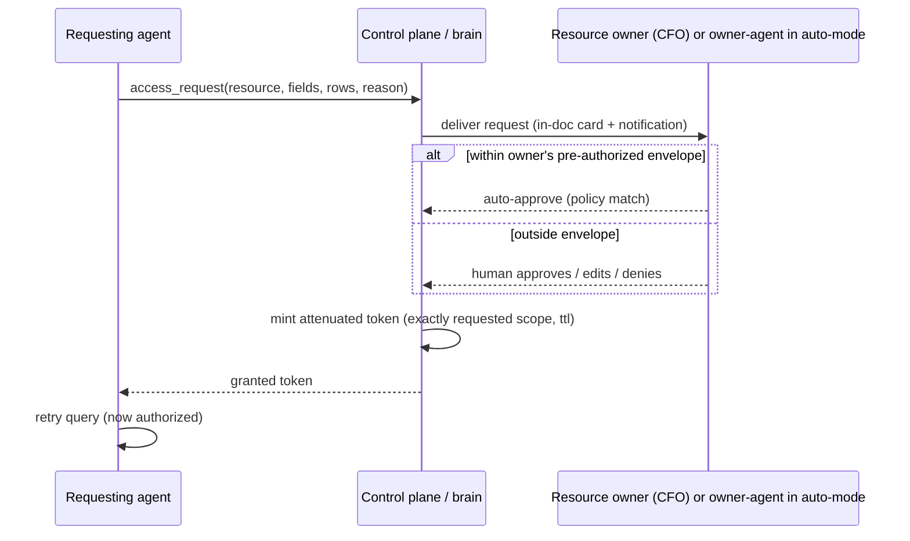
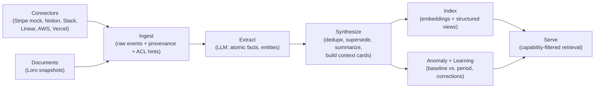
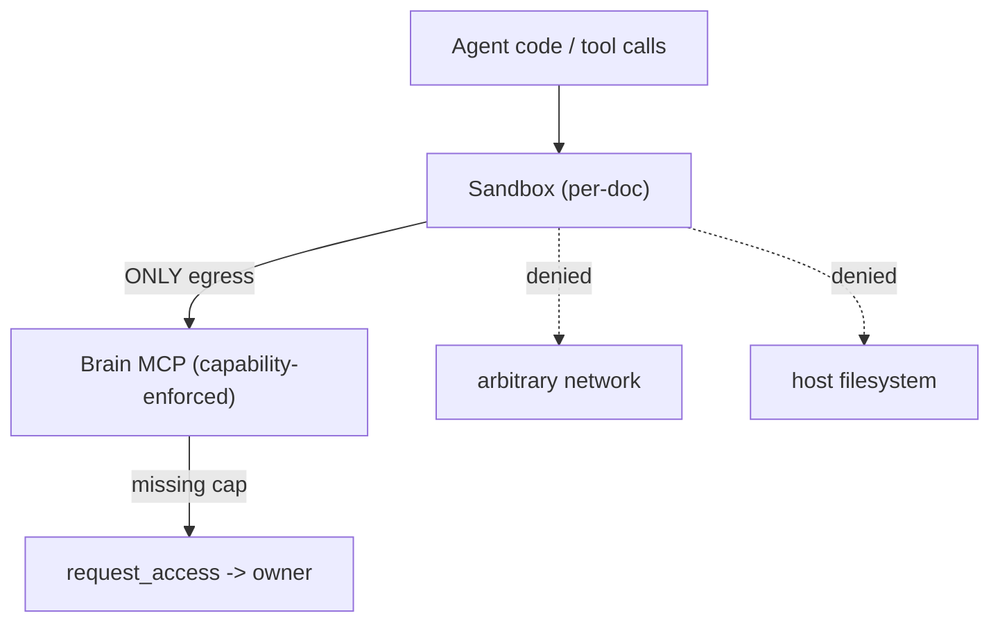
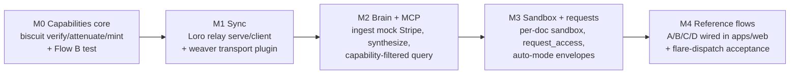

# Contextful — System Specification

> **Status:** Draft v1 · **Scope:** Technical systems · **Fidelity:** Buildable demo, architected to grow
> **Repo:** `superai2026` monorepo · **Domains:** `www.contextful.work` (landing), `demo.contextful.work` (demo)

This is the single master spec for the **technical systems** behind Contextful. The marketing
storyline, demo video, Silicon Valley theme, and brand/landing design are intentionally **out of
scope** here (tracked separately). Where the storyline drives a flow that must work on stage, it is
captured as a **technical reference flow** (§17), not as narrative.

---

## 1. What Contextful is

Contextful is a **local-first company brain** where humans and their AI agents collaborate in shared
documents, and **every agent sees exactly the context it is permitted to see — no more, no less.**

The thesis is an explicit rejection of the "SuperAgent that has all the context" pattern. A single
omniscient context store is a security disaster: it lets an engineer's agent query the CEO's salary,
turns any compromised credential into a full-company leak, and gives finance no way to scope what an
agent may read. Contextful is the opposite:

- **Attenuated, capability-based access** — an agent provably inherits only a *subset* of its owner's
  permissions (biscuit attenuation). The CTO's agent cannot read the CEO's salary even if instructed to.
- **A brain that synthesizes context** from ingested SaaS data + collaborative documents, and exposes
  it over **MCP**, capability-filtered per caller (mem0 / "GBrain"-class, but local-first and scoped).
- **Local-first** — the app works fully on a host machine (e.g. a Mac Studio). Cloud is **optional**,
  used only for sync transport and (optionally) LLM inference.

The motivating scenario is a 100-person software company running a FinOps initiative across Claude,
Notion, Slack, Linear, AWS, Vercel, and Stripe, where Engineering, Operations, Finance, the CTO, the
CIO, and the CFO each hold a *different slice* of the truth and none should hold all of it.

---

## 2. Goals & non-goals

### 2.1 Goals (demo must demonstrate)

1. A user creates a document and shares it with team members **and their agents**; everyone
   collaborates in real time (weaver + Loro CRDT).
2. A user **delegates partial access** to their agent (attenuation); the agent can never exceed the
   user's own grants.
3. Each document is paired with a **secure sandbox**; agents query the brain from inside it.
4. When an agent lacks access, it **raises a permission request** to the resource/agent owner, who
   grants a narrowly-scoped capability; the agent retries and succeeds — while still-denied fields
   (salary) stay denied.
5. The brain **answers questions with company context** and **grows** — it ingests data, synthesizes
   memories, detects anomalies, and learns from prior-month corrections.
6. Everything runs **on-prem on a Tailscale layer**, configured through a control plane.

### 2.2 Demo fidelity (what "buildable demo, architected to grow" means)

| In scope for the demo | Deferred (architected for, not built) |
| --- | --- |
| Single host (Mac Studio) + browser client | Multi-tenant, HA, multi-region sync |
| Mock connectors: Stripe-shaped data from a Kaggle dataset (CSV/JSON) | Real OAuth to Stripe/AWS/Vercel/Notion/Slack/Linear |
| Real Loro CRDT sync over WebSocket on Tailscale | Conflict UX polish, large-doc perf tuning |
| Real biscuit tokens with field/row caveats + attenuation | Org-wide policy admin UI, SCIM, key rotation automation |
| MCP brain with capability-filtered retrieval | Fine-grained audit/compliance exports |
| Per-document sandbox with brain-only egress | Full WASM connector-authoring marketplace |
| Local inference on LM Studio + Gemma (Claude API optional) | Production local-model ops, model tuning |

**Data models, capability tokens, and protocol framing are real** so the demo extends to production
without a rewrite. Only breadth (connectors, tenancy, ops) is mocked.

### 2.3 Non-goals

Peer-to-peer sync (we assume a **centralized authoritative server**), a company-wide single context
store, and any feature that requires an agent to hold more authority than its human owner.

---

## 3. Personas & the access problem they encode

| Persona | Has | Lacks | Capability implication |
| --- | --- | --- | --- |
| **Engineering** | Judgement on whether Claude Code usage is justified | Visibility into pricing, discount tiers | Read usage/utilization views; **no** finance-private fields |
| **Operations** | Owns workflow outcomes, runs evals | Cost visibility | Read outcome/eval views; comment on spend justification |
| **Finance** | Owns the books | Whether $100k/mo of tokens is "worth it" | Read spend; needs Ops/Eng context to judge value |
| **CTO** | Most technical visibility | Wants to *not* commit invoices to a shared repo | Broad read, but mints **scoped** agent tokens, not blanket |
| **CIO** | Sees total monthly burn | Sees no breakdown | Read aggregates; drills down only where granted |
| **CFO** | Knows credits, discount tier, team budgets | — (root of finance-private data) | **Sole owner** of finance-private fields; approves attenuated grants |

The recurring gag — *"obviously an engineer must not be able to query everyone's salary"* — is the
acceptance test for the whole access model (§7, §17 Flow B).

---

## 4. System architecture



**Trust boundary:** the host is authoritative. The browser holds only documents and capabilities it
was granted. Sandboxes have **no ambient authority** — their only data egress is the brain MCP, which
enforces biscuit on every call. Tailscale provides the encrypted network layer. By default
**inference is local** (LM Studio + Gemma on the host), so no content leaves the machine at all; the
optional Claude backend is the only path by which already-permitted content would reach the cloud.

---

## 5. Component → repo mapping

| Component | Location | Language / stack | Notes |
| --- | --- | --- | --- |
| Web app (editor host) | `apps/web` | Next.js 15, React 19, **weaver**, Effect-TS | UI chrome + permission-request UI + agent panel |
| Landing page | `apps/landing` | Astro static | Out of technical scope here; keep scaffolding |
| Sync / brain / sandbox binary | `crates/sync` | Rust (tokio, clap) | Subcommands `serve` / `client` / `mcp` / `ingest` / `ctl` |
| Shared TS libs | `packages/` | TypeScript | Generated protocol + capability bindings; weaver integration glue |
| Tests / acceptance | `flare-dispatch` (external) | TS, Effect-TS, Playwright | Acceptance + e2e for reference flows (§18) |

### 5.1 `crates/sync` module layout (target)

```
crates/sync/src/
  main.rs          # clap dispatch (existing) — extend with mcp/ingest/ctl
  server.rs        # serve: WS CRDT relay (existing stub)
  client.rs        # client: headless file-sync peer (existing stub)
  mcp.rs           # mcp: brain tools over MCP
  sync/            # Loro relay: framing, version-vector exchange, awareness
  store/           # DuckDB/SQLite: doc snapshots+oplog, memories, embeddings
  brain/           # ingest -> extract -> synthesize -> index -> serve, anomaly/learn
  caps/            # biscuit: verify, attenuate, mint, field/row authorization
  connectors/      # connector trait + mock Stripe/Kaggle + stubs; primitive API
  sandbox/         # per-document isolated execution; brain-only egress
  controlplane/    # tailnet config, principal registry, root keys
```

`serve` and `mcp` typically co-run on the host (the brain needs the same store the relay persists).
They are separate subcommands so they can also run as separate processes; a `sync serve --with-mcp`
convenience flag boots both in one process for the demo.

---

## 6. Principals & identity



- **Human principal** — an identity in the control-plane registry (id, display name, public key).
  For the demo, principals are seeded from a config file (the six personas + a CEO).
- **Agent principal** — always **owned by exactly one human**. Its id encodes the owner
  (`agent:<owner>/<n>`). An agent has no root authority; it only ever holds tokens its owner minted by
  attenuation.
- **Keys & roots (hybrid).** Each principal has a keypair. There is **no single root that can mint
  everything.** The control plane is the biscuit **root for identity & document membership only**; each
  *sensitive resource* (e.g. `stripe/finance_private`) has its **own resource root key, held by its
  owner** (the CFO). Owners mint authority tokens over their own resources and sign attenuation blocks
  when delegating to people or agents. Consequence: even a **compromised control plane cannot mint
  access to `employee_salary`** — only the CFO's resource root can.

This ownership edge is what makes "no SuperAgent" provable on two axes: `caps(agent) ⊆ caps(owner)` by
attenuation, **and** no central key holds authority over everyone's data by the hybrid root model.

---

## 7. Capability & access control (biscuit, field & row level)

Access control uses [biscuit](https://www.biscuitsec.org/) tokens (Datalog-based, offline-verifiable,
**attenuable**: you can append caveats but never widen). The Rust `caps/` module wraps `biscuit-auth`.

### 7.1 Resource model

A capability grants an **operation** on a **resource**, optionally narrowed by **field** and **row**
caveats:

```
resource  := document(<doc_id>)
           | source(<source_id>)                 # e.g. stripe
           | view(<source_id>, <view_name>)       # e.g. stripe / spend_by_team
operation := read | write | comment | query | admin
field     := a named column of a view             # e.g. employee_salary, discount_tier, credits
row       := a predicate over a view's rows        # e.g. team in {eng, ops}
```

Views are the unit of finance privacy. `stripe/spend_by_team` exposes `team, period, gross, net`;
`stripe/finance_private` additionally exposes `discount_tier, credits, employee_salary`. The CFO is the
sole root holder of capabilities over `finance_private`.

### 7.2 Token shape

A first-party authority token over a sensitive resource is minted by **that resource's owner root**
(here the CFO); the control-plane root is not involved in data resources:

```datalog
// authority block — what the CFO holds, signed by the CFO's resource root
right("query", view("stripe","finance_private"));
right("query", view("stripe","spend_by_team"));
field("stripe","finance_private","discount_tier");
field("stripe","finance_private","credits");
field("stripe","finance_private","employee_salary");
```

### 7.3 Attenuation = delegation to an agent

The CFO delegates to the CTO (or to an agent) by **appending a block** that can only *remove*. Example:
grant the CTO read of spend including credits and discount tier, **redact salary**, all teams:

```datalog
// appended block — strictly narrows the parent
check if operation($op), $op == "query";
check if resource(view("stripe", $v));                 // only stripe views
deny  if field("stripe", $any, "employee_salary");     // salary is never readable here
allow_field("stripe","finance_private","discount_tier");
allow_field("stripe","finance_private","credits");
row_scope("stripe","spend_by_team", "team", ["eng","ops","sales","finance"]);
```

Because biscuit blocks are monotonic-restrictive, the resulting token is provably `⊆` the CFO's.
An agent token is just a further-attenuated child of its owner's token.

### 7.4 How field/row redaction is *enforced* (faithful to biscuit)

Biscuit authorization is boolean per request context. The brain's query layer therefore authorizes
**each field and row-scope the query would touch**, not the query as a whole:

```mermaid
sequenceDiagram
    participant SBX as Sandbox (agent)
    participant Q as Brain query layer
    participant V as biscuit Authorizer
    SBX->>Q: query(view=spend_by_team incl. credits, all teams)
    Q->>Q: plan: fields {team,period,net,credits}, rows {all teams}
    loop per field
        Q->>V: authorize(operation=query, field=...)
        V-->>Q: allow / deny
    end
    Q->>V: authorize(row_scope team in {...})
    V-->>Q: allowed teams ∩ requested
    Q->>Q: drop/redact denied fields, filter denied rows
    Q-->>SBX: result (employee_salary absent; rows filtered)
```

Denied fields are **dropped from the projection** (or returned as `REDACTED`), denied rows filtered
from the predicate. The agent literally cannot select what it wasn't granted; there is no "ask nicely"
path inside the query engine.

### 7.5 Permission requests & "auto mode" (anti permission-fatigue)

When a query is denied for lack of a capability (not a redaction, but a missing grant), the agent does
not fail silently — it raises a structured **permission request**:

```jsonc
{
  "kind": "access_request",
  "requester": "agent:cto/1",
  "resource": "view(stripe, finance_private)",
  "fields": ["discount_tier", "credits"],
  "row_scope": { "team": ["eng", "ops"] },
  "reason": "CTO asked whether this month's Claude spend is net-justified after credits",
  "doc": "doc_q3_finops",
  "ttl": "P7D"
}
```

Routing & resolution:



**Auto mode** reduces permission fatigue: an owner sets an **envelope** — a policy describing what
their agent may auto-approve on their behalf (e.g. "auto-approve read of `spend_by_team` aggregates to
internal agents, max ttl 7d; always escalate anything touching `employee_salary` or `finance_private`
fields"). Requests inside the envelope are granted by the owner's agent; anything outside escalates to
the human. The envelope is itself expressed as biscuit checks, so an auto-approval can never mint a
token the human couldn't have minted.

---

## 8. Documents & collaborative editing (weaver + Loro)

The editor is **weaver** (`OpenHackersClub/weaver`): a headless TypeScript editor with **LoroDoc as the
single source of truth**, Effect-TS plugin composition, OPFS local-first persistence, and **AI agents
as first-class document peers** (not a chat sidebar). `apps/web` provides only React chrome.

### 8.1 Integration decision

weaver's *own* reference design syncs through Cloudflare Durable Objects / R2 / D1. Contextful **keeps
weaver's editor + CRDT client** but **replaces its sync backend** with `crates/sync serve` over
Tailscale (§9). Concretely:

- Use weaver's headless core, Loro doc model, and Effect-TS plugin/command layers as-is.
- Provide a **sync transport plugin** that speaks the Contextful WS protocol to the Rust server instead
  of Cloudflare.
- Agents-as-peers map to **agent principals**: an agent edits the doc through the same Loro update path
  a human does, scoped by a `write`/`comment` capability on `document(<doc_id>)`.

### 8.2 Document model

- One LoroDoc per document. Containers: a rich-text tree (paragraphs/headings/formatting per weaver's
  MVP), plus a structured `meta` map (`title`, `owner`, `members[]`, `created`, `updated`).
- **Members** are principals (humans and agents) with a per-member capability on the document.
- Each document is paired 1:1 with a **sandbox** (§12) and a brain **scope** (§10.5) so that "what this
  doc's agents may use as context" is itself a capability set.

---

## 9. Sync protocol (`crates/sync serve` / `client`)

```mermaid
sequenceDiagram
    participant C as Client (weaver / headless)
    participant S as serve (authoritative)
    C->>S: HELLO { proto, principal, biscuit }
    S->>S: verify token; check read(document) cap
    S-->>C: HELLO_OK { doc_id, server_vv }
    C->>S: SUBSCRIBE { doc_id, client_vv }
    S-->>C: SNAPSHOT { loro_snapshot @ server_vv }   // catch-up
    par live
        C->>S: UPDATE { loro_update_bytes }          // requires write cap
        S->>S: persist to oplog; relay
        S-->>C: UPDATE { loro_update_bytes }          // from other peers
    and presence
        C->>S: AWARENESS { cursor, selection, presence }  // ephemeral, not persisted
        S-->>C: AWARENESS { peer states }
    end
```

- **Transport:** WebSocket over Tailscale (WSS; confidentiality + auth from Tailscale's WireGuard mesh,
  TLS on top). The server may embed Tailscale via `tsnet`, or bind on the tailnet interface with the
  host's `tailscaled`. Demo default: host daemon, server binds the tailnet IP.
- **Authoritative model:** the server is the single source of truth. No peer-to-peer. On connect a
  client receives a Loro **snapshot** at the server's version vector, then a live stream of updates.
- **CRDT:** Loro. Wire payloads are Loro's native update/snapshot byte blobs with version vectors;
  reconciliation is Loro's (the server never merges by hand).
- **Authorization:** `SUBSCRIBE` requires `read(document)`, `UPDATE` requires `write(document)`,
  comment-only members get `comment(document)`. The token is presented in `HELLO` and re-checked per
  message class.
- **Persistence:** per-doc Loro snapshot + oplog in the file store (§16). Periodic compaction
  snapshot + truncate oplog.
- **`client` role:** a headless peer that syncs documents to **local files** for editing (the seed of a
  future native Mac app). Same protocol; writes a working copy to disk and reflects local edits back as
  Loro updates.

---

## 10. The Brain (memory system)

The brain synthesizes context from ingested SaaS data **and** collaborative documents into queryable
**memories**, exposed over MCP (§11), capability-filtered per caller. It is mem0 / "GBrain"-class but
**local-first and scope-attenuated** — the differentiator vs. a single SuperAgent store.

### 10.1 Pipeline



### 10.2 Data model (file store)

| Table | Purpose | Key columns |
| --- | --- | --- |
| `raw_event` | Immutable ingested record | `id, source_id, view, payload(json), ingested_at, acl_tag` |
| `memory` | Synthesized fact / summary / context card | `id, kind, topic, body, confidence, period, supersedes, created_at` |
| `provenance` | Memory ↔ source link | `memory_id, raw_event_id` (and `doc_id` for doc-derived) |
| `embedding` | Vector for semantic search | `memory_id, vector` (DuckDB VSS / sqlite-vec) |
| `anomaly` | Detected deviation | `id, view, metric, period, baseline, observed, severity, memory_id` |
| `learning` | Correction/feedback that adjusts future synthesis | `id, topic, statement, applies_from, source` |

`acl_tag` on every raw event maps to the resource/field model (§7.1) so retrieval can attach the right
caveats — a memory derived from `finance_private` inherits `finance_private`'s access requirements.

### 10.3 Retrieval (capability-filtered)

Every retrieval carries the caller's biscuit token. The brain:

1. Resolves candidate memories by semantic + structured match.
2. For each candidate, authorizes the **fields/rows of its provenance** against the token (§7.4).
3. Drops or redacts anything not authorized **before** it reaches the agent or the LLM.

Redaction happens at retrieval, so a permitted-but-partial answer is possible (e.g. "team spend up 40%"
without the salary line that contributed to it).

### 10.4 Anomaly detection & learning ("the brain grows")

- **Anomaly:** at each ingest/period close, compare metrics (token spend, utilization, net-of-credits)
  to a rolling baseline; emit `anomaly` rows above a severity threshold and a memory summarizing them.
- **Learning:** when a human corrects the brain in a document ("that spike was a one-off backfill, not a
  trend"), that correction is stored as a `learning` and applied to future synthesis/baselines — so next
  month the brain doesn't re-flag the same pattern. This is the literal "learn from past monthly
  mistakes" requirement.

### 10.5 Document scope

Each document has a **brain scope**: the set of sources/views its sandbox may draw on. Sharing a doc
with a member does **not** widen what that member's agent can read — the agent is still bounded by its
own attenuated token intersected with the doc scope.

### 10.6 LLM inference (local-first, cloud optional)

Extraction/synthesis and the in-sandbox agent loops (§12) call an inference backend behind one trait
with two implementations:

- **On-prem default:** **LM Studio** running a **Gemma** model, via its OpenAI-compatible endpoint
  (`http://localhost:1234/v1`). This is what the demo runs on — inference happens entirely on the host,
  so the on-prem claim is *demonstrated live*, not just told.
- **Optional cloud upgrade (online):** Claude API — `claude-opus-4-8` for high-stakes synthesis/judgement,
  `claude-sonnet-4-6` for routine extraction, `claude-haiku-4-5` for cheap classification. Same trait,
  swapped by config; used only when explicitly enabled and online.

Because the default engine is local, the brain does **not** degrade offline: structured `brain.query` +
redaction never needed an LLM, and synthesis/answers run on local Gemma. Only **already-permitted**
content is ever sent to any backend — redaction (§10.3) runs first, so even the local model never sees
denied fields.

---

## 11. MCP server (`crates/sync mcp`)

The brain is exposed to agents (and to MCP-capable clients like Claude) as an MCP server. Every tool
call carries the caller's biscuit token; the brain enforces §7 on every call.

| Tool | Purpose | Caps required |
| --- | --- | --- |
| `brain.list_sources()` | Sources/views the caller may see | any read on ≥1 view |
| `brain.search(query, scope?)` | Semantic + structured memory search | per-result field/row auth |
| `brain.get_context(topic)` | Synthesized context card for a topic | per-provenance auth |
| `brain.query(view, select, where)` | Structured query over a permitted view | `query(view)` + field/row |
| `brain.detect_anomalies(view, period)` | Anomalies for a period | `query(view)` |
| `brain.remember(fact, doc)` | Write a memory scoped to a document | `write(document)` |
| `brain.request_access(resource, fields, rows, reason)` | Raise a permission request (§7.5) | none |

- **Transport:** stdio for co-located agents; HTTP/SSE over Tailscale for remote agents. Auth via the
  biscuit token on the MCP session.
- **Determinism:** `query` is structured (view + projection + predicate) so authorization is exact;
  free-text `search` returns memories each independently authorized.

---

## 12. Sandbox (per-document)

Each document is paired with a **secure sandbox** in which that document's agents execute: run brain
queries, draft content, and (later) author ad-hoc connectors.



- **Agent runtime.** Each agent runs as an **LLM loop inside its document's sandbox on the host**, using
  the inference backend of §10.6 (local Gemma by default). The loop's only tool surface is the brain MCP;
  it has no other network or filesystem access. This is the concrete form of "agents are MCP clients" —
  the model reasons, calls brain tools, and emits Loro edits as a document peer.
- **No ambient authority.** The sandbox's only data egress is the brain MCP; no arbitrary network, no
  host filesystem. Anything it learns, it learned through a capability check.
- **Insufficient-access path:** a denied query triggers `request_access` (§7.5); on approval the owner
  mints an attenuated token, the sandbox receives it, and retries.
- **Isolation (demo):** a constrained child process with a brain-only socket and resource limits.
  **Architected for** WASM isolation (`wasmtime`) so untrusted agent/connector code can run with a
  capability-shaped host API — that is the growth path, not the demo build.
- **Lifecycle:** created with the document, torn down when the document closes; ephemeral compute, no
  durable state of its own (durable facts go to the brain via `brain.remember`).

---

## 13. Connectors & ingestion

### 13.1 Connector trait (Rust)

```rust
/// A source of raw events for the brain. Demo connectors read local fixtures;
/// production connectors hit real APIs behind the same trait.
trait Connector {
    fn source_id(&self) -> &str;                  // "stripe"
    fn views(&self) -> &[ViewSchema];             // spend_by_team, finance_private, ...
    fn pull(&self, since: Cursor) -> EventStream;  // raw events + acl_tag + provenance
}
```

### 13.2 Demo connectors

- **Stripe (mock):** Stripe-shaped data (charges, invoices, subscriptions, credits, discounts) populated
  from a **Kaggle dataset** mapped into the views in §7.1. `finance_private` carries the
  `discount_tier`, `credits`, and `employee_salary` columns that drive the access gags.
- **Stubs:** Notion / Slack / Linear / AWS / Vercel connectors present the trait + a small fixture each,
  enough for `list_sources` and cross-source context, without real auth.

### 13.3 Ad-hoc connectors via primitives (growth path)

Agents can author ad-hoc connectors using a constrained **primitive API** exposed inside the sandbox
(`fetch`, `parse`, `map_to_view`, `declare_acl`). In the demo this is **specced, not built**: the
primitive surface and the `ViewSchema`/`acl_tag` contract are defined so an authored connector would
slot into the same ingest path, but the demo ships only the fixed mock + stubs.

### 13.4 Ingestion command

`sync ingest --source stripe` runs a connector's `pull`, writes `raw_event` rows with `acl_tag`, and
triggers the synthesis pipeline (§10.1). A `--watch` mode re-ingests on fixture change for live demos.

---

## 14. Control plane & networking

### 14.1 Networking (Tailscale)

- Everything runs **on-prem on a Tailscale tailnet**. The host advertises the sync WS and MCP endpoints
  on its tailnet address; clients (browser host, headless peers) join the same tailnet.
- Tailscale ACLs restrict which nodes may reach the sync/MCP ports. The cloud touches the tailnet only
  for coordination (and optional LLM egress); document content does not traverse the public internet.

### 14.2 Control plane (`sync ctl`)

Configures the deployment — *"we configured that using our control plane."* Responsibilities:

- **Tailnet config:** register the host, emit the Tailscale ACL stanza for sync/MCP ports.
- **Principal registry:** seed humans + agents (the personas + CEO) with keypairs.
- **Identity root only:** the control plane holds the biscuit root for **identity & document membership**
  — not for data resources. It registers each resource owner's **own root public key** but cannot mint
  capabilities over their resources. Owners mint their own authority tokens (§7.2) and the initial
  attenuated tokens for their agents (§7.3).
- **Envelopes:** register each owner's auto-mode envelope (§7.5).

For the demo the control plane is a **config file + `sync ctl` CLI** (seed, mint, revoke, show). A web
admin surface is a growth path, not a demo deliverable.

---

## 15. Storage layout (file-based, local-first)

```
~/.contextful/
  control/            # principals, keys, envelopes, tailnet config
  docs/
    <doc_id>.loro     # snapshot + oplog (Loro)
  brain.duckdb        # raw_event, memory, provenance, embedding, anomaly, learning
  fixtures/
    stripe/*.csv      # Kaggle-derived mock data
  caps/               # issued token records (for revocation/audit)
```

Prefer **DuckDB** for the analytical brain store (vector search via VSS, columnar scans for spend
aggregations) and **SQLite** where simple KV/transactional state fits. Loro persistence is per-doc
files. Everything is on-host; nothing requires the cloud to read or edit.

---

## 16. Security model summary

- **Least authority by construction:** agents hold attenuated subsets of human tokens; `caps(agent) ⊆
  caps(owner)` is enforced by biscuit's append-only blocks, not by policy hope.
- **No capability super-root:** no single key can mint all access. The control-plane root covers
  identity/membership only; sensitive data resources are rooted at their owners (§6). A compromised
  control plane cannot read finance data — the inverse of the "SuperAgent" failure mode.
- **Enforcement at the data boundary:** field/row redaction happens in the brain query layer and at
  retrieval, before any agent or LLM sees data (§7.4, §10.3).
- **No ambient authority in sandboxes:** brain MCP is the only egress; every call is capability-checked.
- **Confidential transport:** Tailscale WireGuard mesh; content stays on-prem.
- **Auditable grants:** every minted/attenuated token and every `access_request` is recorded
  (`caps/`), giving the CIO the breakdown the SuperAgent never could.
- **The salary invariant:** there exists no token, and no approval path inside any non-CFO envelope,
  that yields `employee_salary` — and no key other than the CFO's resource root (not the control-plane
  root, not any other owner) can mint it. This is asserted as an acceptance test (§17 Flow B, §18).

---

## 17. Reference flows (technical; these must work on stage)

### Flow A — request → approve → scoped pull

1. In a shared doc, the CTO asks whether this month's Claude spend is justified after credits.
2. The CTO's agent calls `brain.query(view=stripe/finance_private, select=[net, credits, discount_tier])`
   → **denied** (no cap on `finance_private`).
3. Agent calls `brain.request_access(resource=view(stripe,finance_private), fields=[credits,discount_tier],
   rows=all_teams, reason=…)`.
4. The CFO (or the CFO's agent, if the request is inside the CFO's envelope) approves → control plane
   mints an attenuated token: read `spend_by_team` + `credits` + `discount_tier`, **redact
   `employee_salary`**, all teams, ttl 7d.
5. Agent retries → answers with net-of-credits spend. **Salary never appears.**

### Flow B — the salary invariant (negative test)

1. An Engineering agent attempts `brain.query(view=stripe/finance_private, select=[employee_salary])`.
2. Denied at field level. The agent raises `request_access` for `employee_salary`.
3. Engineering's owner has no envelope path to `employee_salary`; the request escalates and there is no
   key — not the control-plane root, not any non-CFO owner — that can mint it. Only the CFO's resource
   root could, and it won't. The agent stays blocked. *(This is the whole point — proven, not promised.)*

### Flow C — the brain grows

1. End-of-month `sync ingest --source stripe` loads new data → synthesis runs.
2. `brain.detect_anomalies(view=spend_by_team, period=current)` flags a token-spend spike; a memory +
   `anomaly` row are created and surfaced in the doc.
3. A human annotates "one-off backfill, not a trend" → stored as a `learning`.
4. Next month the same pattern is **not** re-flagged — the brain applied the correction.

### Flow D — local-first (the on-prem proof, performed live)

1. Disconnect the cloud uplink entirely. Continue editing the doc — weaver persists to OPFS, Loro
   accumulates updates locally; peers on the tailnet still sync through the host.
2. The brain keeps working **fully**: structured `brain.query` + redaction need no LLM, and
   synthesis/agent answers run on **local Gemma via LM Studio** — on the host, no internet. Nothing
   queues, nothing degrades. This is the demo's on-prem money shot.
3. *(Optional)* Re-enable cloud to switch synthesis to Claude for higher quality — same inference trait,
   no other change.

---

## 18. Testing & acceptance (flare-dispatch)

Acceptance and e2e tests run via `OpenHackersClub/flare-dispatch` (offloads Playwright / acceptance
onto Cloudflare via a GitHub Action). Suites:

- **`playwright-e2e`** — collaborative editing: two browser peers, real-time convergence, presence.
- **`cdp-acceptance`** — boot host (`serve --with-mcp`) + seeded control plane, then assert reference
  flows A, C, D end-to-end.
- **Capability unit/property tests (Rust, `cargo test`)** — attenuation never widens; field/row
  authorization drops the right columns/rows; **Flow B salary invariant** as a property test over all
  non-CFO principals.
- **Brain tests** — synthesis dedupe/supersede; anomaly threshold; learning suppresses re-flag.

CI wiring: `flare-dispatch-action@v0` with `FLAREDISPATCH_ENDPOINT` / `FLAREDISPATCH_HMAC`; results as
PR check-runs. Rust suites run under `cargo test`; JS suites exposed as `test` scripts so
`turbo run test` discovers them.

---

## 19. Build order (milestones)



1. **M0 — Capabilities core.** `caps/` over `biscuit-auth`: resource model, attenuation, field/row
   authorizer. Land the salary invariant test first; it anchors everything.
2. **M1 — Sync.** Loro relay (`serve`/`client`), WS framing, snapshot/update/awareness; weaver transport
   plugin in `apps/web`. Two-peer convergence.
3. **M2 — Brain + MCP.** Mock Stripe/Kaggle ingest, synthesis pipeline, DuckDB store, MCP tools with
   capability-filtered retrieval.
4. **M3 — Sandbox + permission requests.** Per-doc sandbox (brain-only egress), `request_access`
   routing, auto-mode envelopes.
5. **M4 — Reference flows + acceptance.** Wire flows A–D into the web UI; flare-dispatch acceptance/e2e.

---

## 20. Decisions & open questions

### Decided (v1)

1. **Agent runtime** — each agent is an LLM loop inside its document's per-doc sandbox on the host, with
   the brain MCP as its only egress (§12).
2. **Demo mode** — live, over **frozen mock fixtures**; agent turns run for real (no scripting).
3. **Trust root** — **hybrid**: control-plane root for identity/membership, **per-owner roots for
   sensitive data** resources, so no single key can mint everyone's data (§6).
4. **Inference** — **LM Studio + Gemma** on the host is the default backend and what the **live demo runs
   on**; Claude API is the optional cloud upgrade behind the same trait (§10.6).

### Open (assumptions baked into v1; flag to revise)

1. **Kaggle dataset choice** — which dataset maps to the Stripe views (a clean
   `team × period × spend (+ credits/discount/salary)` shape). *Assumption: pick/synthesize one fixture
   matching §7.1.*
2. **MCP packaging** — `sync mcp` as its own process vs. `serve --with-mcp`. *Assumption: both supported;
   demo uses `--with-mcp`.*
3. **Tailscale embedding** — `tsnet` in-process vs. host `tailscaled`. *Assumption: host daemon.*
4. **weaver consumption** — dependency vs. fork into `packages/`. *Assumption: dependency + a Contextful
   sync-transport plugin; no fork.*
5. **Field redaction representation** — `REDACTED` sentinel vs. column omission. *Assumption: omit from
   projection; `search`/context cards mark redaction explicitly.*
6. **Gemma model + sizing** — which Gemma variant in LM Studio balances quality vs. latency for live
   synthesis on the demo host. *Assumption: choose during M2 against the host's hardware.*
```

